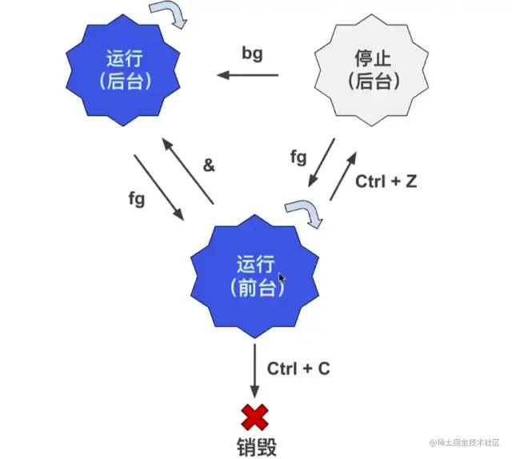

# 基础

## 显示路径

### pwd

显示当前目录的路径

### whic

查看命令的可执行文件所在路径

## 浏览和切换目录

### ls

列出文件和目录

【**常用参数**】

- `-a`显示所有文件和目录包括隐藏的
- `-l`显示详细列表
- `-h`适合人类阅读的
- `-t`按文件最近一次修改时间排序
- `-i`显示文件的`inode`（`inode`是文件内容的标识）

### cd

`cd`是英语 `change directory`的缩写，表示切换目录。

```bash
cd / --> 跳转到根目录  
cd ~ --> 跳转到家目录  
cd .. --> 跳转到上级目录  
cd ./home --> 跳转到当前目录的home目录下  
cd /home/lion --> 跳转到根目录下的home目录下的lion目录  
cd --> 不添加任何参数，也是回到家目录  

[注意] 输入 cd /ho单次 tab键会自动补全路径 + 两次 tab键会列出所有可能的目录列表。
```

### du

列举目录大小信息。

【**常用参数**】

- `-h` 适合人类阅读的；
- `-a`同时列举出目录下文件的大小信息；
- `-s`只显示总计大小，不显示具体信息。

## 浏览和创建文件

### cat

一次性显示文件所有内容，更适合查看小的文件。

【**常用参数**】

- `-n`显示行号。

### less

分页显示文件内容，更适合查看大的文件。

【快捷操作】

- **空格键**：前进一页（一个屏幕）；
- **b 键**：后退一页；
- **回车键**：前进一行；
- **y 键**：后退一行；
- **上下键**：回退或前进一行；
- **d 键**：前进半页；
- **u 键**：后退半页；
- **q 键**：停止读取文件，中止less命令；
- **= 键**：显示当前页面的内容是文件中的第几行到第几行以及一些其它关于本页内容的详细信息；
- **h 键**：显示帮助文档；
- **/ 键**：进入搜索模式后，按 n 键跳到一个符合项目，按 N 键跳到上一个符合项目，同时也可以输入正则表达式匹配。

### head

显示文件的开头几行（默认是 10 行）

【**参数**】

- `-n` 指定行数`head cloud-init.log -n 2`

### tail

显示文件的结尾几行（默认是 10 行）

【**参数**】

- `-n`指定行数`tail cloud-init.log -n 2`
- `-f`会每过 1 秒检查下文件是否有更新内容，也可以用 -s 参数指定间隔时间`tail -f -s 4 xxx.log`

### touch

创建一个文件

### mkdir

创建一个目录

【**常用参数**】

- `-p`递归的创建目录结构`mkdir -p one/two/three`


## 文件复制和移动

### cp

拷贝文件和目录

```bash
cp file file_copy --> file 是目标文件，file_copy 是拷贝出来的文件  
cp file one --> 把 file 文件拷贝到 one 目录下，并且文件名依然为 file  
cp file one/file_copy --> 把 file 文件拷贝到 one 目录下，文件名为file_copy  
cp *.txt folder --> 把当前目录下所有 txt 文件拷贝到 folder 目录下  
```

【**常用参数**】

- `-r`递归的拷贝，常用来拷贝一整个目录

### mv

移动（重命名）文件或目录，与 cp 命令用法相似。

```bash
mv file one --> 将 file 文件移动到 one 目录下  
mv new_folder one --> 将 new_folder 文件夹移动到one目录下  
mv *.txt folder --> 把当前目录下所有 txt 文件移动到 folder 目录下  
mv file new_file --> file 文件重命名为 new_file 
```

## 文件删除和链接

[彻底明白 Linux 硬链接和软链接](http://mp.weixin.qq.com/s?__biz=MzIwNDQwMjIwNQ==&mid=2247483954&idx=1&sn=2fe835d6ca01817557e836bee6f157c5&chksm=96c1f940a1b6705655bc1cb58a2a0e4bdb0000f965a0b8b58a3ab5f27ebc1b6446a40d606011&scene=21#wechat_redirect)

### rm

删除文件和目录，由于 Linux 下没有回收站，一旦删除非常难恢复，因此需要谨慎操作

```bash
rm new_file  --> 删除 new_file 文件  
rm f1 f2 f3  --> 同时删除 f1 f2 f3 3个文件  
```

【常用参数】

- `-i`向用户确认是否删除；
- `-f`文件强制删除；
- `-r`递归删除文件夹，著名的删除操作 `rm -rf`。

ln

英文 Link 的缩写，表示创建链接

1. **硬链接**

   > 使链接的两个文件共享同样文件内容，就是同样的 inode ，**一旦文件 1 和文件 2 之间有了硬链接，那么修改任何一个文件，修改的都是同一块内容**，它的缺点是，只能创建指向文件的硬链接，不能创建指向目录的（其实也可以，但比较复杂）而软链接都可以，因此软链接使用更加广泛。
   >
   > 只影响修改不影响删除

   ```bash
   ln file1 file2  --> 创建 file2 为 file1 的硬链接 
   ```

2. **软连接**
   类似windows快捷方式

   ```bash
   ln -s file1 file2
   ```

   注意：

   ```bash
   total 0  
   -rw-r--r-- 1 root root 0 Jan 14 06:29 file1  
   lrwxrwxrwx 1 root root 5 Jan 14 06:42 file2 -> file1  # 表示file2 指向 file1  

   其实file2只是file1的一个快捷方式，它指向的是file1，所以显示的是 file1 的内容，但其实file2的inode与file1并不相同。如果我们删除了 file2的话，file1是不会受影响的，但如果删除file1的话，file2就会变成死链接，因为指向的文件不见了。
   ```


# 用户与权限

## 用户

### sudo

以 `root`身份运行命令

### useradd + passwd（root）

- `useradd`添加新用户
- `passwd`修改用户密码

```bash
useradd lion --> 添加一个lion用户，添加完之后在 /home 路径下可以查看  
passwd lion --> 修改lion用户的密码  
```
### userdel

删除用户（root）

```bash
userdel lion --> 只会删除用户名，不会从/home中删除对应文件夹  
userdel lion -r --> 会同时删除/home下的对应文件夹  
```
### su

切换用户，需要 root 用户权限

```bash
sudo su --> 切换为root用户（exit 命令或 CTRL + D 快捷键都可以使普通用户切换为 root 用户）  
su lion --> 切换为普通用户  
su - --> 切换为root用户  
```
## 群组

Linux 中每个用户都属于一个特定的群组，如果你不设置用户的群组，默认会创建一个和它的用户名一样的群组，并且把用户划归到这个群组。

### groupadd

创建群组，用法和 useradd 类似。

```bash
groupadd friends  
```
### groupdel

删除一个已存在的群组

```bash
groupdel foo  --> 删除foo群组  
```
### groups

查看用户所在群组

```
groups lion  --> 查看 lion 用户所在的群组  
```
### usermod

用于修改用户的账户。

【常用参数】

- `-l`对用户重命名。需要注意的是` /home`中的用户家目录的名字不会改变，需要手动修改。
- `-g`修改用户所在的群组，例如 `usermod -g friends lion `修改 `lion `用户的群组为` friends` 。
- `-G`一次性让用户添加多个群组，例如 `usermod -G friends,foo,bar lion `。
- `-a` ` -G`会让你离开原先的群组，如果你不想这样做的话，就得再添加 `-a`参数，意味着 `append `追加的意思。

### chgrp

用于修改文件的群组。

```bash
chgrp bar file.txt --> file.txt文件的群组修改为bar  
```
### chown

改变文件的所有者（root）

```bash
chown lion file.txt --> 把其它用户创建的file.txt转让给lion用户  
chown lion:bar file.txt --> 把file.txt的用户改为lion，群组改为bar 
```

【**常用参数**】

- `-R`递归设置子目录和子文件，`chown -R lion:lion /home/frank`把 `frank`文件夹的用户和群组都改为`lion` 。

## 文件权限管理（chmod）

**chmod：**修改访问权限。

```bash
chmod 740 file.txt  
```

【**常用参数**】

- `-R`可以递归地修改文件访问权限，例如`chmod -R 777 /home/lion`

【**文件权限**】

- `d` ：表示目录，就是说这是一个目录，普通文件是 - ，链接是 l 。

- `r` ：`read`表示文件可读。

- `w` ：`write`表示文件可写，一般有写的权限，就有删除的权限。

- `x` ：`execute`表示文件可执行。

- `-` ：表示没有相应权限。

  1. 数字分配权限

     r->4 

     w->2 

     x->1

  2. 字母分配权限

     - `u`：user 的缩写，用户的意思，表示所有者。
     - `g `：group 的缩写，群组的意思，表示群组用户。
     - `o` ：other 的缩写，其它的意思，表示其它用户。
     - `a `：all 的缩写，所有的意思，表示所有用户。

     + `+`：加号，表示添加权限。

     - `-`：减号，表示去除权限。
     - `= `：等于号，表示分配权限。

     ```bash
      chmod u+rx file --> 文件file的所有者增加读和运行的权限 
        chmod g+r file --> 文件file的群组用户增加读的权限  
        chmod o-r file --> 文件file的其它用户移除读的权限  
        chmod g+r o-r file --> 文件file的群组用户增加读的权限，其它用户移除读的权限  
        chmod go-r file --> 文件file的群组和其他用户移除读的权限  
        chmod +x file --> 文件file的所有用户增加运行的权限  
        chmod u=rwx,g=r,o=- file --> 文件file的所有者分配读写和执行的权限，群组其它用户分配读的权限，其他用户没有任何权限  
     ```

## 查找文件

### locate

**搜索包含关键字的所有文件和目录。后接需要查找的文件名，也可以用**正则表达式**。

```bash
安装locete
yum -y install mlocate --> 安装包  
updatedb --> 更新数据库  

locate file.txt  
locate fil*.txt  

[注意] locate 命令会去文件数据库中查找命令，而不是全磁盘查找，因此刚创建的文件并不会更新到数据库中，所以无法被查找到，可以执行 updatedb 命令去更新数据库。
```

### find

用于查找文件，它会去遍历你的实际硬盘进行查找，而且它允许我们对每个找到的文件进行后续操作，功能非常强大。

```bash
find <何处> <何物> <做什么> 
何处：指定在哪个目录查找，此目录的所有子目录也会被查找。
何物：查找什么，可以根据文件的名字来查找，也可以根据其大小来查找，还可以根据其最近访问时间来查找。
做什么：找到文件后，可以进行后续处理，如果不指定这个参数， find 命令只会显示找到的文件。

文件名
find -name "file.txt" --> 当前目录以及子目录下通过名称查找文件  
find . -name "syslog" --> 当前目录以及子目录下通过名称查找文件  
find / -name "syslog" --> 整个硬盘下查找syslog 
find /var/log -name "syslog" --> 在指定的目录/var/log下查找syslog文件  
find /var/log -name "syslog*" --> 查找syslog1、syslog2 ... 等文件，通配符表示所有  
find /var/log -name "*syslog*" --> 查找包含syslog的文件  
[注意] find 命令只会查找完全符合 “何物” 字符串的文件，而 locate 会查找所有包含关键字的文件。

大小
find /var -size +10M --> /var 目录下查找文件大小超过 10M 的文件  
find /var -size -50k --> /var 目录下查找文件大小小于 50k 的文件  
find /var -size +1G --> /var 目录下查找文件大小查过 1G 的文件  
find /var -size 1M --> /var 目录下查找文件大小等于 1M 的文件  

最近访问时间
find -name "*.txt" -atime -7  --> 近 7天内访问过的.txt结尾的文件  

find . -name "file" -type f  --> 只查找当前目录下的file文件  
find . -name "file" -type d  --> 只查找当前目录下的file目录  

目录和文件
find . -name "file" -type f  --> 只查找当前目录下的file文件  
find . -name "file" -type d  --> 只查找当前目录下的file目录  

操作结果
find -name "*.txt" -printf "%p - %u\n" --> 找出所有后缀为txt的文件，并按照 %p - %u\n 格式打印，其中%p=文件名，%u=文件所有者  
find -name "*.jpg" -delete --> 删除当前目录以及子目录下所有.jpg为后缀的文件，不会有删除提示，因此要慎用  
find -name "*.c" -exec chmod 600 {} \; --> 对每个.c结尾的文件，都进行 -exec 参数指定的操作，{} 会被查找到的文件替代，\; 是必须的结尾  
find -name "*.c" -ok chmod 600 {} \; --> 和上面的功能一直，会多一个确认提示  
```

## 软件仓库（yum）

**yum 常用命令**

- `yum update | yum upgrade` 更新软件包
- `yum search xxx` 搜索相应的软件包
- `yum install xxx`安装软件包
- `yum remove xxx`删除软件包

**切换 CentOS 软件源**

1. 首先备份系统自带 yum 源配置文件`mv /etc/yum.repos.d/CentOS-Base.repo /etc/yum.repos.d/CentOS-Base.repo.backup`

2. 下载阿里云的 yum 源配置文件到`/etc/yum.repos.d/CentOS7`

   ```bash
   wget -O /etc/yum.repos.d/CentOS-Base.repo http://mirrors.aliyun.com/repo/Centos-7.repo  
   ```


3. 生成缓存

   ```bash
   yum makecache  
   ```

## 阅读手册

### man

```bash
安装更新man
sudo yum install -y man-pages --> 安装  
sudo mandb --> 更新  
```

种类

- 可执行程序或`Shell`命令；
- 系统调用（ Linux 内核提供的函数）；
- 库调用（程序库中的函数）；
- 文件（例如`/etc/passwd`）；
- 特殊文件（通常在`/dev`下）；
- 游戏；
- 杂项（`man(7)`，`groff(7)`）；
- 系统管理命令（通常只能被`root`用户使用）；
- 内核子程序。

> 输入 man + 数字 + 命令 / 函数，可以查到相关的命令和函数，若不加数字， man 默认从数字较小的手册中寻找相关命令和函数

```bash
man 3 rand  --> 表示在手册的第三部分查找 rand 函数  
man ls    --> 查找 ls 用法手册  
```

### help

# 进阶

## 文本操作

### grep

全局搜索一个正则表达式，并且打印到屏幕。简单来说就是，在文件中查找关键字，并显示关键字所在行。

```bash
grep text file # text代表要搜索的文本，file代表供搜索的文件  
  
# 实例  
[root@lion ~]# grep path /etc/profile  
pathmunge () {  
    pathmunge /usr/sbin  
    pathmunge /usr/local/sbin  
    pathmunge /usr/local/sbin after  
    pathmunge /usr/sbin after  
unset -f pathmunge  
```

**常用参数**

- `-i`忽略大小写，`grep -i path /etc/profile`
- `-n`显示行号，`grep -i path /etc/profile`
- `-v`只显示搜索文本不在的那些行，`grep -v path /etc/profile`
- `-r`递归查找，`grep -r hello /etc`，Linux 中还有一个 rgrep 命令，作用相当于`grep -r`

**高级用法**（配合正则表达式）

```bash
grep -E path /etc/profile --> 完全匹配path  
grep -E ^path /etc/profile --> 匹配path开头的字符串  
grep -E [Pp]ath /etc/profile --> 匹配path或Path  
```

### sort

对文件的行进行排序。

**基础语法**

```bash
sort name.txt # 对name.txt文件进行排序  
```

执行`sort name.txt`命令，会对文本内容进行排序。

**常用参数**

- `-o`将排序后的文件写入新文件，`sort -o name_sorted.txt name.txt`；
- `-r`倒序排序，`sort -r name.txt` ；
- `-R`随机排序，`sort -R name.txt` ；
- `-n`对数字进行排序，默认是把数字识别成字符串的，因此 138 会排在 25 前面，如果添加了 -n 数字排序的话，则 25 会在 138 前面。

### wc

`word count`的缩写，用于文件的统计。它可以统计单词数目、行数、字符数，字节数等。

**基础语法**

```bash
wc name.txt # 统计name.txt  
```

**常用参数**

- `-l`只统计行数， `wc -l name.txt`；
- `-w`只统计单词数，`wc -w name.txt`；
- `-c`只统计字节数，`wc -c name.txt`；
- `-m`只统计字符数，`wc -m name.txt`。

### uniq

删除文件中的重复内容。

**基础语法**

```bash
uniq name.txt # 去除name.txt重复的行数，并打印到屏幕上  
uniq name.txt uniq_name.txt # 把去除重复后的文件保存为 uniq_name.txt  
【注意】它只能去除连续重复的行数。
```

**常用参数**

- `-c`统计重复行数， `uniq -c name.txt`；
- `-d`只显示重复的行数，`uniq -d name.txt`。

### **cut**

剪切文件的一部分内容。

**基础语法**

```bash
cut -c 2-4 name.txt # 剪切每一行第二到第四个字符  
```

**常用参数**

- `-d`用于指定用什么分隔符（比如逗号、分号、双引号等等）`cut -d , name.txt`；
- `-f`表示剪切下用分隔符分割的哪一块或哪几块区域，`cut -d , -f 1 name.txt`。

## 重定向 管道 流

### **重定向**

把本来要显示在终端的命令结果，输送到别的地方（到文件中或者作为其他命令的输入）。

#### **输出重定向 `>`**

`>`表示重定向到新的文件，`cut -d , -f 1 notes.csv > name.csv`，它表示通过逗号剪切`notes.csv`文件（剪切完有 3 个部分）获取第一个部分，重定向到`name.csv`文件。

【注意】使用`>`要注意，如果输出的文件不存在它会新建一个，如果输出的文件已经存在，则会覆盖。因此执行这个操作要非常小心，以免覆盖其它重要文件。

**输出重定向** `>>`

表示重定向到文件末尾，因此它不会像 > 命令这么危险，它是追加到文件的末尾（当然如果文件不存在，也会被创建）。

**输出重定向 2>**

标准错误输出

```bash
cat not_exist_file.csv > res.txt 2> errors.log  
```

- 当我们`cat`一个文件时，会把文件内容打印到屏幕上，这个是标准输出；
- 当使用了`> res.txt`时，则不会打印到屏幕，会把标准输出写入文件 `res.txt`文件中；
- `2> errors.log`当发生错误时会写入`errors.log`文件中。

**输出重定向** `2>>`

标准错误输出（追加到文件末尾）同 >> 相似。

**输出重定向** `2>&1`

标准输出和标准错误输出都重定向都一个地方

```bash
cat not_exist_file.csv > res.txt 2>&1  # 覆盖输出  
cat not_exist_file.csv >> res.txt 2>&1 # 追加输出  
```

#### **输入重定向** `<`

`<`符号用于指定命令的输入。

```bash
cat < name.csv # 指定命令的输入为 name.csv  
```

虽然它的运行结果与`cat name.csv`一样，但是它们的原理却完全不同。

- `cat name.csv`表示`cat`命令接收的输入是`notes.csv`文件名，那么要先打开这个文件，然后打印出文件内容。
- `cat < name.csv` 表示`cat`命令接收的输入直接是`notes.csv`这个文件的内容，`cat`命令只负责将其内容打印，打开文件并将文件内容传递给 `cat`命令的工作则交给终端完成。

**输入重定向** `<<`

将键盘的输入重定向为某个命令的输入。

```bash
sort -n << END # 输入这个命令之后，按下回车，终端就进入键盘输入模式，其中END为结束命令（这个可以自定义）  
  
wc -m << END # 统计输入的单词  
```

### **管道**`|`

> 把两个命令连起来使用，一个命令的输出作为另外一个命令的输入，英文是 `pipeline`，可以想象一个个水管连接起来，管道算是重定向流的一种。

**流**

流并非一个命令，在计算机科学中，流 stream 的含义是比较难理解的，记住一点即可：流就是读一点数据, 处理一点点数据。其中数据一般就是二进制格式。上面提及的重定向或管道，就是把数据当做流去运转的。

到此我们就接触了，流、重定向、管道等 Linux 高级概念及指令。其实你会发现关于流和管道在其它语言中也有广泛的应用。Angular 中的模板语法中可以使用管道。Node.js 中也有 stream 流的概念。

## 查看进程

在 Windows 中通过 Ctrl + Alt + Delete 快捷键查看软件进程。

### w

帮助我们**快速了解**系统中目前有**哪些用户登录着**，以及他们在干什么。

```bash
[root@lion ~]# w  
 06:31:53 up 25 days,  9:53,  1 user,  load average: 0.00, 0.01, 0.05  
USER     TTY      FROM             LOGIN@   IDLE   JCPU   PCPU WHAT  
root     pts/0    118.31.243.53    05:56    1.00s  0.02s  0.00s w  
   
- 06:31:53：表示当前时间  
up 25 days, 9:53：表示系统已经正常运行了“25天9小时53分钟”  
- 1 user：表示一个用户  
load average: 0.00, 0.01, 0.05：表示系统的负载，3个值分别表示“1分钟的平均负载”，“5分钟的平均负载”，“15分钟的平均负载”  
  
 USER：表示登录的用于  
 TTY：登录的终端名称为pts/0  
 FROM：连接到服务器的ip地址  
 LOGIN@：登录时间  
 IDLE：用户有多久没有活跃了  
 JCPU：该终端所有相关的进程使用的 CPU 时间，每当进程结束就停止计时，开始新的进程则会重新计时  
 PCPU：表示 CPU 执行当前程序所消耗的时间，当前进程就是在 WHAT 列里显示的程序  
 WHAT：表示当下用户正运行的程序是什么，这里我运行的是 w  
```

### ps

用于**显示当前系统中的进程**， ps 命令显示的进程列表不会随时间而更新，是**静态的**，是运行 ps 命令那个时刻的状态或者说是一个**进程快照**。

**基础语法**

```bash
[root@lion ~]# ps  
  PID TTY          TIME CMD  
 1793 pts/0    00:00:00 bash  
 4756 pts/0    00:00:00 ps  
 
 PID：进程号，每个进程都有唯一的进程号  
 TTY：进程运行所在的终端  
 TIME：进程运行时间  
 CMD：产生这个进程的程序名，如果在进程列表中看到有好几行都是同样的程序名，那么就是同样的程序产生了不止一个进程  
```

**常用参数**

- `-ef`列出所有进程；
- `-efH`以乔木状列举出所有进程；
- `-u`列出此用户运行的进程；
- `-aux`通过`CPU`和内存使用来过滤进程`ps -aux | less`;
- `-aux --sort -pcpu`按`CPU`使用降序排列，`-aux --sort -pmem`表示按内存使用降序排列;
- `-axjf`以树形结构显示进程，`ps -axjf`它和`pstree`效果类似。

### top

获取**进程的动态列表**。

```bash
top - 07:20:07 up 25 days, 10:41,  1 user,  load average: 0.30, 0.10, 0.07  
Tasks:  67 total,   1 running,  66 sleeping,   0 stopped,   0 zombie  
%Cpu(s):  0.7 us,  0.3 sy,  0.0 ni, 99.0 id,  0.0 wa,  0.0 hi,  0.0 si,  0.0 st  
KiB Mem :  1882072 total,   552148 free,   101048 used,  1228876 buff/cache  
KiB Swap:        0 total,        0 free,        0 used.  1594080 avail Mem   
  
  PID USER      PR  NI    VIRT    RES    SHR S %CPU %MEM     TIME+ COMMAND                   
  956 root      10 -10  133964  15848  10240 S  0.7  0.8 263:13.01 AliYunDun
    1 root      20   0   51644   3664   2400 S  0.0  0.2   3:23.63 systemd 
    2 root      20   0       0      0      0 S  0.0  0.0   0:00.05 kthreadd 
    4 root       0 -20       0      0      0 S  0.0  0.0   0:00.00 kworker/0:0H  
```

- `top - 07:20:07 up 25 days, 10:41, 1 user, load average: 0.30, 0.10, 0.07`相当`w`命令的第一行的信息。
- 展示的这些进程是按照使用处理器`%CPU`的使用率来排序的。

### kill

结束一个进程，`kill + PID`。

```
kill 956 # 结束进程号为956的进程  
kill 956 957 # 结束多个进程  
kill -9 7291 # 强制结束进程  
```

## 管理进程

**进程状态**

主要是切换进程的状态。我们先了解下 Linux 下进程的五种状态：

​	1. 状态码 R ：表示正在运行的状态；

​	2. 状态码 S ：表示中断（休眠中，受阻，当某个条件形成后或接受到信号时，则脱离该状态）；

​	3. 状态码 D ：表示不可中断（进程不响应系统异步信号，即使用 kill 命令也不能使其中断）；

​	4. 状态码 Z ：表示僵死（进程已终止，但进程描述符依然存在，直到父进程调用 wait4() 系统函数后将进程释放）；

	5. 状态码 T ：表示停止（进程收到 SIGSTOP 、 SIGSTP 、 SIGTIN 、 SIGTOU 等停止信号后停止运行）。

**前台进程 & 后台进程**

默认情况下，用户创建的进程都是前台进程，前台进程从键盘读取数据，并把处理结果输出到显示器。例如运行 top 命令，这就是一个一直运行的前台进程。

后台进程的优点是不必等待程序运行结束，就可以输入其它命令。在需要执行的命令后面添加 & 符号，就表示启动一个后台进程。

### &

启动后台进程，它的缺点是后台进程与终端相关联，一旦关闭终端，进程就自动结束了。

```bash
cp name.csv name-copy.csv &  
```

### nohup

使进程**不受挂断**（关闭终端等动作）的影响。

```bash
nohup cp name.csv name-copy.csv  
```

nohup 命令也可以和 & 结合使用。

```
nohup cp name.csv name-copy.csv &  
```

### bg

使一个 “后台暂停运行” 的进程，状态改为“后台运行”。

```bash
bg %1 # 不加任何参数的情况下，bg命令会默认作用于最近的一个后台进程，如果添加参数则会作用于指定标号的进程  
```

### jobs

显示当前终端后台进程状态。

### fg

fg 使进程转为前台运行，用法和 bg 命令类似。



## 守护进程

一个运行起来的程序被称为进程。在 Linux 中有些进程是特殊的，它不与任何进程关联，不论用户的身份如何，都在后台运行，这些进程的父进程是 PID 为 1 的进程， PID 为 1 的进程只在系统关闭时才会被销毁。它们会在后台一直运行等待分配工作。我们将这类进程称之为守护进程 daemon 。守护进程的名字**通常会在最后有一个 d ，表示 daemon 守护的意思，例如 systemd 、httpd** 

### systemd

systemd 是一个 Linux 系统基础组件的集合，提供了一个系统和服务管理器，运行为 PID 1 并负责启动其它程序。

通过命令也可以看到 PID 为 1 的进程就是 systemd 的系统进程。

systemd 常用命令（它是一组命令的集合）：

```bash
systemctl start nginx # 启动服务  
systemctl stop nginx # 停止服务  
systemctl restart nginx # 重启服务  
systemctl status nginx # 查看服务状态  
systemctl reload nginx # 重载配置文件(不停止服务的情况)  
systemctl enable nginx # 开机自动启动服务  
systemctl disable nginx # 开机不自动启动服务  
systemctl is-enabled nginx # 查看服务是否开机自动启动  
systemctl list-unit-files --type=service # 查看各个级别下服务的启动和禁用情况  
```

## 文件压缩解压

- **打包**：是将多个文件变成一个总的文件，它的学名叫存档、归档。
- **压缩**：是将一个大文件（通常指归档）压缩变成一个小文件。

> 使用 tar 将多个文件归档为一个总的文件，称为 archive 。然后用 gzip 或 bzip2 命令将 archive 压缩为更小的文件。

### tar

创建一个`tar`归档。

**基础用法**

```bash
tar -cvf sort.tar sort/ # 将sort文件夹归档为sort.tar  
tar -cvf archive.tar file1 file2 file3 # 将 file1 file2 file3 归档为archive.tar  
```

**常用参数**

- `-cvf`表示 create（创建）+ verbose（细节）+ file（文件），创建归档文件并显示操作细节；
- `-tf` 显示归档里的内容，并不解开归档；
- `-rvf`追加文件到归档，`tar -rvf archive.tar file.txt`；
- `-xvf`解开归档，`tar -xvf archive.tar`。

### gzip / gunzip

“压缩 / 解压” 归档，默认用`gzip`命令，压缩后的文件后缀名为`.tar.gz`。

**tar 归档 + 压缩**

可以用 tar 命令同时完成归档和压缩的操作，就是给 tar 命令多加一个选项参数，使之完成归档操作后，还是调用`gzip` 或 `bzip2`命令来完成压缩操作。

### zcat、zless、zmore

之前讲过使用`cat less more`可以查看文件内容，但是压缩文件的内容是不能使用这些命令进行查看的，而要使用`zcat、zless、zmore`进行查看。

### zip/unzip

“压缩 / 解压” zip 文件（ zip 压缩文件一般来自 windows 操作系统）。

**命令安装**

```bash
# Red Hat 一族中的安装方式  
yum install zip   
yum install unzip  
```

基础用法

```shell
unzip archive.zip # 解压 .zip 文件  
unzip -l archive.zip # 不解开 .zip 文件，只看其中内容  
  
zip -r sort.zip sort/ # 将sort文件夹压缩为 sort.zip，其中-r表示递归 
```

## 编译安装软件

如果碰到`yum`仓库中没有的软件，我们就需要会更高级的软件安装 “源码编译安装”。

**编译安装**

> 简单来说，编译就是将程序的源代码转换成可执`yum`行文件的过程。大多数 Linux 的程序都是开放源码的，可以编译成适合我们的电脑和操纵系统属性的可执行文件。

基本步骤如下：

- 1.下载源代码
- 2.解压压缩包
- 3.配置
- 4.编译
- 5.安装

```bash
实际案例

1、下载

我们来编译安装 htop 软件，首先在它的官网下载源码：
https://bintray.com/htop/source/htop#files

下载好的源码在本机电脑上使用如下命令同步到服务器上：
scp 文件名 用户名@服务器ip:目标路径  
scp ~/Desktop/htop-3.0.0.tar.gz root@121.42.11.34:.  

也可以使用 wegt 进行下载：
wegt+下载地址  
  
wegt https://bintray.com/htop/source/download_file?file_path=htop-3.0.0.tar.gz  

2、解压文件
tar -zxvf htop-3.0.0.tar.gz # 解压   
cd htop-3.0.0 # 进入目录  

3、配置
执行./configure，它会分析你的电脑去确认编译所需的工具是否都已经安装了。

4、编译
执行
make命令

5、安装
执行
make install
命令，安装完成后执行
ls /usr/local/bin/查看是否有 htop命令。如果有就可以执行htop命令查看系统进程了。
```

## 网络

### ifconfig

查看 ip 网络相关信息，如果命令不存在的话， 执行命令`yum install net-tools`安装。

参数解析：

> ` eth0`对应有线连接（对应你的**有线网卡**），就是用网线来连接的上网。eth是 Ethernet 的缩写，表示 “以太网”。有些电脑可能同时有好几条网线连着，例如服务器，那么除了eth0，你还会看到 eth1、eth2 等。

> `lo`表示本地回环（ Local Loopback 的缩写，对应一个**虚拟网卡**）可以看到它的 ip 地址是 127.0.0.1 。每台电脑都应该有这个接口，因为它对应着 “连向自己的链接”。这也是被称之为“本地回环” 的原因。所有经由这个接口发送的东西都会回到你自己的电脑。看起来好像并没有什么用，但有时为了某些缘故，我们需要连接自己。例如用来测试一个网络程序，但又不想让局域网或外网的用户查看，只能在此台主机上运行和查看所有的网络接口。例如在我们启动一个前端工程时，在浏览器输入 127.0.0.1:3000 启动项目就能查看到自己的 web 网站，并且它只有你能看到。

> wlan0表示无线局域网（上面案例并未展示）。

### host

ip 地址和主机名的互相转换。

**软件安装**

```
yum install bind-utils  
```

用法：host + [域名/IP]

### ssh

连接远程服务器通过非对称加密以及对称加密的方式（同 HTTPS 安全连接原理相似）连接到远端服务器。

```bash
ssh 用户@ip:port  
  
- 1、ssh root@172.20.10.1:22 # 端口号可以省略不写，默认是22端口  
- 2、输入连接密码后就可以操作远端服务器了  
```

**配置 ssh**

`config`文件可以配置`ssh`，方便批量管理多个`ssh`连接。

配置文件分为以下几种：

- 全局`ssh`服务端的配置：`/etc/ssh/sshd_config`；
- 全局 `ssh`客户端的配置：`/etc/ssh/ssh_config`（很少修改）；
- 当前用户`ssh`客户端的配置：`~/.ssh/config`。

【**服务端**`config`**文件的常用配置参数**】

| 服务端 config 参数     | 作用                                       |
| ---------------------- | ------------------------------------------ |
| Port                   | sshd 服务端口号（默认是 22）               |
| PermitRootLogin        | 是否允许以 root 用户身份登录（默认是可以） |
| PasswordAuthentication | 是否允许密码验证登录（默认是可以）         |
| PubkeyAuthentication   | 是否允许公钥验证登录（默认是可以）         |
| PermitEmptyPasswords   | 是否允许空密码登录（不安全，默认不可以）   |

[**注意**] 修改完服务端配置文件需要重启服务`systemctl restart sshd`

【客户端`config`文件的常用配置参数】

| 客户端 config 参数 | 作用                     |
| ------------------ | ------------------------ |
| Host               | 别名                     |
| HostName           | 远程主机名（或 IP 地址） |
| Port               | 连接到远程主机的端口     |
| User               | 用户名                   |

**免密登录**

`ssh`登录分两种，一种是基于口令（账号密码），另外一种是基于密钥的方式。

- 基于口令，就是每次登录输入账号和密码

- 基于密钥
  原理：客户机生成密钥对（公钥和私钥），把公钥上传到服务器，每次登录会与服务器的公钥进行比较，这种验证登录的方法更加安全，也被称为 “公钥验证登录”。

  ```bash
  1、在客户机中生成密钥对（公钥和私钥）ssh-keygen（默认使用 RSA 非对称加密算法）
  运行完ssh-keygen会在~/.ssh/目录下，生成两个文件：
  id_rsa.pub：公钥
  id_rsa：私钥

  2、把客户机的公钥传送到服务
  执行ssh-copy-id root@172.x.x.x（ssh-copy-id它会把客户机的公钥追加到服务器~/.ssh/authorized_keys的文件中）。
  执行完成后，运行ssh root@172.x.x.x就可以实现免密登录服务器了。

  ssh-keygen
  ssh-copy-id
  ssh --
  ```

### wget

可以使我们直接从终端控制台下载文件，只需要给出文件的 HTTP 或 FTP 地址。

```bash
wget [参数][URL地址]  
  
wget http://www.minjieren.com/wordpress-3.1-zh_CN.zip 
```

**常用参数**

- `-c`继续中断的下载。

## 备份

### scp

它是`Secure Copy`的缩写，表示**安全拷贝**。`scp`可以使我们通过网络，把文件从一台电脑拷贝到另一台电脑。

`scp`是基于`ssh`的原理来运作的，`ssh`会在两台通过网络连接的电脑之间创建一条安全通信的管道，`scp`就利用这条管道安全地拷贝文件。

其中`source_file`和`destination_file`都可以这样表示：`user@ip:file_name`，`user`是登录名，ip 是域名或 ip 地址。`file_name`是文件路径。

### rsync

`rsync`命令主要用于**远程同步文件**。它可以同步两个目录，不管它们是否处于同一台电脑。它应该是最常用于 “增量备份” 的命令了。它就是智能版的 `scp` 命令。

```bash
1.软件安装
yum install rsync

2.基础用法
rsync -arv Images/ backups/ # 将Images 目录下的所有文件备份到 backups 目录下  
rsync -arv Images/ root@192.x.x.x:backups/ # 同步到服务器的backups目录下  
```

**常用参数**

- `-a`保留文件的所有信息，包括权限，修改日期等；
- `-r`递归调用，表示子目录的所有文件也都包括；
- `-v`冗余模式，输出详细操作信息

## 系统

### halt

关闭系统，需要 root 身份。

### reboot

重启系统，需要root

### poweroff

直接运行即可关机，不需要root

## vim

Vim 是从 vi 发展出来的一个文本编辑器。其代码补完、编译及错误跳转等方便编程的功能特别丰富，在程序员中被广泛使用。和 Emacs 并列成为类 Unix 系统用户最喜欢的编辑器。

**Vim 常用模式**

- **交互模式**
- **插入模式**
- **命令模式**
- **可视模式**

### vim基础操作

1. 进入`vim file.name`

2. 插入 i

3. 跳转：行首`0` ，行末`$`

4. 交互模式`w`按单词移动

5. 删除`x`

   1. 删除一行：连按两次`d`来删除光标所在的那一行。
   2. 删除多行：例如先输入数字 2 ，再按下`dd`，就会删除从光标所在行开始的两行。
   3. 删除一个单词：将光标置于一个单词的首字母处，然后按下`dw` 。
   4. 删除多个单词：例如先按数字键 2 再按`dw`就可以删除两个单词了。
   5. 从光标所在位置删除至行首：`d0`。
   6. 从光标所在位置删除至行末：`d$`。

6. 粘贴：如果之前用 `dd`或者 `yy`剪切复制过来的，可以使用 `p`来粘贴。同样也可以使用 `数字+p` 来表示复制多次。

7. **替换一个字符**

   在交互模式下，将光标置于想要替换的字符上。按下 `r`键，接着输入你要替换的字符即可

8. **撤销操作**

   如果要撤销最近的修改，只需要按下 `u`键，如果想要撤销最近四次修改，可以按下 4，再按下 `u`。

9. **重做**

   取消撤销，也就是重做之前的修改使用 `ctrl + r` 。

10. 跳转

    1. 显示行号：进入命令模式，然后输入`set nu`，如果要隐藏行号的话，使用 `set nonu`。
    2. 跳转到指定行：`数字+gg`，例如`7gg`，表示跳转到第 7 行。
    3. 要跳转到最后一行，按下`G`。
    4. 要跳转到第一行，按下`gg`。

### 高级操作

#### 查找

处于交互模式下，按下`/`键，那么就进入查找模式，输入你要查找的字符串，然后按下回车。光标就会跳转到文件中下一个查找到的匹配处。如果字符串不存在，那么会显示`"pattern not found"` 。

- `n`跳转到下一个匹配项；
- `N`跳转到上一个匹配项。

[**注意**] 用斜杠来进行的查找是从当前光标处开始向文件尾搜索，如果你要从当前光标处开始，向文件头搜索则使用 `?`，当然也可以先按下`gg`跳转到第一行在进行全文搜索。

#### 查找并替换

- 替换光标所在行第一个匹配的字符串：

  ```bash
  # 语法  
  :s/旧字符串/新字符串  
    
  # 实例  
  :s/one/two  
  ```

- 替换光标所在行所有旧字符串为新字符串：

  ```bash
  # 语法  
  :s/旧字符串/新字符串/g  
  ```

- 替换第几行到第几行中所有字符串：

  ```bash
  # 语法  
  :n,m s/旧字符串/新字符串/g  
    
  # 实例  
  :2,4 s/one/two/g  
  ```

- 最常用的就是全文替换了：

  ```bash
  # 语法  
  :%s/旧字符串/新字符串/g  
  ```

#### 合并文件

可以用冒号`+r` ( `:r` ) 实现在光标处插入一个文件的内容。

```bash
:r filename # 可以用Tab键来自动补全另外一个文件的路径 
```

#### 分屏

Vim 有一个特别便捷的功能那就是分屏，可以同时打开好几个文件，分屏之后，屏幕每一块被称为一个 viewport ，表示 “视口”。

- **横向分屏** : sp 文件名
- **垂直分屏**: vsp 文件名

**分屏模式下的快捷键**

- `Ctrl + w`再加 `Ctrl + w`，表示从一个 viewport 移动光标到另外一个 viewport ；
- `Ctrl + w`再加 “方向键”，就可以移动到这个方向所处的下一个视口了；
- `Ctrl + w`再加`+`号，表示扩大当前视口；


- `Ctrl + w`再加`-`号，表示缩小当前视口；
- `Ctrl + w`再加`=`号，表示平均当前视口；
- `Ctrl + w`再加`r`键，会反向调换视口位置；


- `Ctrl + w`再加`q`键，会关闭当前视口；
- `Ctrl + w`再加`o`键，会关闭除当前视口以外的所有视口；

#### 运行外部命令

`:!`

在 Vim 中可以运行一些终端命令，只要先输入 :! ，然后接命令名称。

例如：

```bash
:!ls # 在Vim中打开的文件所在的目录运行ls命令  
```

#### 可视模式

前面只讲了 Vim 的三种模式，其实还有一种模式叫做可视模式。

- 进入它的三种方式（都是从交互模式开始）：

- - `v`字符可视模式，进入后配合方向键选中字符后，然后再按 `d`键可以删除选中。
  - `V`行可视模式，进入后光标所在行默认被选中，然后再按 `d`键可以删除所在行。
  - `Ctrl + v`块可视模式，它是可视模式最有用的功能了，配合 `d` 和 `I`键可以实现删除选中的内容和插入内容。

- 同时选中多行，并在选中行头部插入内容的具体操作步骤：

- ```bash
  - 1. ctrl + v 进入块可视模式  
  - 2. 使用方向键进行选中（上下左右）假设选中5行  
  - 3. 输入 I 键进行多行同时插入操作  
  - 4. 插入完成后连续按两下 esc 键，实现多行同时插入相同字符
  ```

进入可视模式之后的操作键：

- `d`键，表示删除选中；
- `I`键，表示在选中之前插入；
- `u`键，表示选中变为小写；
- `U`键，表示选中变为大写；

## Vim 配置

**选项参数**

在 Vim 被启动后，可以运行一些指令来激活一些选项参数，但是这些选项参数的配置在退出 Vim 时会被忘记，例如前面讲解的激活行号。如果希望所在的配置是永久性的，那么需要在家目录（`cd ~`）创建一个 Vim 的配置文件 `.vimrc`。

**.vimrc**

> Vim 配置非常丰富，我们可以通过个性化配置把 Vim 打造成属于自己的 IDE 等等。在 github 上也可以搜索到一些强大的 Vim 配置文件。


