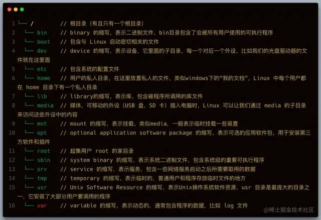
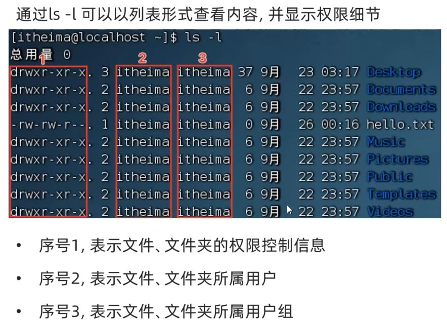
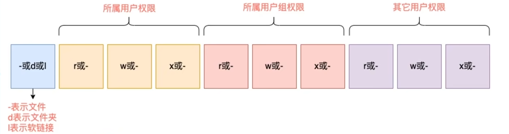
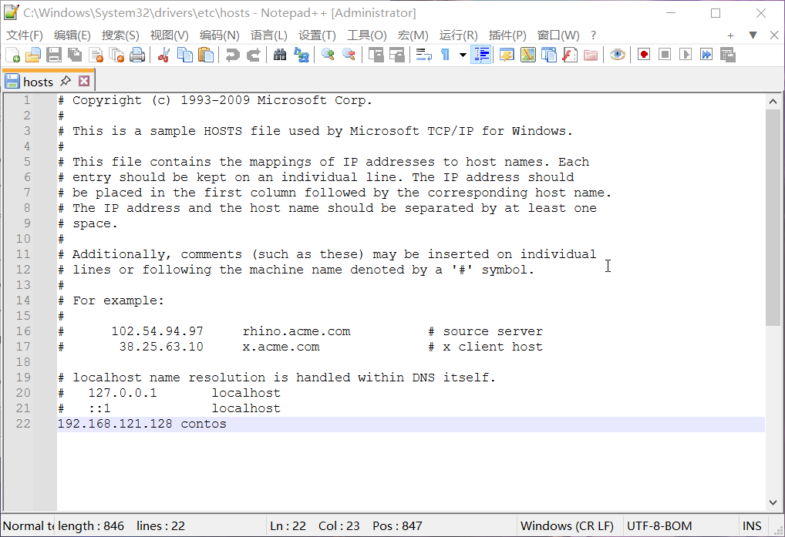
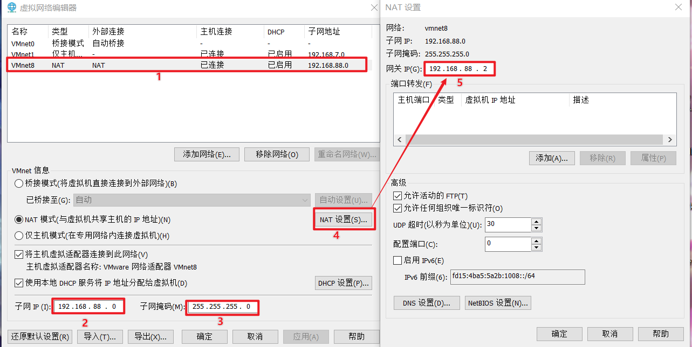
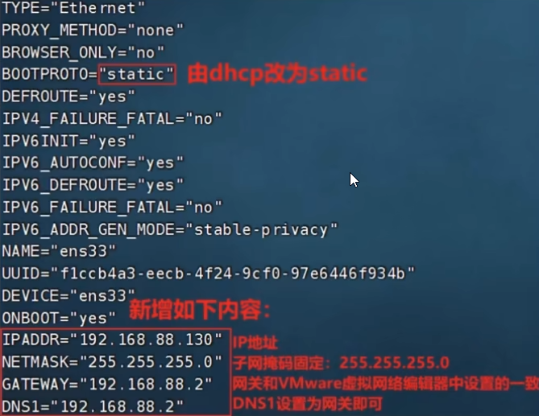
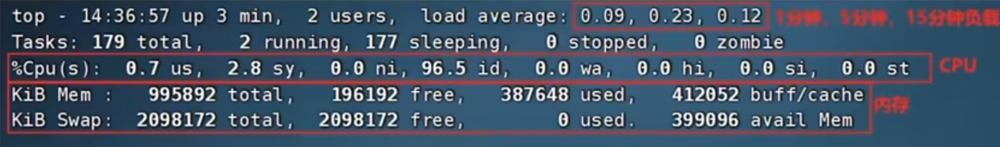
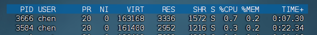
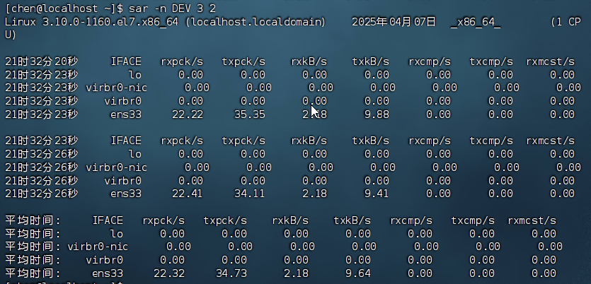

# 预备知识

[Linux入门教程（非常详细）从零基础入门到精通，看完这一篇就够了_linux学习-CSDN博客](https://blog.csdn.net/bigbangbangbang1/article/details/131575669)

## shell

- Shell是一个程序，提供一个与用户对话的环境。这个环境只有一个命令提示符，让用户从键盘输入命令，所以又称为**命令行环境（command line interface，简写为CLI）**。
- Shell是一个命令解释器，解释用户输入的命令。它支持变量、条件判断、循环操作等语法，所以用户可以用Shell命令写出各种小程序，**又称为Shell脚本。**<u>这些脚本都通过Shell的解释执行，而不通过编译。</u>

> Shell这个单词的原意是 “外壳”，跟kernel（内核）相对应，比喻内核外面的一层，即用户跟内核交互的对话界面。
>
> 通过执行`echo $SHELL`命令可以查看到当前正在使用的`Shell`。还可以通过`cat /etc/shells`查看当前系统安装的所有`Shell`种类。

## 命令

```bash
[root@iZm5e8dsxce9ufaic7hi3uZ ~]# pwd  
/root  

命令解析：
	1. root：表示用户名；
	2.iZm5e8dsxce9ufaic7hi3uZ：表示主机名；
	3.~：表示目前所在目录为家目录，其中root用户的家目录是 /root普通用户的家目录在 /home 下；
	4.#：指示你所具有的权限（root用户为# ，普通用户为$ ）。
	5.执行whoami命令可以查看当前用户名；
	6.执行hostname命令可以查看当前主机名；
```

## 文件



-----

# 认识Linux操作系统

## Linux发行版

主要学习**Cent OS** 和 **Ubuntu**

## Linux搭建

1. 安装vm
2. 下载centos镜像文件
3. 安装centos操作系统

[CentOS7(Linux)详细安装教程（手把手图文详解版）-CSDN博客](https://blog.csdn.net/qq_57492774/article/details/131772646)

## 远程连接Linux操作系统

1. **FinallyShell**[下载](https://www.hostbuf.com/)
2. 输入centos操作系统的IP地址进行远程连接，IP可在终端输入==**ifconfig**==查询

## WLS（安装Ubuntu）

[WLS(适用于Windows的Linux子系统)的安装-CSDN博客](https://blog.csdn.net/qq_40371773/article/details/129249529?ops_request_misc=%257B%2522request%255Fid%2522%253A%25224ffd9fafd41a45fcf7862e1ad1fdc600%2522%252C%2522scm%2522%253A%252220140713.130102334..%2522%257D&request_id=4ffd9fafd41a45fcf7862e1ad1fdc600&biz_id=0&utm_medium=distribute.pc_search_result.none-task-blog-2~all~top_click~default-1-129249529-null-null.142^v102^pc_search_result_base3&utm_term=wls&spm=1018.2226.3001.4187)

## vm快照--保存当前环境

[VMware虚拟机快照与恢复_vmware快照-CSDN博客](https://blog.csdn.net/sleepren/article/details/142924048?ops_request_misc=%257B%2522request%255Fid%2522%253A%25229134850db22b544889de7e04953d533f%2522%252C%2522scm%2522%253A%252220140713.130102334..%2522%257D&request_id=9134850db22b544889de7e04953d533f&biz_id=0&utm_medium=distribute.pc_search_result.none-task-blog-2~all~sobaiduend~default-1-142924048-null-null.142^v102^pc_search_result_base3&utm_term=vm%E5%BF%AB%E7%85%A7&spm=1018.2226.3001.4187)

# Linux操作命令

## 简单命令

### 1.命令基础格式

> `command [-options] [parameter]`
>
> - command：命令
> - -options：[可选] 选项，可以通过选项控制命令的行为**细节**
> - parameter：[可选] 命令参数，多数用于**命令的指向目标**等

### 2.基本命令

#### 1.==ls== 列出目录（工作目录）下的内容

> `ls [-a -l -h] [地址]`
>
> - -a ：all，列出全部文件（包含隐藏文件、文件夹）`.`**开头的文件表示隐藏文件（夹）**
> - -l：列表展示，
> - -h：列出文件大小，和-l一起使用

**补充：**HOME目录与工作目录

Home目录：每个用户在Linux系统的专属目录，默认在：/home/用户名

工作目录：Linux命令行在执行命令的时候，需要一个工作目录，打开终端默认设置工作目录在用户home目录

#### 2.==cd== 切换工作目录

> `cd [路径]`
>
> - 不写参数表示直接回到用户home目录

**补充：**

- `.`表示当前目录
- `..`表示上一级目录
- `~`表示HOME目录

绝对路径：以根目录为起点，`/`开头

相对路径：以当前目录为起点

#### 3.==pwd== 查看当前工作目录

> pwd

#### 4.==mkdir== 创建目录(文件夹)

> `mkdir  [-p] 路径`
>
> - -p 可选，表示自动创建不存在的父目录

#### 5.==touch== 创建文件

> touch 路径

#### 6.==cat== 查看文件内容

> cat 路径

#### 7.==more== 查看文件内容

> more 路径
>
> - 空格翻页
> - `q`退出

#### 8.==cp== 复制文件(夹)

> `cp [-r] 参数1 参数2`
>
> - -r：可选，复制文件夹使用，表示递归
> - 参数1：被复制的文件\或文件夹
> - 参数2：复制去的地方

#### 9.==mv== 移动文件(夹)

> mv  参数1 参数2
>
> - 参数1：被移动文件(夹)
> - 参数2：移动去的地方

#### 10.==rm== 删除文件(夹)

> `rm  [-r -f] 参数1···n`
>
> - -r：用于删除文件夹
> - -f：强制删除（不会弹出提示确认信息）
>   - 普通用户不会弹出提示，root管理员会有提示
> - 参数：要删除的文件或文件夹路径，空格隔开

**补充**：

rm支持通配符`*`做模糊匹配

- `*`匹配任意内容（包含空）
- 例：test*、\*test、\*test\*表示匹配以test开头、结尾、包含内容

#### 11.==which== 查看所使用的命令的程序文件存放位置

#### 12.==fand== 按文件名查找

> `find 起始路径  -name  "被查找文件名"`
>
> `find 起始路径  -size + | -n [KMG]`
>
> 支持通配符
>
> - `+` `_`：表示大于和小于
> - `n`：大小数字
> - KMG：单位

#### 13.==grep== 从文件中过滤关键字过滤文件行

> `grep [-n] 关键字 文件路径`
>
> - -n：可选，结果中显示匹配的行的行号
> - 关键字：带有空格或其他特殊字符使用" "包裹

#### 14.==wc== 数量统计

> `wc [-c -m -l -w] 文件路径`
>
> - -c：统计bytes数量
> - -m：统计字符数量
> - -l：统计行数
> - -w：统计单词数

#### 15.管道符(|)与重定向符(>  \>>)

**管道符**：`|`，将做左边的结果作为右边的输入

**重定向符**：`>`和`>>`，将左侧命令结果**覆盖/追加**写入到符号右侧文件中

#### 16.==echo== 输出指定内容

> echo 输出内容

**注意**：

- 输出内容复杂时使用==" "==包裹
- 输出内容是命令执行结果使用**反引号**(==\` `==)

#### 17.==tail== 查看文件尾部内容

跟踪文件的最新更改

> `tail [-f -mun] 路径`
>
> - -f：持续跟踪
> - -num：查看尾部多少行，**默认10行**

### vi\vim编辑器

#### 1.vi/vim编辑器介绍

vi/vim是visual interface的简称，是Linux中最经典的文本编辑器。
同图形化界面中的文本编辑器一样，vi是命令行下对文本文件进行编辑的绝佳选择。
**vim** 是 vi 的加强版本，兼容 vi 的所有指令，不仅能编辑文本，而且还具有 shell 程序编辑的功能，可以不同颜色的字体来辨别语法的正确性，极大方便了程序的设计和编辑性。

#### 2.三种命令模式

1. **命令模式（Command Mode）**
   - 这是vi/vim启动后的默认模式。
   - 在此模式下，用户可以执行各种编辑命令，如移动光标、删除文本、复制和粘贴等，但不能直接输入文本。
   - 要进入插入模式或替换模式，需要先按相应的命令键（如按`i`进入插入模式，按`R`进入替换模式）。
2. **插入模式（Insert Mode）**
   - 在此模式下，用户可以输入和编辑文本。
   - 要进入插入模式，通常需要在命令模式下按下`i`（插入到光标前）、`a`（插入到光标后）、`o`（在光标所在行的下一行插入新行）或`O`（在光标所在行的上一行插入新行）等键。
   - 在插入模式下，按`Esc`键可以返回到命令模式。
3. **末行模式（Last Line Mode）**
   - 也称为扩展命令模式或冒号模式。
   - 在命令模式下输入`:`（冒号）可以进入末行模式。
   - 在此模式下，用户可以输入各种扩展命令，如保存文件（`:w`）、退出编辑器（`:q`）、查找和替换文本（`:s`）等。
   - 执行完命令后，按`Enter`键，vi/vim会执行相应的操作并返回到命令模式。

#### 3.创建文件

> vi  文件名
>
> vin  文件名

#### 4.命令模式快捷键

根据提供的信息，我们可以将vi/vim编辑器的功能分为几个类别，并为每个类别创建一个表格。以下是按照功能分类建立的表格：

##### 进入输入模式

| 模式     | 命令 | 描述                                    |
| -------- | ---- | --------------------------------------- |
| 命令模式 | i    | 在当前光标位置进入**输入模式**          |
| 命令模式 | a    | 在当前光标位置之后进入**输入模式**      |
| 命令模式 | I    | 在当前行的开头，进入**输入模式**        |
| 命令模式 | A    | 在当前行的结尾，进入**输入模式**        |
| 命令模式 | o    | 在当前光标下一行进入**输入模式**        |
| 命令模式 | O    | 在当前光标上一行进入**输入模式**        |
| 输入模式 | esc  | 任何情况下输入 **esc** 都能回到命令模式 |

##### 光标移动

| 快捷键 | 功能描述                     |
| ------ | ---------------------------- |
| h      | 向左移动光标一个字符         |
| l      | 向右移动光标一个字符         |
| j      | 向下移动光标一行             |
| k      | 向上移动光标一行             |
| 0      | 移动到行首                   |
| ^      | 移动到行首的第一个非空白字符 |
| $      | 移动到行尾                   |
| w      | 移动到下一个单词的开头       |
| b      | 移动到上一个单词的开头       |
| e      | 移动到当前单词的末尾         |
| G      | 移动到文件的末尾             |
| gg     | 移动到文件的开头             |
| nG     | 移动到第n行                  |
| %      | 跳转到匹配的括号             |
##### 文本滚动
| 快捷键 | 功能描述     |
| ------ | ------------ |
| Ctrl+f | 向前滚动一页 |
| Ctrl+b | 向后滚动一页 |
| Ctrl+d | 向前滚动半页 |
| Ctrl+u | 向后滚动半页 |
##### 文本编辑
| 快捷键 | 功能描述         |
| ------ | ---------------- |
| yy     | 复制当前行       |
| yank   | 复制选中的文本   |
| p      | 在光标后粘贴     |
| P      | 在光标前粘贴     |
| dd     | 删除当前行       |
| d      | 删除选中的文本   |
| x      | 删除光标所在字符 |
| X      | 删除光标前的字符 |
| u      | 撤销最近的更改   |
| Ctrl+r | 重做撤销的操作   |
##### 搜索和替换
| 快捷键         | 功能描述                     |
| -------------- | ---------------------------- |
| ==/==pattern   | 向下搜索pattern              |
| ==?==pattern   | 向上搜索pattern              |
| n              | 查找下一个匹配项             |
| N              | 查找上一个匹配项             |
| ==:s==/old/new | 替换当前行的第一个old为new   |
| :s/old/new/g   | 替换当前行的所有old为new     |
| :%s/old/new/g  | 替换整个文件中的所有old为new |
##### 保存和退出
| 快捷键 | 功能描述                       |
| ------ | ------------------------------ |
| ZZ     | 保存并退出                     |
| :w     | 保存文件                       |
| :q     | 退出vi/vim（如果未做更改）     |
| :q!    | 强制退出vi/vim（放弃所有更改） |
| :wq    | 保存并退出                     |
##### 底线命令模式

| 快捷键     | 功能描述     |
| ---------- | ------------ |
| :set nu    | 显示行号     |
| :set paste | 设置粘贴模式 |

## 用户和权限

- root用户拥有最大的系统操作权限


- 普通用户权限，一般在HOME目录内是不受限的，其他地方一般只有只读和执行

### ==su== 切换用户

> `su [-] [用户名]`
>
> - `-`：可选，是否在切换用户后加载环境变量
> - 用户默认root

### ==sudo==

在我们得知root密码的时候,可以通过su命令切换到root得到最大权限。但是我们不建议长期使用root用户,避免带来系统损坏。

我们**可以使用sudo命令,为普通的命令授权,临时以root身份执行。**

> `sudo  其他命令`

- 在其它命令之前,带上sudo,即可为这一条命令临时赋予root授权
- 但是并不是所有的用户,都有权利使用sudo,我们需要为普通用户配置sudo认证

> 为普通用户配置sudo认证
>
> - **切换到root用户**，执行**visudo**命令，会自动通过vi编辑器打开：/etc/sudoers
> - 在文件的最后添加：**your_username    ALL=(ALL)         NOPASSWD: ALL**
>     - 其中最后的NOPASSWD:ALL表示使用sudo命令，无需输入密码
> - 最后通过 wq 保存

### 用户与用户组

#### 用户组管理

以下命令需root用户执行
• 创建用户组

> `groupadd 用户组名`

• 删除用户组

> `groupdel 用户组名`

#### 用户管理

以下命令需 root 用户执行
• 创建用户

> `useradd [-g -d] 用户名`
>
> - -g ：指定用户的组，**不指定-g，会创建同名组并自动加入**，指定-g 需要组已经存在**，如已存在同名组，必须使用-g**
> - -d： 指定用户 HOME 路径，不指定，HOME 目录**默认在：/home/用户名**

• 删除用户

> `userdel [-r] 用户名`
>
> - -r：删除用户的 HOME 目录，不使用-r，删除用户时，HOME 目录保留

• 查看用户所属组

> `id [用户名]`
>
> 参数：用户名，被查看的用户，如果**不提供则查看自身**

• 修改用户所属组

> `usermod -aG `用户组 用户名，将指定用户添加到指定用户组

**补充：**

使用getent命令可查看当前系统中有哪些用户\用户组

- 查看用户

> `getent passwd`

结果组成：

用户名:密码(x):用户ID:组ID:描述信息(无用):HOME目录:执行终端(默认bash)

- 查看用户组

> `gentent group`

结果组成：

组名称:组认证(显示为x):组ID

### 权限信息



#### 权限细节（10个槽）



**rwx：**

r表示读权限  
w表示写权限  
x表示执行权限  
针对文件、文件夹的不同，rwx的含义有细微差别  

- r, 针对文件可以查看文件内容  
  - 针对文件夹，可以查看文件夹内容，如ls命令  
- w, 针对文件表示可以修改此文件  
  - 针对文件夹，可以在文件夹内：创建、删除、改名等操作  
- x, 针对文件表示可以将文件作为程序执行  
  - 针对文件夹，表示可以更改工作目录到此文件夹，即cd进入  

#### ==chmod== 修改权限

我们可以使用chmod命令，修改文件、文件夹的权限信息。
**注意：只有文件、文件夹的所属用户或root用户可以修改。**

> `chmod [-R]` 权限 文件或文件夹
>
> - 选项: -R, 对**文件夹内的全部内容**应用同样的操作

示例：

> chmod u=rwx,g=rx,o=x hello.txt，将文件权限修改为：rwxr-x--x

其中：u表示user所属用户权限，g表示group组权限，o表示other其它用户权限

> chmod -R u=rwx,g=rx,o=x test，将文件夹test以及文件夹内全部内容权限设置为：rwxr-x--x

#### 权限的数字序号

权限可以用3位数字来代表，第一位数字表示用户权限，第二位表示用户组权限，第三位表示其它用户权限。

数字的细节如下：**r记为4，w记为2，x记为1**，

| 数字 | 用户权限 | 用户组权限 | 其他用户权限 |     权限表示     |
| :--: | :------: | :--------: | :----------: | :--------------: |
|  0   |   ---    |    ---     |     ---      |    无任何权限    |
|  1   |   --x    |    --x     |     --x      |   仅有执行权限   |
|  2   |   -w-    |    -w-     |     -w-      |   仅有写入权限   |
|  3   |   -wx    |    -wx     |     -wx      | 有写入和执行权限 |
|  4   |   r--    |    r--     |     r--      |   仅有读取权限   |
|  5   |   r-x    |    r-x     |     r-x      | 有读取和执行权限 |
|  6   |   rw-    |    rw-     |     rw-      | 有读取和写入权限 |
|  7   |   rwx    |    rwx     |     rwx      |    有全部权限    |
#### ==chown== 修改所属用户(组)

使用chown命令, 可以修改文件、文件夹的所属用户和用户组
普通用户无法修改所属为其它用户或组, 所以**此命令只适用于root用户执行**

> ` chown [-R] [用户] [:] [用户组] `  文件或文件夹
>
> - 选项, -R, 同chmod, 对文件夹内全部内容应用相同规则
> - 选项, 用户, 修改所属用户
> - 选项, 用户组, 修改所属用户组
> - `:` 用于分隔用户和用户组

# Linux实用操作

## 快捷键

### ctrl + C 强制停止

1. Linux**某些程序的运行**，如果想要强制停止它，可以使用快捷键ctrl + c

> [itheima@localhost ~]$ tail
>
> ^C
> [theima@localhost ~]$

2. **命令输入错误**，也可以通过快捷键ctrl + c，退出当前输入，重新输入

> [theima@localhost ~]$ cd /a/b/c/d/e^C
>
> [theima@localhost ~]$

### ctrl + d 推出或登出

1. 退出账户登录
2. 退出某些特定程序专属页面，如python
3. 不能用于退出vi/vim

### 历史命令搜索

#### ==history==查询历史命令

查看历史输入过的命令，可配合管道、grep命令使用

#### ==!==命令前缀，自动执行上次匹配前缀命令

#### ==ctrl + r==输入内容去匹配历史命令

### 光标移动快捷键

ctrl + a, 跳到命令开头
ctrl + e, 跳到命令结尾
ctrl + 键盘左键, 向左跳一个单词
ctrl + 键盘右键, 向右跳一个单词

### 清屏（ctrl + l / clear）

## 安装软件

### ==yum==命令

yum: RPM包软件管理器，用于自动化安装配置Linux软件，并可以自动解决依赖问题。

> `yum [-y] [install | remove | search]` 软件名称
>
> - 选项：-y，自动确认，无需手动确认安装或卸载过程
> - install: 安装
> - remove: 卸载
> - search: 搜索

**注：**yum命令需要**root权限**哦，可以su切换到root，或使用sudo提权。
yum命令需要**联网**

例子：

```bath
1.通过yum命令安装wget程序
	yum [-y] install wget
	
2.通过yum命令卸载wget命令
	yum [-y] remove wget

3.通过yum命令，搜索是否有wget安装包
	yum search wget
```

### ==apt==命令 - 扩展  

前面学习的各类Linux命令，都是通用的。但是软件安装，CentOS系统和Ubuntu是使用不同的包管理器。CentOS使用yum管理器，Ubuntu使用apt管理器  
通过前面学习的WSL环境，我们可以得到Ubuntu运行环境。

> `apt [-y][install | remove | search] `软件名称  

用法和yum一致，同样需要root权限  

- apt install wget, 安装wget  
- apt remove wget, 移除wget  
- apt search wget, 搜索wget  

## systemctl命令

Linux系统很多软件（内置或第三方）均支持使用systemctl命令控制:启动、停止、开机自启
能够被systemctl管理的软件，一般也称之为:服务

>  `systemctl start | stop | status | enable | disable 服务名`
>
> •start 启动
> •stop 关闭
> •status 查看状态
> •enable 开启开机自启
> •disable 关闭开机自启

系统内置的服务比较多，比如:

- NetworkManager,主网络服务
- network,副网络服务
- firewalld,防火墙服务
- sshd,ssh服务(FinalShell远程登录Linux使用的就是这个服务)

除了内置的服务以外，部分第三方软件安装后也可以以systemctl进行控制。

- `yum install -y ntp`，安装ntp软件  
  可以通过ntpd服务名，配合systemctl进行控制  
- `yum install -y httpd`，安装apache服务器软件  
  可以通过httpd服务名，配合systemctl进行控制  
  部分软件安装后没有自动集成到systemctl中，我们可以手动添加。

## 软连接

### ==ln==命令创建软连接

在系统中创建软链接，可以将文件、文件夹链接到其它位置。类似Windows系统中的《快捷方式》

> `ln -s 参数1 参数2`
>
> - -s选项，创建软连接  
> - 参数1:被链接的文件或文件夹  
> - 参数2:要链接去的目的地  

## 日期、时区

### ==date==命令

通过date命令可以在命令行中查看系统的时间

> `date [-d] [+格式化字符串]`
>
> -d 按照给定的字符串显示日期，一般用于日期计算

格式化字符串：通过特定的字符串标记，来控制显示的日期格式

-  %Y 年  
- %y 年份后两位数字（00..99）  
- %M 月份（01.12）  
-  %d 日（01.31）  
-  %H 小时（00.23）  
-  %M 分钟（00.59）  
-  %S 秒（00.60）  
-  %s 自1970-01-01 00:00:00 UTC 到现在的秒数  

date命令进行日期加减  
-d选项,可以按照给定的字符串显示日期,一般用于日期计算  
date -d "+1 day" +%Y%m%d # 显示后一天的日期  
date -d "-1 day" +%Y%m%d # 显示前一天的日期  
date -d "-1 month" +%Y%m%d # 显示上一月的日期  
date -d "+1 month" +%Y%m%d # 显示下一月的日期  
date -d "-1 year" +%Y%m%d # 显示前一年的日期  
date -d "+1 year" +%Y%m%d # 显示下一年的日期  
其中支持的时间标记为:
year年   
month月    
day天   
hour小时   
minute分钟   
second秒   
-d选项可以和 格式化字符串配合一起使用

### 修改时区

1. 使用root权限，执行如下命令，修改时区为东八区时区

   > rm -f /etc/localtime
   >
   > sudo ln -s /usr/share/zoneinfo/Asia/Shanghai /etc/localtime


2. 将系统自带的localtime文件删除，并将/usr/share/zoneinfo/Asia/Shanghai文件链接为localtime文件即可

### 自动校准

#### ==ntp==程序

我们可以通过ntp程序**自动校准**系统时间

1. 安装ntp:

   > yum -y install ntp

2. 启动并设置开机自启:

   > systemctl start ntpd
   > systemctl enable ntpd

当ntpd启动后会定期的帮助我们联网校准系统的时间

也可以**手动校准**（需root权限）: ntpdate -u ntp.aliyun.com
通过阿里云提供的服务网址配合ntpdate（安装ntp后会附带这个命令）命令自动校准
[root@bogon ~]# ntpdate -u ntp.aliyun.com
8 Oct 15:59:21 ntpdate[18492]: adjust time server 203.107.6.88 offset -0.009122 sec

## IP地址、主机名

### IP地址

每一台联网的电脑都会有一个地址，用于和其它计算机进行通讯
IP地址主要有2个版本，V4版本和V6版本

IPv4版本的地址格式是：a.b.c.d 其中abcd表示0~255的数字，如192.168.88.101就是一个标准的IP地址**。

可以通过命令：ifconfig, 查看本机的ip地址，如无法使用ifconfig命令，可以安装：yum -y install net-tools

### 主机名

| 命令                            | 作用               |
| ------------------------------- | ------------------ |
| hostname                        | 查看主机名         |
| hostnamectl set-hostname 主机名 | 修改主机名(需root) |

### 域名解析(主机名映射)

通过主机名找到对应计算机IP地址。

1. 先在本机记录中查找
   windows：C:\Windows\System32\drivers\etc\hosts
   linux：/etc/hosts
2. 联网在DNS服务器上询问，如114.114.114.114

在本机记录中添加Linux主机名映射



设置静态IP

1. VMware中配置IP地址网关和网段
   
2. Linux中**root**编辑<u>/etc/sysconfig/network-scripts/ifcfg-ens33</u>文件
   
   执行：systemctl restart network 重启网卡，也可以先关闭后打开（stop->start）

## 网络传输

### ==ping==命令

可以通过ping命令,检查指定的网络服务器是否是可联通状态

> ping [-c num] ip或主机名
>
> 选项: -c, 检查的次数, 不使用-c选项, 将无限次数持续检查
> 参数: ip或主机名, 被检查的服务器的ip地址或主机名地址

### ==wget==命令

wget是非交互式的文件下载器，可以在命令行内下载网络文件

> wget [-b] url
>
> 选项：-b，可选，后台下载，会将日志写入到当前工作目录的wget-log文件
> 参数：url，下载链接

可以通过`tail -f wget-log`监控后台下载速度

### ==cutl==命令

curl可以发送http网络请求，可用于：下载文件、获取信息等

> curl [-O] url
>
> 选项：-O，用于下载文件，当url是下载链接时，可以使用此选项保存文件
> 参数：url，要发起请求的网络地址

### 端口

#### 什么是端口

端口，是设备与外界通讯交流的出入口。端口可以分为：物理端口和虚拟端口两类
物理端口：又可称之为接口，是可见的端口，如USB接口，RJ45网口，HDMI、DP、VGA端口等
虚拟端口：是指计算机内部的端口，是不可见的，是用来操作系统和外部进行交互使用的

#### 端口的划分

- 公认端口：1~1023，用于系统内置或常用知名软件绑定使用，如SSH服务的22端口，HTTPS服务的443端口非特殊需要，不要占用这个范围的端口
- 注册端口：1024~49151，用于松散绑定使用（用户自定义）
- 动态端口：49152~65535，用于临时使用（多用于出口），通常不会固定绑定程序，而是当程序对外进行网络链接时，用于临时使用

#### 查看端口占用

##### ==nmap==

可以通过Linux命令去查看端口的占用情况

> 1. 使用nmap命令，安装nmap: `yum -y install nmap`
> 2. 查看：`nmap 被查看的IP地址`

##### ==netstart==

可以通过**netstat**命令，查看指定端口的占用情况

> 1. 安装netstat：`yum -y install net-tools`
> 2. 查看：`netstat -anp | grep 端口号`

## 进程管理

程序运行在操作系统中，是被操作系统所管理的。
为管理运行的程序，每一个程序在运行的时候，便被操作系统注册为系统中的一个：进程，并为每一个进程都分配一个独有的：进程ID（进程号）

### ==ps==查看进程

可以通过ps命令查看Linux系统中的进程信息

> ps [-e -f]
>
> 选项：-e，显示出全部的进程
> 选项：-f，以完全格式化的形式展示信息（展示全部信息）

一般来说，固定用法就是：ps -ef 列出全部进程的全部信息

显示结果含义从左到右分别是：

- UID：进程所属的用户ID  
- PID：进程的进程号ID  
- PPID：进程的父ID（启动此进程的其它进程）
- C：此进程的CPU占用率（百分比）
- STIME：进程的启动时间
- TTY：启动此进程的终端序号，如显示？，表示非终端启动
- TIME：进程占用CPU的时间
- CMD：进程对应的名称或启动路径或启动命令

### ==kill==杀死进程

> `kill [-9] 进程ID`
>
> -9表示强制关闭

## 主机状态

### ==top==查看cpu资源占用

可以通过top命令查看CPU、内存使用情况，类似windos的任务管理器，默认每5秒刷新一次

>top
>
>q 或Ctrl + C退出

top命令也支持选项:

| 选项 | 功能                                                         |
| ---- | ------------------------------------------------------------ |
| -p   | 只显示某个进程的信息                                         |
| -d   | 设置刷新时间，默认是5s                                       |
| -c   | 显示产生进程的完整命令，默认是进程名                         |
| -n   | 指定刷新次数，比如 top -n 3，刷新输出3次后退出               |
| -b   | 以非交互非全屏模式运行，以批次的方式执行top，一般配合-n指定输出几次统计信息，将输出重定向到文件，比如 top -b -n 3 > /tmp/top.tmp |
| -i   | 不显示任何闲置(idle)或无用(zombie)的进程                     |
| -u   | 查找特定用户启动的进程                                       |

### top命令内容



> - 第一行：`top - 14:39:58 up 6 min, 2 users, load average: 0.06, 0.17, 0.13`
>   **top**：命令名称，**14:39:58**：当前系统时间，**up 6 min**：启动了6分钟，2 **users**：2个用户登录，**load**：1、5、15分钟负载
> - 第二行：`Tasks: 175 total, 1 running, 174 sleeping, 0 stopped, 0 zombie`
>   **Tasks**：175个进程，**1 running**：1个进程子在运行，**174 sleeping**：174个进程睡眠，0个停止进程，0个僵尸进程
> - 第三行：`%Cpu(s): 0.3 us, 1.4 sy, 0.0 ni, 98.3 id, 0.0 wa, 0.0 hi, 0.0 si, 0.0 st`
>   **%Cpu(s)**：CPU使用率，**us**：用户CPU使用率，**sy**：系统CPU使用率，**ni**：高优先级进程占用CPU时间百分比，**id**：空闲CPU率，**wa**：IO等待CPU占用率，**hi**：CPU硬件中断率，**si**：CPU软件中断率，**st**：强制等待占用CPU率
> - 第四、五行：`KiB Mem : 995892 total, 187672 free, 394912 used, 413308 buff/cache KiB Swap: 2098172 total, 2098172 free, 0 used, 391852 avail Mem`
>   **KiB Mem**：物理内存，**total**：总量，**free**：空闲，**used**：使用，**buff/cache**：buff和cache占用
>   **KiB Swap**：虚拟内存（交换空间），**total**：总量，**free**：空闲，**used**：使用，**buff/cache**：buff和cache占用



> **PID**：进程id
> **USER**：进程所属用户
> **PR**：进程优先级，越小越高
> **NI**：负值表示高优先级，正表示低优先级
> **VIRT**：进程使用虚拟内存，单位KB
> **RES**：进程使用物理内存，单位KB
> **SHR**：进程使用共享内存，单位KB
> **S**：进程状态（S休眠，R运行，Z僵死状态，N负数优先级，I空闲状态）
> **%CPU**：进程占用CPU率
> **%MEM**：进程占用内存率
> **TIME+**：进程使用CPU时间总计，单位10毫秒
> **COMMAND**：进程的命令或名称或程序文件路径

### 磁盘信息监控

#### ==df==命令 

可以查看硬盘的使用情况

> df [-h]
>
> 选项：-h，以更加人性化的单位显示

#### ==iostat==

查看CPU、磁盘的相关信息

> `iostat [-x] [num1] [num2]`
>
> 选项：-x，显示更多信息
> num1：数字，刷新间隔，num2：数字，刷新几次

“TPS”通常指的是“每秒传输次数”（Transfers Per Second）。这是iostat命令输出的一个常见指标，用于衡量磁盘I/O活动。具体来说，TPS表示在一秒钟内磁盘进行读和写操作的次数总和。这个指标可以帮助管理员了解磁盘的工作负载情况，从而评估系统的性能和瓶颈。

### 网络状态监控

可以使用sar命令查看网络的相关统计（sar命令非常复杂，这里仅简单用于统计网络）

> sar -n DEV num1 num2
>
> 选项：-n，查看网络，DEV表示查看网络接口
> num1：刷新间隔（不填就查看一次结束），num2：查看次数（不填无限次数）



> IFACE 本地网卡接口的名称
> rxpck/s 每秒钟接受的数据包
> txpck/s 每秒钟发送的数据包
> rxKB/S 每秒钟接受的数据包大小，单位为KB
> txKB/S 每秒钟发送的数据包大小，单位为KB
> rxcimp/s 每秒钟接受的压缩数据包
> txcimp/s 每秒钟发送的压缩包
> rxmcast/s 每秒钟接收的多播数据包

## 环境变量

1. ### 什么是环境变量？  

  环境变量是一组信息记录, 类型是KeyValue型(名称=值), 用于操作系统运行的时候记录关键信息  
2. ### 通过==env==命令可以查看当前系统配置的环境变量信息  
3. ### 通过==$==符号, 可以取出环境变量的值  
4. ### 什么是PATH, 作用是?  

  环境变量PATH会记录一组目录, 目录之间用`:`隔开。这里记录的是命令的搜索路径, 当执行命令会从记录中记录的目录中挨个搜索要执行的命令并执行。可以通过修改这个项目的值, 加入自定义的命令搜索路径如**export PATH=$PATH:自定义路径**  
5. ### 如何修改环境变量?  
- 临时生效: export 名称=值  
- 永久生效:
    - 针对用户: **~/.bashrc**文件中配置
    - 针对全部用户: **/etc/profile**文件中配置
    - 配置完成, 可以通过**source**命令立刻生效  

## 上传和下载

1. ### 直接拖拽

2. ### rz、sz命令

   - 安装命令`yum -y install lrzsz`
   - rz文件上传
   - sz文件下载

## 压缩和解压

市面上有非常多的压缩格式
zip 格式: Linux、Windows、MacOS，常用
7zip: Windows 系统常用
rar: Windows 系统常用
tar: Linux、MacOS 常用
gzip: Linux、MacOS 常用
在 Windows 系统中常用的软件如: winrar、bandizip等软件，都支持各类常见的压缩格式，这里不多做讨论。
我们现在要学习，如何在 Linux 系统中操作: tar、gzip、zip 这三种压缩格式完成文件的压缩、解压操作。

### ==tar==命令

- **==.tar==**, 称之为tarball, 归档文件, 即简单的将文件组装到一个.tar的文件内, 并没有太多文件体积的减少, 仅仅是**简单的封装**
- **==.gz==**, 也常见为**.tar.gz, gzip**格式压缩文件, 即使用gzip压缩算法将文件压缩到一个文件内, 可以**极大的减少压缩后的体积**

针对这两种格式, 使用tar命令均可以进行压缩和解压缩的操作

> `tar [-c -v -x -f -z -C] 参数1 参数2 ... 参数N`
>
> - -c, 创建压缩文件, 用于压缩模式
> - -v, 显示压缩、解压过程, 用于查看进度
> - -x, 解压模式
> - -f, 要创建的文件, 或要解压的文件, -f选项必须在所有选项中位置处于最后一个
> - -z, gzip模式, 不使用-z就是普通的tarball格式
> - -C, 选择解压的目的地, 用于解压模式
>   它是一个叫归档的文件

#### tar的压缩常用组合

- ==-cvf==
  `tar -cvf test.tar 1.txt 2.txt 3.txt  `
  将1.txt 2.txt 3.txt 压缩到test.tar文件内
- ==-zcvf==
  `tar -zcvf test.tar.gz 1.txt 2.txt 3.txt  `
  将1.txt 2.txt 3.txt 压缩到test.tar.gz文件内，使用gzip模式

**注意**：

- -z选项如果使用的话，一般处于选项位第一个
- -f选项，**必须**在选项位最后一个

#### 常用的tar解压组合有

- ==-xvf==
  `tar -xvf test.tar  `
  解压test.tar, 将文件解压至当前目录  

- ==-xvf==
  `tar -xvf test.tar -C /home/itheima`
    解压test.tar, 将文件解压至**指定目录**（/home/itheima）  

- ==-zxvf==
  ` tar -zxvf test.tar.gz -C /home/itheima`

    以**Gzip**模式解压test.tar.gz, 将文件解压至指定目录（/home/itheima）

**注意**：

-  -f选项，必须在选项组合体的最后一位
-  -z选项，建议在开头位置
- -C选项单独使用，和解压所需的其它参数分开

### ==zip==命令

#### zip 命令压缩文件

可以使用 zip 命令, 压缩文件为 zip 压缩包

> `zip [-r] 参数1 参数2 ... 参数N`
>
>  -r, **被压缩的包含文件夹**的时候, 需要使用-r选项, 和rm、cp等命令的-r效果一致

#### unzip 命令解压文件

使用 unzip 命令，可以方便的解压 zip 压缩包

> `unzip [-d] 参数`
>
> -d，指定要解压去的位置，同 tar 的-C 选项
> 参数，被解压的 zip 压缩包文件


# 关于Linux的相关问题

1. Linux操作系统为什么要选择命令行形式？
   - 图形化页面不好用且不稳定
   - 使用命令行更高效且稳定、资源占用低
   - 企业和开发者都选择命令行


## 下载镜像源

```shell
1.mirrorlist.centos.org替换为国内可以访问的镜像源。
curl -o /etc/yum.repos.d/CentOS-Base.repo http://mirrors.aliyun.com/repo/Centos-7.repo

2.然后再清除yum缓存
yum clean all

3.然后重新生成缓存
yum makecache
```


