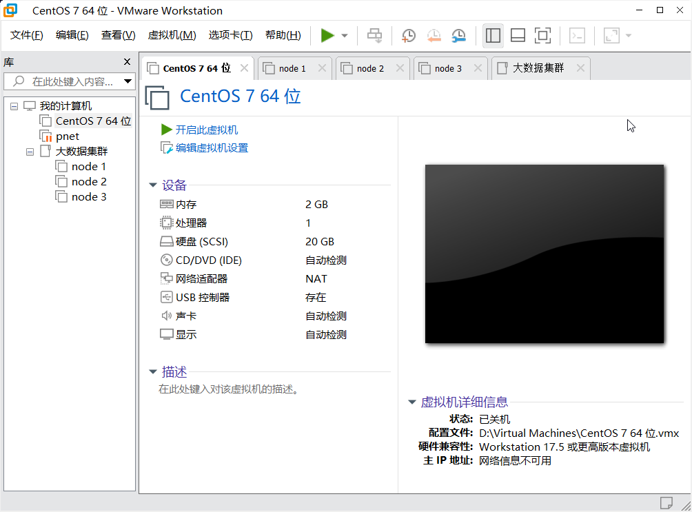
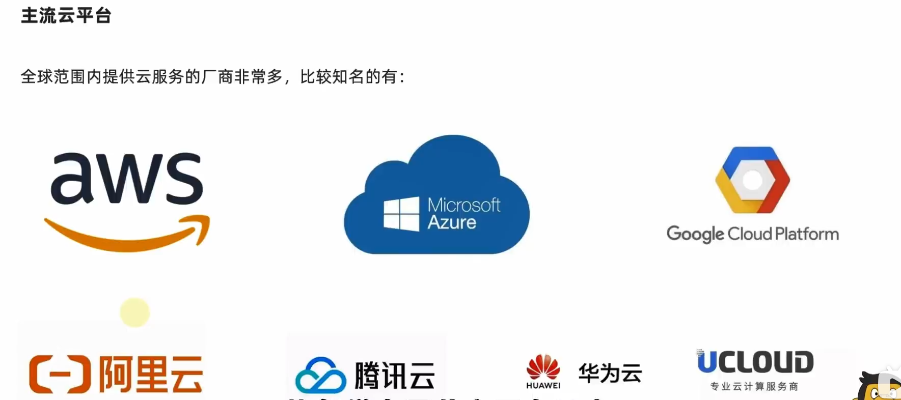
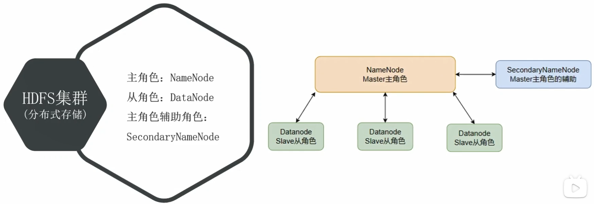
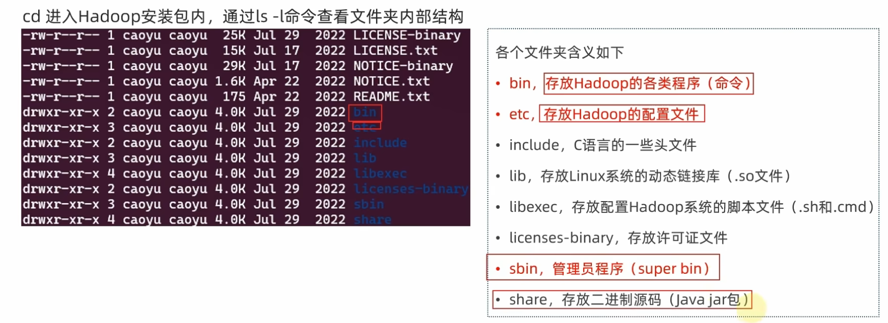

大数据

## 前期准备

### 虚拟机创建

Linux系统版本：centOS 7

| 节点   | CPU(核心) | 内存(GB) |
| ------ | --------- | -------- |
| node 1 | 1         | 4        |
| node 2 | 1         | 2        |
| node 3 | 1         | 2        |



### 主机名、IP、SSH免密登录

#### 1.配置固定IP地址

开启node1，修改主机名为node1，并修改固定ip为：192.168.88.131

```bash
 # 修改主机名
 hostnamectl set-hostname node1

 # 修改IP地址
 vim /etc/sysconfig/network-scripts/ifcfg-ens33
IPADDR="192.168.88.131"

# 重启网卡
systemctl stop network
systemctl start network
# 或者直接
systemctl restart network

同样的操作启动node2和node3,
修改node2主机名为node2，设置ip为192.168.88.132
修改node2主机名为node3，设置ip为192.168.88.133
```

#### 2.配置主机名映射

1. 在Windows系统中修改hosts文件，末尾添加如下内容：
   路径`C:\Windows\System32\drivers\etc`
```
192.168.88.131 node1
192.168.88.132 node2
192.168.88.133 node3
```
2. 在3台Linux的`/etc/hosts`文件中，填入如下内容（3台都要添加）：
```
192.168.88.131 node1
192.168.88.132 node2
192.168.88.133 node3
```
#### 3.配置SSH免密登录

后续安装的集群化软件，多数需要远程登录以及远程执行命令，我们可以简单起见，配置三台Linux服务器之间的免密码互相SSH登陆。

1. 在每一台机器都执行: `ssh-keygen -t rsa -b 4096`, 一路回车到底即可
2. 在每一台机器都执行:
```
1 ssh-copy-id node1
2 ssh-copy-id node2
3 ssh-copy-id node3
```
3. 执行完毕后, node1、node2、node3之间将完成root用户之间的免密互通

#### 4.创建hadoop用户并配置免密登录

后续大数据的软件，将不会以**root**用户启动（确保安全，养成良好的习惯）。
我们为大数据的软件创建一个单独的用户hadoop，并为三台服务器同样配置hadoop用户的免密互通

1. 在每一台机器执行：`useradd hadoop`，创建hadoop用户
2. 在每一台机器执行：`passwd hadoop`，设置hadoop用户密码为123456
3. 在每一台机器均**切换到hadoop用户**：`su - hadoop`，并执行`ssh-keygen -t rsa -b 4096`，创建ssh密钥
4. 在每一台机器均执行
```
ssh-copy-id node1
ssh-copy-id node2
ssh-copy-id node3
```

### JDK部署

下载：https://www.oracle.com/java/technologies/javase/javase8u211-later-archive-downloads.html

配置JDK环境

1.  创建文件夹，用来部署JDK，将JDK和Tomcat都安装部署到：/export/server 内  

   ``` bash
   mkdir -p /export/server 
   ```

2.  解压缩JDK安装文件  

   ```bash
   tar -zxvf jdk-8u351-linux-x64.tar.gz -C /export/server 
   ```

3.  配置JDK的软链接  

   ```bash
   ln -s /export/server/jdk1.8.0_351 /export/server/jdk  
   ```

4.  配置JAVA_HOME环境变量，以及将$JAVA_HOME/bin文件夹加入PATH环境变量中  

   ```bash
   编辑/etc/profile文件
   export JAVA_HOME=/export/server/jdk  
   export PATH=$PATH:$JAVA_HOME/bin  
   ```

5. 生效环境变量

   ```bash
   source /etc/profile
   ```

6. 配置java执行程序的软链接

   ```bash
   删除系统自带的java程序
   rm -f /usr/bin/java
   # 软链接我们自己安装的java程序
   ln -s /export/server/jdk/bin/java /usr/bin/java
   ```


7. 执行验证

   ```bash
   java -version
   javac -version
   ```


### 防火墙、SELinux、时间同步等系统设置

1. 关闭防火墙和SELinux
   集群化软件之间需要通过端口互相通讯，为了避免出现网络不通的问题，我们可以简单的在集群内部关闭防火墙。

   ```bash
   在每一台机器都执行：
   systemctl stop firewalld
   systemctl disable firewalld
   ```

   Linux有一个安全模块：SELinux，用以限制用户和程序的相关权限，来确保系统的安全稳定。在当前，我们只需要关闭SELinux功能，避免导致后面的软件运行出现问题即可

   ```bash
   在每一台机器都执行：
   vim /etc/sysconfig/selinux

   将第七行，SELINUX=enforcing 改为 SELINUX=disabled

   init 6
   保存退出后，重启虚拟机即可，千万要注意disabled单词不要写错，不然无法启动系统 

   systemctl status firewalld
   ```

   2. 修改时区并配置自动时间同步

      ```bash
      1. 以下操作在三台Linux均执行
      安装ntp软件
      yum install -y ntp

      2.更新时区
      rm -f /etc/localtime; sudo ln -s /usr/share/zoneinfo/Asia/Shanghai /etc/localtime

      3.同步时间
      ntpd -u ntp.aliyun.com

      4.开启ntp服务并设置开机自启
      systemctl start ntpd
      systemctl enable ntpd
      ```

## 云计算

### 什么是云平台

云平台也称云计算平台。云计算，顾名思义，就是将计算在云上运行。
那么在这里面的3个概念

- 云：通俗的理解就是远程计算机，并且是一组一堆，这些远程计算机协同工作构建出一个平台，对用户提供服务
-  计算：这是一个概念很大的名词，小了说可以认为是对业务数据进行计算的算力，不过通俗意义上，计算是指构建业务系统的各种需求
-  平台：将云（远程硬件资源）和计算（远程软件资源）组合在一起，就形成了一个平台，对用户提供各种各样的服务。

我们可以这样理解，云平台是：一个云上的平台，聚合了一些软硬件资源，为用户提供各种各样的远程服务


### laaS服务(Infrastructure as a Service)

**基础设施即服务**，IaaS见名知意，即将IT基础设施作为服务。

​	IT基础设施是指：

1. 公网IP、带宽

2. VPC（virtual private cloud）私有虚拟局域网

3. 云服务器（CPU、内存、磁盘等计算、存储资源）

   简单来说就是构建一个实体服务器所需的：CPU、内存、磁盘、网络、公网IP、交换机等等一系列物理设备的云上化。
   这些称之为IaaS服务，IT基础设施作为服务对外提供。

### PaaS服务(Platform as a Service)

**平台即服务**

Platform as a Service：平台即服务. 是指将平台作为一种服务对外提供.
那么我们要学习的云平台，就是一种PaaS服务，其他还有如

- 腾讯地图开发平台
- 小程序开发平台
- 云上消息中心平台（Kafka等）
- 云上Hadoop大数据计算平台

### SaaS服务(Software as a Service)

**软件即服务**

Software as a Service: 软件即服务, 是指将软件作为一种服务对外提供.

- 云上数据库服务
- 云上缓存服务
- 云网盘服务
- DNS服务
- 流量高防服务
- 域名托管服务
- 和一切其它非云平台提供的, 如: ProcessON、DrawIO、CSDN博客、邮箱服务、135编辑器、在线Office等

SaaS就是现成可用的软件(可认为是解决方案)提供给你, 你只需要有网络(浏览器或其它客户端)去连接使用即可(可能付费)。无需关心维护、管理等。

## 阿里云示例

### 创建云上虚拟局域网（VPC）

完成账户注册后，即可在阿里云上购买相关的服务搭建大数据集群了。
首先，我们需要为集群准备好在云上的网络。
在云上，每个人都可以得到专属的云上私有局域网，称之为VPC（virtual private cloud）。
它就相当于物理的路由器，可以提供一个子网，并允许我们将所需的资源（服务器、数据库等）放置在这个网络内。

### 安全组sg(security group)

安全组其实就是云上的虚拟流量防火墙。
被安全组绑定的资源（比如服务器），其网络流量的进出都被安全组所控制。
我们可以通过控制安全组的规则，来决定：
资源的流量可以去往什么地方（出站控制）
外部的哪些访问可以连接到资源（入站控制）

# 第一章 大数据简介

## 大数据核心工作：

1. 数据存储
2. 数据计算
3. 数据传输

## 大数据软件生态

### 数据存储

- **Apache Hadoop - HDFS**
  
  Apache Hadoop框架内的组件HDFS是大数据体系中使用**最为广泛的分布式存储技术**


- **Apache HBase**
  
  Apache HBase是大数据体系内使用**非常广泛的NoSQL KV型数据库技术**HBase是基于HDFS之上构建的。
- Apache KUDU
  
  Apache Kudu同样为大数据体系中使用较多的**分布式存储引擎**
- 云平台存储组件
  除此以外，各大云平台厂商也有相应的大数据存储组件，如阿里云的OSS、UCloud的US3、AWS的S3、金山云的KS3等等

### 数据计算

- Apache Hadoop - MapReduce
  
  Apache Hadoop的MapReduce组件是最早一代的大数据分布式计算引擎对大数据的发展做出了卓越的贡献


- Apache Hive
  
  Apache Hive是一款以SQL为主要开发语言的分布式计算框架。其底层使用了Hadoop的MapReduce技术
  Apache Hive至今仍活跃在大数据一线，被许多公司使用。

- Apache Spark
  

  Apache Spark是目前全球范围内最火热的分布式内存计算引擎。 是大数据体系中的明星计算产品

- Apache Flink
  

  Apache Flink同样也是一款明星级的大数据分布式内存计算引擎。特别是在实时计算（流计算）领域，Flink占据了大多数的国内市场。

### 数据传输

- Apache Kafka
  
  Apache Kafka是一款分布式的消息系统，可以完成海量规模的数据传输工作。
  Apache Kafka在大数据领域也是明星产品


- Apache Pulsar
  
  Apache Pulsar同样是一款分布式的消息系统。
  在大数据领域同样有非常多的使用者。


- Apache Flume  
  
  Apache Flume是一款流式数据采集工具，可以从非常多的数据源中完成数据采集传输的任务。  
- Apache Sqoop
    
    Apache Sqoop是一款ETL工具，可以协助大数据体系和关系型数据库之间进行数据传输。  

## Apache Hadoop 概述

​	通常意义上，Hadoop是一个整体，其内部还会细分为三个功能组件，分别是：

- **HDFS组件** 
  HDFS是Hadoop内的分布式存储组件可以构建分布式文件系统用于数据存储  
- **MapReduce组件** 
  MapReduce是Hadoop内分布式计算组件。提供编程接口供用户开发分布式计算程序  
- **YARN组件** 
  YARN是Hadoop内分布式资源调度组件。可供用户整体调度大规模集群的资源使用。

### Hadoop发行版本

Apache开源社区版本 
	http://hadoop.apache.org/ 
商业发行版本   

-  CDH（Cloudera's Distribution, including Apache Hadoop），Cloudera公司出品，目前使用最多的商业版  
-  HDP（Hortonworks Data Platform），Hortonworks公司出品，目前被Cloudera收购  
- 星环，国产商业版，星环公司出品，在国内政企使用较多    

## Hadoop HDFS 分布式文件系统

### 基础架构

#### 去中心化模式

没有明确的中心，众多服务器之间基于特定规则进行同步协调。

#### 中心化模式（主从模式）

大数据框架，大多数的基础架构上，都是符合：中心化模式的。
即：有一个中心节点（服务器）来统筹其它服务器的工作，统一指挥，统一调派，避免混乱。
这种模式，也被称之为：一主多从模式，简称主从模式（Master And Slaves）

### HDFS



**NameNode**

- HDFS系统的主角色，是一个独立的进程   

- 负责管理HDFS整个文件系统    

- 负责管理DataNode  

**SecondaryNameNode**

- NameNode的辅助，是一个独立进程   

- 主要帮助NameNode完成元数据整理工作（打杂）


**DataNode**

- HDFS系统的从角色，是一个独立进程   

- 主要负责数据的存储，即存入数据和取出数据  


### 部署集群

1. [下载Hadoop安装包](https://hadoop.apache.org)

2. 上传 & 解压

   注：node1 上完成以下操作

   1. 上传Hadoop安装包到node1节点中
   2. 解压缩安装包到/export/server/中
      `tar -zxvf hadoop-3.3.4.tar.gz -C /export/server`
   3. 构建软链接
      `cd /export/server`
      `ln -s /export/server/hadoop-3.3.4 hadoop`
   4. 进入hadoop安装包内
      `cd hadoop`




