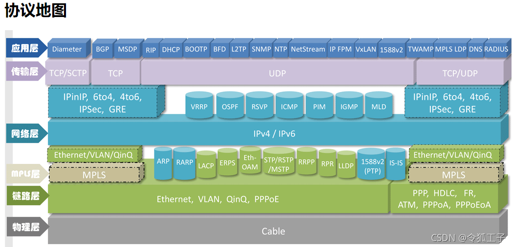

# 1.协议

## 重要协议

[在线学习-华为](https://info.support.huawei.com/info-finder/tool/zh/enterprise/packetformat)

### SNMP

SNMP简单网络管理协议

1. 内容
   1. 在**应用层**进行网络设备间通信的管理协议，可用于网络状态监视、网络参数设定、网络流量统计与分析及发现网络故障等。
   2. SNMP是基于**UDP协议**的非面向连接的协议，由SNMP协议、管理信息库和管理信息结构三部分组成。
   3. 由于SNMP使用UDP协议，因此传输效率较高 but 容易丢失报文。为减少数据丢失风险，建议将每个管理信息封装成单独的数据包并发送，且报文长度不要超过484字节。
   4. SNMP协议实体发**送请求和应答报文**的默认端口号是**UDP 161**，而SNMP代理发送**Trap报文**的默认端口号是**UDP162**。

2. 网络管理系统结构

   1. 管理站（Network Manager）管理站是位于网络系统**主干或者靠近主干**的工作站，是网络管理系统的核心，负责管理代理和信息库，**定期查询代理信息**，**确定独立的网络设备和网络状态是否正常**。

   2. 代理（Agent）代理位于被管理设备。负责收集被管理设备的各种信息和响应管理站的命令或请求，并将其传输到MIB数据库中。**代理设备可以是交换机、服务器、路由器、网关等设备。**

   3. 管理信息库（MIB）。类似于一个**分布式数据库**，**提供有关被管理网络各类系统和设备的信息**。

   4. 网络管理协议（SNMP）通过SNMP协议使管理站和代理之间传递、交互信息。

3. 数据单元

   | 操作             | 描述                                               | 发送站     | 端口                                |
   | :--------------: | :------------------------------------------------: | :--------: | :---------------------------------: |
   | Get-Request      | 从代理进程处提取一个或多个数据项                   | 管理站发送 | 发送端口:UDP161                     |
   | Get-Next-Request | 从代理进程处提取一个或多个当前数据项的下一个数据项 | 管理站发送 | 发送端口:UDP161                     |
   | Set-Request      | 设置代理进程的一个或多个数据项                     | 管理站发送 | 发送端口:UDP161                     |
   | Get-Response     | 返回一个或多个参数值，代理站对前面三种操作的响应   | 代理站发送 | 接收端口:UDP161                     |
   | Trap(SNMP陷阱)   | 当有部分重要事件发生时，代理站主动向管理站发送     | 代理站发送 | 发送端口:随机端口号; 接收端口:UDP162 |

### HDLC

高级链路状态控制

1. 定义：一种快速高效的WAN协议，常用于**同步专线连接的数据封装**，面向比特的数据链路控制协议

2. 特点：透明传输，可靠性高，传输效率高和灵活性

3. 结构：采用带位填充的首尾标志法作为帧同步控制方式，属于串行链路协议；**0111110**作为开始和结束，<u>遇到连续五个1，其后补0</u>

   

4. 信息帧、监控帧、无编号帧

   

   

### ppp

点到点协议

点对点协议PPP为在点对点连接上传输多协议数据包提供了一个标准方法，是==面向字符的链路控制协议==。PPP最初设计是为两个对等节点之间的IP流量传输提供一种封装协议。
PPP帧的格式需要分两种情况：
采用如SONET和SDH链路时，使用零比特插入法（面向比特编码）；
采用异步传输链路时，使用特殊的字符填充（面向字符编码）。

1. PPP特点
   - PPP具有==动态协商IP==地址的能力。允许在数据链路层协商成功后（链路控制协议层LCP负责），再协商IP地址和==路由==（网络控制协议层NCP负责）。
   - PPP支持多种网络协议。
   - PPP具有身份验证功能，但<u>不具备纠错能力和重传机制</u>，所以ppp是**不可靠传输协议**。
   - PPP可以用于多种类型的物理介质上。
2. PPP两种认证方式（理解）
   - **PAP认证**：被认证方向认证方发送Authenticate-Request报文，其中包含了身份和口令信息。若通过认证，认证方回复Authenticate-Ack；否则返回Authenticate-Nak。这种方式下协商信息以明文方式传输，安全性低。
   - **CHAP挑战认证**：认证方主动发起挑战信息challenge，信息中包含识别ID和一个随机的challenge字符串。被认证方收到后，将收到的ID和随机字符串加上认证的口令密码进行MD5运算，生成一个摘要，并将摘要和用户名一并作为Response信息发送给认证方。认证方根据收到的用户名在本地认证库查找对应的口令密码，然后与接收到的摘要对比，相同则返回Success信息，不同则返回Failure信息。这种认证方式下协商信息已密文形式传输，安全性高。

### PPPoE

将点对点协议（PPP）封装在以太网中的一种**网络隧道协议**。

由于协议中集成PPP协议，可以实现传统以太网不能提供的身份验证、加密以及压缩等功能，和数字用户线路（DSL）等以以太网协议向用户提供接入服务的协议体系。

- PPPoE的两个阶段：
  - PPPoE发现阶段：**两端获得对端的MAC地址**，创建会话ID以供后面交换报文使用。
  - PPP会话阶段：一旦连接的双方知道了对端的MAC地址，会话就创建了。<u>用户主机与接入集中器根据在发现阶段所协商的PPP会话连接参数进行PPP会话。</u>

### ICMP

Internet控制报文协议

1. 三层协议，用于在IP主机、路由器之间传递控制信息（指网络不同，主机是否可达，路由是否可用），错误报告控制信息。

2. 报文格式

   

3. |   报文类型   |  类型  |       描述       |                  功能                  |
   | :----------: | :----: | :--------------: | :------------------------------------: |
   | 差错报告报文 | **0**  |     回送应答     |              ping正常应答              |
   |              | **3**  |    终点不可达    |       路由器不能把数据发送到目的       |
   |              |   4    |     源点抑制     | 路由器因拥塞丢弃报文时，向原发送此报文 |
   |              | **5**  |    路由重定向    |           路由器发现更好路径           |
   |              | **11** |     ICMP超时     |              IP报文TTL为0              |
   |              |   12   |     参数问题     |             报文中出现错误             |
   |   询问报文   | 8、10  |  发送请求或应答  | 测试某一站点时，发送请求，目标回复应答 |
   |              | 13、14 | 时间戳请求或应答 |                时间标记                |

### ARP

1. 从IP地址到物理地址的映射。ARP表保存在三层设备中.是IP和MAC的对应关系表

2. ARP包：

   

   ARP请求：

   - 帧头的目的MAC用**广播**形式进行发送，ARP请求包中的<u>目的MAC值为0</u>，<u>操作类型为Request</u>。同时，网关会**阻止**该报文发送到其他网络。
   - 所有主机收到后，会检查IP地址是否匹配，不匹配则不响应，匹配后主机C把源MCA和IP地址将记录到自己ARP缓存表中。**发送ARP Reply进行响应**。

   ARP响应：

   - 向主机A发送的ARP Reply报文，源地址和源MAC都是主机C的地址，<u>操作类型为Reply</u>，以**单播**形式传送。
   - 主机A收到Reply报文后，检查MAC地址是否匹配，然后将源MAC和源IP地址记录主机A的ARP缓存表中。

3. ARP代理：一种允许一个设备（代理）代表其他设备进行ARP请求和响应的网络配置模式。**当一个设备需要发送数据到另一个子网或者在本地网络上没有直接连接的目标主机时**，它可以将ARP请求发送给代理设备。

4. 后到优先：后到的ARP请求会覆盖先前的ARP请求

5. ARP欺骗：通过伪造IP地址与MAC地址的映射关系实现的一种欺骗攻击。攻击者可以发送虚假的ARP请求或应答报文，使得目标主机接收错误的IP和MAC绑定关系。(==注==：攻击者是客户机，被攻击者是服务器)

   防御措施：

   - 客户端**静态绑定网关**的真实MAC地址。
   - 在交换机和路由器上设置端口与MAC地址的**静态绑定**。
   - **定期检测自身的ARP缓存**，检测是否有MAC地址相同的不同表项，即可发现异常。
   - 使用**防火墙**持续监控ARP缓存，检测异常变化。

6. 逆向ARP（RARP）：通过MAC找IP

## 路由协议

### RIP

路由信息协议：是一种内部网关协议（IGP），用于在自治系统（AS）内交换路由信息

1. 重点速记
   1. **距离矢量**路由协议
   2. 算法：Bellman-Ford（贝尔曼-福特）
   3. 报文封装在传输层（UDP报文）
   4. **==UDP520==端口**发送消息
   5. 路由协议优先级**100**（华为）
   6. 经过节点<=**15**跳，16跳为不可达
   7. 每次路由更新最多承载**25**条路由
   8. 建立邻居：**==224.0.0.9==**

2. RIP路由计时器：
   1. 周期更新计时器：**30**秒
   2. 失效计时器：**180**秒
   3. 垃圾收集计时器：**120**秒

3. 防环机制：

   1.水平分割（==接受的路由更新信息不转发出去==）
   2.毒性反转（标记为==16跳==）
   3.触发更新（==更新立即发送更新信息==）

4. RIPv1和RIPv2区别

- RIPv1：**有类别**路由协议，只支持以**广播**方式发布协议报文，**只支持主类路由**，不支持路由聚合，不支持不连续子网。不支持次优路径检测
- RIPv2：**无分类**路由协议，支持**广播**和**组播**方式发布协议报文，组播地址为==**224.0.0.9**==，接口运行RIPv2时，也能接收RIPv1的报文。**支持无类路由，支持次优路径检测**

5. 宣告

   

### OSPF

开放式最短路径优先

1. 重点速记：

   1. **链路状态**路由协议
   2. 算法：Dijkstra(迪杰斯特拉)
   3. 封装：IP层
   3. 协议号：**89**
   5. 路由优先级：**10**
   6. 根据链路带宽计算路径开销
   7. 建立邻居：==**224.0.0.5**==和==**224.0.0.6**==；

   - 发送**hello报文**建立邻居关系
   - 使用**DBD报文**描述需要同步的路由信息
   - 使用**LSR**（链路状态请求）报文发送请求对方发送路由信息
   - 对方使用**LSU**（链路状态更新）发送路由信息
   - 使用**LSAck**确认信息（其中包含LSA信息）
   - 路由器收到**LSA[^8]**信息记录在**LSDB**中；通过**SPF（最短路径算法）**计算最优路由存入路由表

   6. 收敛完成后，邻居间周期性发送hello报文维持关系（p2p和广播类型网络：周期**10s**；其他：周期**30s**）
   7. ospf所发送的信息是与本路由器相邻的所有路由器的链路状态。通过**泛洪**方式发送，路由器手打其他路由器信息状态后**缓存一段时间**以保证不同节点状态信息同步
   8. 骨干区：0（必须存在，不能分裂）；非骨干区必须与骨干区相连；否则需要虚链路技术（vlink）解决

2. OSPF设备类型

   - ABR:区域边界路由器，**跨域不同区**
   - ASBR:自治域边界路由器，连接**非OSPF路由区域**的路由器

     ==注==：域内在ABR上汇聚，域外引入路由在ASBR上汇聚

3. OSPF的LSA类型与特殊区域

   

   - LSA-1,LSA-2：区域内传输；LSA-2用于选举DR、BDR
   - LSA-3：跨区域传输
   - LSA-5：外部路由传入
   - LSA-7：NSSA区中的外部路由传入，但传到相邻路由器就**转为LSA-5**
   - NSSA区：非纯末节区；减少LSA-5传入，可连接其他路由域
   - stub区：末节区；只传默认路由，防止其他LSA传入
   - totally区：完全末节区，只有一个连接其他区的ABR，没有ASBR和虚连接；3、4、5类LSA不能进入

4. router ID选举DR、BDR

   1. router ID

   - 可以手动配置
   - 选择**loop back接口IP最大**
   - 选择**活跃的物理接口IP地址最大**

   2. DR（指定路由器）BDR（备份指定路由器）

   - 指定DR、BDR优先级：**越大越优先**
   - 选举router ID最大的作为DR、其次为BDR

5. 宣告方式

   

### BGP

边界网关协议：运行于 TCP 上的一种自治系统的路由协议，常用于互联网服务提供商（ISP）之间以及大型企业网络之间交换路由信息

1. 重点速记

   1. **距离矢量**路由协议
   2. 承载路由条目数量大，选路原则丰富，适用于自治域（AS）之间路由。AS边界路由相连称EBGP对等体，AS内部路由只有建立IBGP对等体才可传递和接收BGP路由条码
   3. 发送**==TCP179==端口**建立邻居

   - 发送**open报文**建立邻居
   - **updata报文**传递路由信息

   4. 网络收敛后：周期性(**60s**)发送**keepalive**探测邻居是否存活
   5. BGP错误时，发送**notification报文**
   6. BGP起初交换整个路由表，后续**更新变化和增量BGP路由**

2. 路由属性

   1. 公认必遵：Origin[^9]、AS_Path[^10]、Next_hop[^11]
   2. 公认任意：Local_Preference[^12]、Atomic_aggrega[^13]
   3. 可选过度：Aggregator[^14]、Community[^15]
   4. 可选非过度：MED[^16]、Cluster-List[^17],Originator-ID[^18]

3. 防环机制

   - EBGP通过**AS-Path属性防环**：每通过一个路由加上自己的AS号到AS-Path列表中

   - IBGP通过**水平分割机**制防环：从IBGP收到的路由不会传递到另外的IBGP邻居

     ==注==：当没有环时：配置**反射器**，**全互联**（跨越已建立的，与未建立的建立，挨个建立关系）

4. 选路原则

   **①**优选**Preferred-==Value==属性值最大**的路由。
   **②**优选**Local_==Preference==属性值最大**的路由。
   ③本地始发的BGP路由优于从其他对等体学习到的路由，本地始发的路由优先级:优选手动聚合>自动聚合>network>import>从对等体学到的。
   **④**优选**AS_Path属性值最短**的路由。
   **⑤**优选**Origin属性最优**的路由。优先级从高到低的排列是：IGP、EGP、Incomplete。
   **⑥**优选**MED[^16]属性值最小**的路由。
   ⑦优选从EBGP对等体学来的路由（EBGP路由优先级高于IBGP路由）。
   ⑧优选到Next_Hop的IGP度量值最小的路由。
   ⑨优选Cluster_List最短的路由。
   ⑩优选Router_ID(Originator_ID）最小的设备通告的路由。

5. 生成方式

   - 使用**network宣告**路由：存在与本地路由表中的所有非BGP路由均可以通过network宣告方式成为BGP路由。y优点：可以精确宣告路由，但是大量的路由条目造成工作量较大
   - 使用**路由引入**方式：存在与本地路由表中的所有非BGP路由均可以通过路由引入方式成为BGP路由。是针对某些特定路由进行引入（例如:对所有OSPF路由引入，成为BGP路由）。
     优点：相对配置量小
     缺点：一旦引入某种协议路由，会造成**该协议的所有路由条目均为BGP路由**，精细化程度低。

6. 基本配置

   

### IS-IS

中间系统到中间系统的协议：一种链路状态路由协议，用于在自治系统内交换路由信息

1. 重点速记
   1. **链路状态**路由协议

   2. 算法：Dijkstra(迪杰斯特拉)

   3. 路由优先级：**15**

   4. ==2.5层路由协议==

   5. NET地址：区域ID、系统ID、固定字段（了解：地址结构：IDP（初始域）+ DSP（域指定））

      

   6. 路由器等级level-1、level-2、level-1-2

   - **level-1**<u>只能</u>与本区域level-2和**本区域**level-1-2建立邻居
   - **level-2**<u>只能</u>与本区域level-2和**任意区域**level-1-2建立邻居

   7. 可划分不同区域，level-2是骨干区，level-1是非骨干区

2. 报文类型

   - IIH：建立和维持邻接关系
     广播网络中的Level-1 IS-IS路由器使用Level-1 LAN IIH
     广播网络中的Level-2 IS-IS路由器使用Level-2 LAN IIH
     点到点网络中则使用P2P IIH
   - **LSP**：用于交换链路状态信息
     level-1 LSP、level-2 LSP
   - **SNP**：通过描述全部或部分链路数据库中的LSDB，从而维护LSDB的完整和同步
     CSNP(level-1 CSNP、level-2 CSNP) 
     PSNP(level-1 PSNP、level-2 PSNP) 

3. 选举

   伪节点(DIS)选举：在广播网络中，IS-IS在所有路由器中选举一个路由器作为DIS，**用来创建和更新伪节点，并负责生成伪节点的LSP**，用来描述有哪些网络设备。伪节点是用来模拟广播网络中的一个虚拟节点，而**非真实路由器**。

4. 度量值（cost）

   IS-IS使用cost（开销）作为路由度量值，cost越小路径越优，每一个激活了IS-IS的接口都会维护接口 Cost。然而与OSPF不同的是，IS-IS接口的Cost在缺省情况下并不与接口带宽相关(在实际部署时，IS-IS也支持根据带宽调整 Cost值),无论接口带宽多大,**缺省时 Cost为10**。<u>一条IS-IS路径的Cost等于本路由器到达目标网段沿途的所有路由传递方向入接口的Cost总和。</u>

5. 宣告方式

   

6. 扩展内容-路由渗透

   

### VRRP

虚拟路由冗余协议

1. 解决局域网中配置静态网关出现**单点失效**现象
2. 广泛引用挂在边缘网络中
3. 设计目的：即使实际第一跳路由器（网关）失效任能维护路由器间的连通性

## 传输层协议

### TCP

1. IP报文协议号：**6**

2. 报文结构

   

   - **源端口**和**目的端口**：是传输层与应用层的服务接口。 
   - 序号：TCP连接传送的数据流中的每一个字节都有一个序号。首部中序号字段是本报文段所发送的数据的第一个字节的序号。
   - 确认号：是期望收到对方下一个报文段的数据的第一个字节的序号。
   - 数据偏移：它指出报文段的数据起始处距离TCP报文段的起始处有多远。实际上就是TCP报文段首部的长度。
   - 控制位：包括URG，ACK，PSH，RST，SYN，FIN。
     - URG（紧急指针）：URG=1时，系统报文段中有紧急数据应尽快传送。
     - ACK（确认序号）：ACK=1时确认号字段才有效，ACK=0时确认号字段无效。
     - PSH（推送）：接收方收到PSH=1的报文段时不等待缓冲满就提交到应用进程。
     - RST（重置连接）：**RST=1**时，表明TCP连接中出现**严重差错**，必须释放连接。
     - SYN（同步序列编号）：SYN=1时，表明请求建立连接。
     - FIN（结束标志）：当FIN=1时，发送端的数据已发送完毕并要求释放传输连接。
   - 窗口：滑动窗口大小，用来控制对方发送的数据量，单位是字节，指明对方发送窗口的上限。窗口大小是一个**16bit**字段，因而窗口大小**最大为65535**。
   - 校验和：奇偶校验，校验的范围包括首部和数据两个部分，计算校验和时需要在报文段前加上12字节的伪首部。
   - 紧急指针：指出本报文段中紧急数据最后一个字节的序号。只有当紧急比特URG=1时才有效。

3. 三次握手与四次挥手

   

   - CLOSED：关闭状态，没有连接
   - LISTEN：侦听并等待对端的TCP连接请求
   - SYN-SENT：发送SYN连接请求后，等待对端回复SYN请求
   - SYN-RECEIVED：收到来自对端的SYN请求，并回复SYN请求后，等待对端响应SYN请求的ACK消息
   - ESTABLISHED：代表连接建立，双方在这个状态下进行TCP数据交互
   - CLOSE-WAIT：等待本地用户（进程）发送FIN关闭请求给对端
   - CLOSING：双方同时发送FIN关闭请求时，会进入CLOSING状态，等待对端发送FIN报文的响应ACK消息
   - TIME-WAIT：该状态是为了确保对端收到了FIN请求的ACK响应。

4. 四大机制

   1. TCP字节编号确认机制

   - **面向字节**：TCP将需要传输的数据看作是由字节组成的数据流。
   - **字节编号**：每个字节都有一个对应的序号，用于确保数据的正确顺序和数据完整性。
   - **初始序号**：在TCP连接建立时，通信双方会协商确定一个初始序号。
   - **报文段首部的序号字段**：TCP报文段的首部有一个序号字段，其值表示该报文段中数据部分第一个字节的序号。
   - **确认机制**：TCP采用累积确认的方式，即接收方对成功接收的最高序号的字节进行确认。这个确认号实际上是接收方希望下一次接收的第一个字节的序号。
   - **示例解释**：假设主机A发送的数据序号从400开始，数据长度为100字节，那么接收端接收到这些数据后，会返回一个确认号为501的确认信息给主机A，表明它已经收到了所有到序号500为止的数据，并期待下一个接收的数据序号是501。

   2. TCP流量控制机制

      TCP使用滑动窗口机制来实现流量控制，确保发送方不会发送超过接收方能够处理的数据量。

      1. 关键点

      - **窗口大小限制**：滑动窗口的最大值为65535字节。
      - **发送窗口限制**：发送方的发送窗口大小不能超过接收方指定的接收窗口大小。
      - **窗口单位**：窗口大小以字节为单位，而不是报文段。
      - **窗口调整**：发送方根据接收方通知的可接收数据大小来调整发送窗口。
      - **零窗口处理**：如果发送方收到窗口大小为0的TCP数据报，则停止发送数据，直到收到非零窗口通知。
      - **窗口移动**：发送窗口仅在收到接收方的ACK确认后才会向前移动。

      2. 流量控制过程
         1. **初始化**：连接建立时，接收方通过TCP头部中的窗口字段通知发送方自己的接收窗口大小。
         2. **数据传输**：发送方根据接收窗口大小发送数据。
         3. **窗口调整**：接收方根据缓冲区情况动态调整接收窗口大小，并通过ACK通知发送方。
         4. **零窗口处理**：当接收方无法处理更多数据时，发送零窗口通知，发送方暂停发送。
         5. **恢复发送**：接收方处理完数据后，发送非零窗口通知，发送方恢复数据发送。

   3. TCP拥塞控制机制

      1. 慢启动

      - 初始设置：TCP连接建立时，拥塞窗口（cwnd）设为1，发送一个报文段。
      - 窗口增长：每接收到一个ACK确认，cwnd以2的指数方式增长，即`cwnd = cwnd * 2`。
      - 阈值转换：当cwnd达到或超过**慢启动阈值（ssthresh）**时，停止慢启动，进入拥塞避免阶段。

      2. 拥塞避免

      - 窗口调整：在拥塞避免阶段，每收到一个ACK，cwnd增加1，即`cwnd = cwnd + 1`，采用线性增长方式。
      - 超时处理：如果发生发送超时，ssthresh会被设置为超时时刻窗口大小的一半，并且cwnd会被重新设置为1。
      - 重复过程：超时后，重新开始慢启动过程，当cwnd再次达到ssthresh时，进入拥塞避免阶段。

      

   4. TCP重传机制（ARQ）

      - 停等ARQ：每发送一个报文段就等待对方ACK，期间不再发送报文段。收不到ACK就重新发送。
      - 连续ARQ：连续发送一组报文段，然后再等待这些报文段的ACK。
      - 回退n帧ARQ：当发送方接收到接收方的状态报告指示第n个报文段出错后，**回退到这个n编号的报文段，从n编号以及之后的报文段全部重新发送**。
      - 选择重传ARQ：当发送方接收到接收方的状态报告指示第n个报文段出错后，**回退到这个n编号的报文并重传这一个报文段**，然后从刚刚截至发送的编号的报文段继续发送后续报文段。
      - 快重传：发送端只要**连续收到三个重复的ACK**即可断定有报文段丢失了，就**立即重传丢失的报文段**。

### UDP

1. IP报文协议号：**17**

2. 报文

   

   - 源端口号和目的端口号：是传输层与应用层的服务接口。
   - 长度：UDP的数据报长度（包含首部和数据），最小值为**8**字节（只有首部）。

### 常见应用端口号:arrow_down_small:

| 协议 | 端口号 | 描述                      | 作用                                                   |
| ---- | ------ | ------------------------- | ------------------------------------------------------ |
| TCP  | 20     | FTP数据端口               | 用于FTP协议传输文件数据                                |
| TCP  | 21     | FTP连接端口               | 用于FTP协议建立控制连接，发送命令和响应                |
| TCP  | 22     | 安全的SSH服务             | 提供安全的远程登录和命令执行，以及数据传输             |
| TCP  | 23     | telnet服务                | 提供不安全的远程登录服务，用于执行远程主机上的命令     |
| TCP  | 25     | 简单邮件传输协议SMTP      | 用于电子邮件的发送和转发                               |
| TCP  | 80     | 超文本传输协议HTTP        | 用于在Web服务器和客户端之间传输网页数据                |
| TCP  | 110    | 邮局协议pop3              | 用于从邮件服务器检索电子邮件                           |
| TCP  | 161    | 简单网络管理协议SNMP      | 用于网络设备的管理和监控                               |
| TCP  | 179    | 边界网关协议BGP           | 用于互联网上不同自治系统之间的路由选择                 |
| TCP  | 363    | RSVP预留协议隧道          | 用于保留网络资源，保证特定流量的服务质量               |
| TCP  | 443    | 安全的超文本传输协议HTTPS | 提供加密的Web服务器通信，保护数据传输过程中的安全性    |
| UDP  | 53     | DNS服务                   | 用于域名解析，将域名转换为IP地址                       |
| UDP  | 67     | DHCP服务                  | 用于自动分配IP地址和其他网络配置信息给网络中的设备     |
| UDP  | 161    | 简单网络管理协议SNMP      | 与TCP 161类似，用于网络设备的管理和监控，但使用UDP协议 |
| UDP  | 162    | SNMP trap                 | 用于网络设备发送异步通知给管理站，报告重要事件         |
| UDP  | 520    | RIP协议                   | 用于网络设备之间交换路由信息，是一种内部网关协议       |

## 应用层协议

| 服务器名称  |                          作用                          |
| :---------: | :----------------------------------------------------: |
|  DNS服务器  |            负责域名解析，将域名转换为IP地址            |
| DHCP服务器  |      动态分配IP地址、子网掩码和默认网关等网络设置      |
|  FTP服务器  |    用于文件传输协议，允许用户在网络上下载或上传文件    |
| 邮件服务器  |             处理电子邮件的接收、存储和发送             |
|  WEB服务器  |        存放网站文件，处理HTTP请求并提供网页内容        |
| 代理服务器  |      作为客户端和服务器之间的中介，转发请求和响应      |
| IIS服务组件 | 微软公司的Internet信息服务，支持HTTP、HTTPS、FTP等协议 |
### DNS服务器

DNS：域名解析服务

1. 分类：

   1. 按工作性质

      - 主域名服务器：负责维护一个区域的所有域名信息，是特定的所有信息的权威信息源数据可以修改。
      - 辅助域名服务器：辅助域名服务器作为主域名服务器的备份提供域名解析服务，解析数据从主域名服务器中同步，不可修改。
      - 缓存域名服务器：将从其他服务器获取的查询应答记录保存在自己高速缓存中，后续有相同查询的信息就直接调用高速缓存中的记录。
      - 转发域名服务器：负责所有非本地域名的查询。转发域名服务器接到查询请求后，在其记录中查找，没有结果，就请求依次转发到指定的域名服务器，直到查找到结果为止否则返回无法映射的结果。

   2. 按地域性

      - **根域名**服务器：根域名服务器是最高层级的域名服务器。每一个根域名服务器都要存有所有顶级域名服务器的IP地址和域名。
      - **顶级域名**服务器：顶级域名服务器负责管理在本服务器上注册的所有二级域名。
      - **权限域名**服务器：DNS的区域划分中，每一个区域都可以都设置一台权限域名服务器，负责将管辖区内的地址解析。 
      - **本地域名**服务器：也称为默认域名服务器。最靠近用户端的服务器。

      

2. 查询方式

   1. 递归查询（Recursive Query）：
      - 当客户端发起一个DNS查询请求时，它会向DNS服务器发送递归查询请求。
      - 递归查询要求**DNS服务器必须给出一个准确的答案**，即使它需要向其他DNS服务器查询。
      - 如果被请求的DNS服务器不知道答案，它会以递归的方式向其他DNS服务器查询，直到找到答案为止。
      - 最终，查询结果会返回给客户端。
   2. 迭代查询（Iterative Query）：
      - 当客户端发起一个DNS查询请求时，它会向DNS服务器发送迭代查询请求。
      - 迭代查询中，DNS服务器不会为客户端完成所有查询工作，而是**提供尽可能接近答案的信息**。
      - 如果被请求的DNS服务器不知道答案，它会返回一个参考或者更接近答案的DNS服务器地址给客户端。
      - 客户端根据这个信息继续向其他DNS服务器查询，直到找到答案为止。
   3. ==根和本地一般是递归查询==
   4. 客户机查询：本机查询DNS缓存——没有->本机hosts文件——没有->网络中的DNS服务器发送查询请求

3. DNS资源记录

   1. NS记录：名称服务器记录，指定区域中由哪个DNS服务器来进行解析。
   2. SOA记录：起始授权机构记录，记录了在众多NS记录里那一台才是主要的服务器。
   3. A记录：正向域名解析，将域名转换成IP的记录。
   4. PTR记录：逆向域名解析，将IP转换成域名的记录。
   5. MX记录：邮件交换记录，指向一个邮件服务器，用于电子邮件系统发邮件时根据收信人的地址后缀来定位邮件服务器。
   6. CNAME记录：别名记录，用于将某个别名指向到某个A记录上，这种记录允许您将多个名字映射到同一台计算机。
   7. HINFO记录：主机描述，记录CPU，OS等信息。
   8. TXT记录：某个主机或域名的说明。

### DHCP服务器

DHCP：动态主机配置协议

可以自动为客户端分配IP地址、子网掩码、默认网关，DNS信息等内容，担任DHCP服务的可以是服务器和交换机，路由器等网络设备。

1. DHCP报文类型

   1. **discover**：客户端通过广播寻找可用服务器
   2. **offer**：服务端单播应答客户端，并携带了IP地址等配置参数。
   3. **request**：客户端通过广播回应收到第一个offer的发送者服务端。在后期使用P地址超过租期的50%时，客户端通过单播方式向同一个服务端申请续租。
   4. **ACK**：服务端单播应答客户端，至此，客户端可以正式使用IP地址。
   5. **NAK**：服务端收到request后由于某些原因而无法正常分配IP地址，单播回应NAK。
   6. **release**：客户端不再使用该IP地址时，单播发送该报文通知相关服务端。
   7. **decline**：客户端收到ACK后，使用IP地址发现有地址冲突，则单播告知服务端。

2. DHCP工作原理（重点）

   1. 获取IP地址
      1. DHCP服务端打开**UDP 67**端口，监听请求。
      2. DHCP客户端从**UDP 68**利用UDP向服务端发送Discover广播形式报文。
      3. DHCP服务端发送Offer单播形式报文，携带了IP地址等配置参数。
      4. DHCP客户从多个DHCP服务端中选择一个，然后向其发送Request广播形式报文(一般选择最先收到offer报文的发送者服务端进行回复)。
      5. DHCP服务器回复ACK单播形式报文，这时客户才可以正式使用IP地址。
   2. 续租IP地址
      1. 当租用期过了一半，DHCP客户向此刻使用的IP地址的下发服务器发送Request单播形式报文，要求更新租用期。
      2. DHCP服务器若**同意**，则回复**ACK**单播形式报文。DHCP客户得到了新的租用期，重新设置计时器。
      3. DHCP服务器若**不同意**，则发回否认报文**NACK**。这时DHCP客户必须立即停止使用原来的IP地址，而必须重新申请IP地址。
      4. 若DHCP服务器**不响应**步骤①，则在**租用期过了87.5%**时，DHCP客户必须发送请求**reguest**广播形式报文请求IP地址。

3. option id

   | option id | 作用                                                 |
   | :-------: | :--------------------------------------------------- |
   |     1     | 子网掩码                                             |
   |     3     | 网关路由                                             |
   |     6     | DNS服务器                                            |
   |    43     | 一般用于无线局域网三层组网中,AP发现AC设备            |
   |    53     | 用于显示DHCP的报文类型                               |
   |    82     | 用于DHCP中继，通知DHCP服务器按需求对为用户分配IP地址 |

### FTP服务器

文件传输服务

FTP是一个交互会话的系统，在进行文件传输时，FTP的客户和服务器之间需要建立两个TCP连接:**控制连接(TCP21端口)和数据连接( TCP 20端口)**。控制连接在整个会话期间一直打开，FTP客户发出的传送请求通过控制连接发送给服务器端的控制进程，但控制连接不用来传送文件。用于传输文件的是数据连接。完成文件的传送后，关闭数据传送连接并结束运行。但控制连接并不一定关闭。**断点续传**<u>是对传统FTP的改进，使得在因某种原因中断传输并再次启动传输时，可以继续传输，而不必从头开始重传。其中**断点信息保存在客户端上**。</u>

1. 连接方式

   - **Port主动模式**：FTP客户端会打开一个随机端口（大于1023）来监听，并发送PORT命令给FTP服务器，告知服务器其IP地址和端口号。FTP服务器随后会从其数据端口（通常是端口20）主动连接到客户端指定的端口来建立数据连接。

     1. 客户端打开一个随机端口N，并发送PORT N命令给服务器。
     2. 服务器接收到PORT命令后，使用其数据端口（通常是20）主动连接客户端的IP地址和端口N。
     3. 数据传输在服务器到客户端的方向上通过这个新建的连接进行。

     

   - **Passive被动模式**：（为了解决客户端位于防火墙或NAT后面时无法接受来自服务器的主动连接的问题。）FTP服务器打开一个随机端口，并发送PASV命令响应给客户端，告知客户端其IP地址和端口号。客户端随后会从其端口主动连接到服务器指定的端口来建立数据连接。

     1. 客户端发送PASV命令给服务器请求进入被动模式。
     2. 服务器选择一个随机端口P，并发送PASV响应给客户端，告知其IP地址和端口P。
     3. 客户端接收到PASV响应后，使用其数据端口主动连接服务器的IP地址和端口P。
     4. 数据传输在客户端到服务器以及服务器到客户端的方向上通过这个新建的连接进行。

     

2. FTP账户权限

   - Real用户：默认情况下服务器会把建立的所有账户都归属为Real。当这类用户登录FTP服务器的时候，其默认的主目录就是其帐号命名的目录。
   - Guest用户：<u>只能够访问自己的主目录。</u>服务器通过这种方式来保障FTP服务上其他文件的安全性。
   - Anonymous（匿名）用户：匿名访问用户。在FTP服务器中没有指定帐户，但是其仍然可以进行匿名访问某些公开的资源。

### 邮件服务器协议

1. SMTP发送协议：负责发送邮件的SMTP进程是SMTP客户端，负责接收邮件的SMTP进程是SMTP服务端。
2. POP3接收协议：具有身份鉴别功能，和对邮件的删除备份等操作功能。一般情况下，用户从POP3服务器上读取了邮件，POP3服务器就将该邮件删除了。
3. IMAP邮件访问协议：可以通过客户端直接对服务器上的邮件进行操作，邮件存储在服务器上。MAP服务器邮箱中的邮件会一直保存着，直到用户发出删除邮件的命令。

#### pop3

(邮局协议版本3):邮件发送到服务器上，电子邮件客户端调用邮件客户机程序以连接服务器，并下载所有未阅读的电子邮件。这种离线访问模式是一种存储转发服务，将邮件从邮件服务器端送到个人终端机器上，一般是PC机或 MAC。一旦邮件发送到 PC 机或MAC上，邮件服务器上的邮件将会被删除。但POP3邮件服务器大都可以“只下载邮件，服务器端并不删除”，也就是改进的POP3协议。==端口：110；协议：TCP==

#### SMTP

（简单邮件传输协议）：是一种提供可靠且有效的[电子邮件传输](https://baike.baidu.com/item/%E7%94%B5%E5%AD%90%E9%82%AE%E4%BB%B6%E4%BC%A0%E8%BE%93/22035911?fromModule=lemma_inlink)的协议。SMTP是建立在FTP[文件传输服务](https://baike.baidu.com/item/%E6%96%87%E4%BB%B6%E4%BC%A0%E8%BE%93%E6%9C%8D%E5%8A%A1/5389842?fromModule=lemma_inlink)上的一种邮件服务，主要用于系统之间的邮件信息传递，并提供有关来信的通知。SMTP独立于特定的传输子系统，且只需要可靠有序的数据流信道支持，SMTP的重要特性之一是其能跨越网络传输邮件，即“SMTP邮件中继”。使用SMTP，可实现相同网络处理进程之间的邮件传输，也可通过[中继器](https://baike.baidu.com/item/%E4%B8%AD%E7%BB%A7%E5%99%A8/1867747?fromModule=lemma_inlink)或网关实现某处理进程与其他网络之间的邮件传输。==端口：25 协议：TCP==

#### IMAP

（因特网信息访问协议）：用来从本地邮件客户端访问远程服务器上的邮件

### WEB服务器

1. 定义：万维网（WEB）是一个基于超文本和HTTP的全球性分布式信息系统，提供图形化界面以便于在互联网上查找和浏览信息。它通过URL定位网络资源，形成了一个互联的网状结构。为了确保数据传输的安全，<u>https协议结合了SSL和HTTP，实现加密传输和身份认证。</u>

- 万维网是基于超文本和HTTP的信息系统。
- 它提供了一个直观的图形化界面来访问互联网资源。
- 使用URL来定位网络上的网页和其他资源。
- https通过SSL加密HTTP，保障传输安全和身份验证。

2. 缓存数据：
   1. **Cookie**:提供了一种在Web应用程序中存储用户特定信息的方法。当用户访问站点时，Cookie存储用户首选项或其他信息。当该用户再次访问该网站时，便可以检索以前存储的信息。<u>存储于客户端硬盘上。</u>
   2. **Session**:为当前用户会话提供信息。还提供对可用于存储信息的会话范围的缓存的访问，以及控制如何管理会话的方法。<u>存储于服务器内存中。</u>
   3. **WEB缓存Cache**:用于缓存用户的访问请求。<u>存储于服务器的内存中。</u>
3. 常见的http错误代码
   - 1xx:**临时响应并需要请求者继续执行操作**的状态代码。
   - 2xx:**成功**处理了请求的状态代码。
   - 3xx:表示要完成请求，需要进行进一步操作。通常，这些状态代码用来**重定向**。
   - 4xx:这些状态代码表示**请求可能出错**，妨碍了服务器的处理。
   - 5xx:这些状态代码表示服务器在尝试处理请求时发生内部错误。这些错误可能是**服务器本身的错误**，而不是请求出错。

### 代理服务器

WEB代理服务器

- **用途**：用于访问网页，有内容过滤和缓存功能。
- **功能**：打破 IP 限制访问被限制网站、隐藏内部 IP、通过缓存提高网站访问速度（不能提高用户带宽）。
- **常用端口**：TCP 的==80、8080、8081、9080==等端口。

### IIS服务组件

互联网信息服务

- 互联网信息服务 IIS 是微软提供的基于 Windows 的互联网基本服务，组件有 FTP、NNTP、HTTP/HTTPS 等服务及.Net Framework、ASP.NET 等运行环境。
- IIS 7.0 有新的 Runtime State and Control API，提供多种实时状态信息，通过本机 COM 组件 API 暴露，由 appcmd.exe 和 IIS Manager 包装和暴露。
- IIS 7.0 还有新的 WMI 提供者，为 VBScript 和 JScript 提供配置和状态信息，管理员可通过 WMI 自动化基本配置任务和管理网站及应用程序。

## 加密协议

### SSL

安全套接层是Netscape公司率先采用的网络安全协议。它是在传输[通信协议](https://baike.baidu.com/item/%E9%80%9A%E4%BF%A1%E5%8D%8F%E8%AE%AE/3351624?fromModule=lemma_inlink)（TCP/IP）上实现的一种安全协议，采用[公开密钥](https://baike.baidu.com/item/%E5%85%AC%E5%BC%80%E5%AF%86%E9%92%A5/7453570?fromModule=lemma_inlink)技术。SSL广泛支持各种类型的网络，同时提供三种基本的安全服务，它们都使用公开密钥技术。

### PEM

隐私增强邮件，是一种早期的、基于电子邮件的加密协议，旨在为电子邮件提供安全保障

# 2.计算

1. 调制技术

   | 调制技术             | 码元种类 |
   | -------------------- | -------- |
   | ASK(幅度)            | 2        |
   | FSK(频移)            | 2        |
   | PSK(相位)            | 2        |
   | BPSK(2相位)          | 2        |
   | DPSK/2DPSK(差分相位) | 2        |
   | 4DPSK(4差分相位)     | 4        |
   | QPSK(正交相位)       | 4        |

   注：解调采样数量为模拟信号最高频率**2倍**

2. 编码技术

   - 基本编码
     - 极性编码（单极性码[^1]、极性码[^2]、双极性码[^3]）
     - 归零码
     - 双相码：曼彻斯特码
     - 不归零码NRZ：差分曼彻斯码
   - 应用型编码
     - 曼彻斯特编码：低到高=0 高到低=1 编码效率**50%**

     - 差分曼彻斯特编码：1翻转 0不便 编码效率**50%**

     - MLT-3编码：0不变 1跳转（与之前反方向）

     - **nB/mB编码**：m位编码成n比特

       |  类型  | 编码效率 |      应用      |
       | :----: | :------: | :------------: |
       | 4B/5B  |   80%    | 百兆快速以太网 |
       | 8B/10B |   80%    |   千兆以太网   |
       | 64B/6B |   97%    |   万兆以太网   |

3. 数据通信计算

   1. 时延计算

      - 带宽：模拟信号频带宽度(hz)/数字信道传送最高数据率(bps)
      - 时延：一个报文或分组从一个网络一端到另一端所需时间(总时延=发送时延+传播时延+~~处理时延~~)

      1. 发送时延[^4] = 数据(bit) / 信道带宽(bps)

      2. 传输时延[^5] = 信道长度(m) / 电磁波在信道上的**传播速度**(m/s)

         ==注==：**光纤-光速(3\*10^8^m/s)** 铜缆-2.3\*10^8^m/s **电缆-2\*10^8^m/s** 卫星-270m/s

   2. 信息传输速率计算

      1. **奈奎斯特定理**（无噪声）

      - ==$R=B\log_2N$==

      - ==$B=2W$==

        B:码元的速率 	W:信道带宽 ($W=f_{max}-f_{min}$) 

        R:数据速率	N:码元种类数

        ==注==：进制数=N

      2. **香农公式**

         ==$C=Wlog_2{(1+\frac SN)}$==

         分贝转换：==$DB=10\log_{}(\frac SN)$==

         C:极限频率	$\frac SN$:信噪比

4. 交换机参数计算

   1. 背板带宽 = 端口数 $\times$ 相应端口速率 $\times$ 2（全双工模式）
   2. 包转发率 = 千兆端口数量 $\times$ 1.488Mbps + 其余类型端口数 $\times$ 相应速率

-----

# 3.帧、包

1. 帧

   1. Ethernet_II帧格式

      

      - 前导码：物理层封装
      - 帧起始定界符：超过范围的数据分段，在起始位加入定界符表示顺序
      - 目的地址：目的MAC地址
      - 源地址：源MAC地址
      - 类型：用来标识上层协议的类型，使用网络层哪种协议
      - 数据：上层数据（46~1500字节）
      - 帧校验序列：校验数据的是否丢失和完整性

      长度/类型：占用2字节，表示数据的类型
      例如:==Ox0800表示IP包，Ox0806表示ARP数据包，Ox8035表示RARP数据包==

   2. IEEE802.3帧格式

      

      IEEE 802.3帧格式类似于Ethernet_II帧，只是Ethernet_II帧的类型被802.3帧的长度字段取代，并且占用了数据字段的8个字节作为LLC和SNAP字段。

   ==注==：类型字段值大于等于1536（0x0600）时，帧使用的是Ethernet II格式；小于等于1500（0x05DC）时，帧使用的是IEEE 802.3格式。**数据帧在发送时还需要加上7B前导码，1B定界符，和最小12B的帧间隔用于帧定界与间隔。**

2. 包
   

   - 版本：指IP协议版本。通信双方使用的版本必须一致
   - 首部长度：IP数据包的头部长度
   - 优先给予服务类型：定义IP数据包是否优先传送，和服务类型
   - 总长度：IP数据总长度最长为65535字节，包括包头和数据
   - 标识符：IP对上层数据分片，给每个分片放入标识符字段，保证分片可以有序的重组
   - 标志：验证数据的完整性，指示不可以被分片或者最后一个分片是否发出
   - 段偏移量：在一个分片序列中将各分片有顺序的连在一起
   - TTL:防止数据包在网络中无限循环的转发下去，每经历一个路由器ttl值-1，值为0将其丢弃
   - 协议号：封装上层协议类型所对应的协议号
   - 首部校验和：只检验数据包首部，不包括数据部分每经过一个路由器都都重新计算首部校验
   - 源地址：发送端的IP地址
   - 目标地址：接受端的IP地址
   - 可选项：描述性息；创建时间等
   - 数据：上层数据

----

# 4.IEEE 802

1. IEEE 802.1a:局域网体系结构
2. IEEE 802.1ad：以太网实现S+C的**QinQ**方式
3. IEEE 802.1d：生成树协议
4. IEEE 802.1q：虚拟桥接局域网（VLAN）
5. IEEE 802.1s:多实例生成树协议
6. IEEE 802.1w：快速生成树协议
7. IEEE 802.1x：局域网安全认证等
8. IEEE 802.3：定义CSMA/CD总线介质访问控制方法和物理层规范
9. IEEE 802.11：定义无线局域网的MAC和物理层规范

----

# 5.重要技术

## VLAN

1. 划分：端口；MAC地址；IP组播；协议

2. IEEE 802.q

   

   - TPID标签协议标识符：表明这是一个添加了IEEE 802.q标签的帧（区别未加LAN标签的帧），值：**0x8100**
   - PRI:表示0\~7八个优先级，用于交换机阻塞时优先发送哪个帧
   - **VID**：表示vlan id，范围0-4095，0为保留vlan id
   - CFI：标准格式指示器、标识MAC地址在传输介质中是否以标准格式封装

3. 接口：连接PC－access接口（只能通过１个vlan数据）　连接交换机trunk接口（多个vlan数据）

## QinQ

1.　协议：802.1ad
2.　`QinQ（802.1Q in 802.1Q）`就是一项扩展vlan空间扩展技术，通过在内网Tag外面在添加一层公网Tag，这样数据就有了`4096 * 4096`个VLAN ID。

## 链路聚合技术

1.　采用链路聚合技术可以在不进行硬件条件下通过多个物理接口捆绑为一个逻辑接口eth-trunk，增加带宽

## 生成树技术

1. 内容：**解决二层网络因部署链路冗余而出现物理环路产生广播风暴**。通过选举阻塞端口逻辑断开一个接口，其他链路出现物理断开时，切换为连接端口

2. 状态

   - **断开**：端口物理断开
   - **监听**：等待时间15s
   - **学习**：等待时间15s
   - **转发**：正式转发数据
   - **阻塞**：端口逻辑阻塞

   ==注==：生成树稳定后，如果有物理接口断开，阻塞->监听需要20s

3. 选举

   1. 名词

   - 桥ID(**BID**)：每台交换机的ID，由本地交换机的优先级和MAC组成（==优先级范围0-65536，默认32768==）
   - 根桥ID(**RID**)：由根桥交换机的优先级和MAC组成
   - 端口ID(**PID**)：每个交换机端口的ID，由交换机端口优先级和端口编号组成（==优先级范围0-255，默认128==）
   - **cost**值：根据交换机端口带宽算出的开销值

   ==注==：以上参数被包含在BPDU报文中

   - 根桥所有接口为**指定端口(DP)**
   - 每个非根桥选举一个**根端口(RP)**
   - 每段链路选举一个**指定端口(DP)**
   - 没有被选举的一个端口为**阻塞端口(AP)**

   2. 过程：

      1. 选举根桥：BID小
      2. 选举根端口：

      - 到根桥的累加cost值（带宽越高cost越小）小的优先成为RP 
      - 对端BID小的，本端对应端口优先成为RP
      - 对端PID小的，本端对应端口优先成为RP

      3. 选举指定端口：

      - 到根桥的累加cost值（带宽越高cost越小）小的优先
      - 本端BID小的，端口优先成为指定端口

      ==注==：BID选举优先选择优先级小的，相同则选择MAC（端口编号）小的

## 路由类

### ACL

访问控制列表

1. **ACL用于匹配路由和过滤数据**
2. 基本ACL（2000-2999）：只能匹配源IP地址
3. 高级ACL（3000-3999）：可匹配源IP，目标IP，源端口等三层和四层的字段
4. ACL匹配原则：自上而下依次匹配，成功->跳出。明细规则靠前站；末尾隐藏都放行。
5. 时间ACL需要协同时间列表

### NAT

网络地址转换
NAT地址翻译技术，**解决IP短缺，需要在路由器上进行配置，使内部私有地址转换为外部公有地址**

### PBR

策略路由

1. **一种比基于目标网络进行路由更加灵活的数据包路由转发机制**
2. 原理：通过策略路由决定如何对需要路由的数据包进行处理，策略路由决定了一个数据包下一跳装啊路由器
3. 依据目的地址转发/源地址/数据应用/数据包长度
4. 优点：转发数据包更灵活实现负载均衡

## 无线接入技术

### Ad-hoc

802.15.4标准。由一组带有无线收发装置的终端组成一个临时性自治系统。移动终端具有路由和报文转发功能，可以通过无线连接构成任意的网络拓扑，也可以接入Internet或蜂窝网络。独立组网；动态拓扑。不足在于移动终端的局限性，安全性差。适用于军事应用，紧急场合，偏远野外，临时场合等。

### WiMAX

基于802.16标准，主要应用于城域网的接入。WiMAX网络体系结构包括核心网络，基站(BS)，用户基站(SS)，接力站(RS)，用户终端(TE)。适用于固定接入；游牧式;便携式；全移动等场景。

## 无线局域网技术

1. IEEE 802.11协议

   IEEE 802.11是现今无线局域网通用的标准，其中定义了媒体访问控制层（MAC层）和物理层。802.11的MAC层采用CSMA/CA控制发送与接收。

| 标准     | 工作频段    | 传输速率 | 非重叠工作信道 | 传输类型     |
| -------- | ----------- | -------- | -------------- | ------------ |
| 802.11   | 2.4GHz      | 2Mbps    | 3              | 红外线扩频   |
| 802.11a  | 5GHz        | 54Mbps   | 12             | OFDM         |
| 802.11b  | 2.4GHz      | 11Mbps   | 3              | 扩频DSSS     |
| 802.11g  | 2.4GHz      | 54Mbps   | 3              | OFDM         |
| 802.11n  | 2.4GHz/5GHz | 600Mbps  | 3/12           | OFDM MIMO    |
| 802.11ac | 5GHz        | 1Gbps    | 12             | OFDM MIMO    |
| 802.11ax | 2.4GHz/5GHz | 9.6Gbps  | 3/12           | OFDM MU-MIMO |
==注==:表中的“传输速率”一栏的数值是理论上的最大传输速率，实际使用中的速率可能会因环境因素和设备性能而有所不同。此外，**802.11ax 也被称为 WiFi 6**。

2. 4G频段，频率范围为**2.412—2.472GHz**，共**60MHz**带宽，划分为13个子信道，相邻信道的==中心频点间隔5MHz==，相邻的多个信道存在频率重叠(如1信道与2、3、4、5信道有频率重叠)，整个频段内只有3个(==1、6、11==)互不干扰信道可用，信道可用带宽为20MHz。5GHz频段，频率范围为5.180GHz-5.700GHz，划分为12个信道，可以使用的非重叠信道为149,153,157,161,165。信道可用带宽为20MHz、40MHz、80MHz。

### CSMA/CA

带有冲突避免的载波侦听多路访问

1. **载波侦听**：设备在发送数据前会先侦听信道是否空闲。
2. **碰撞避免**：通过随机退避算法减少数据包在传输过程中的碰撞。
3. **确认机制**：发送方在发送数据后，需要接收方发送确认（ACK）帧来确认数据成功接收。
4. **退避策略**：当检测到信道忙或发生碰撞时，设备会等待一个随机时间后再次尝试发送。
5. **网络分配向量（NAV）**：用于预测信道将忙多久，以避免在此期间发送数据
6. 类型：

   1-坚持型
   非坚持型
   p-坚持型

### AC AP

AC无线控制器+AP节点的无线网络架构：
对于小型网络部署无线环境，**AP可以使用Fat模式通过无线桥接的方式进行互联**，但是这种部署方式会存在**网络稳定性差**，**不能实现无缝漫游**。所以在**中大型的无线局域网部署中一般采用AC无线控制器和Fit模式的AP进行部署**。
**AC**是一种网络设备，用来**集中化控制管理无线AP**，对AP进行下发配置、修改相关配置参数、安全控制等。

1. AC模式
   1. 路由模式:部署在局域网边界。**可以代替路由器，具备基本的路由转发及NAT功能。**
   2. 网桥模式:设备以网桥模式部署时对客户原有的网络基本没有改动，相当于透明串接在网络中，可以做行为管理，一般部署在边界路由器与交换机之间的链路。具体的部署位置根据网络需求而定。
   3. 旁路模式:旁路模式主要用于**实现监控功能**，一般以旁挂的方式部署在核心交换机或汇聚交换机。

2. 无线控制器转发模式

   - 本地转发（直接转发）
     - 管理数据和业务数据分开，业务数据从AP直接转发，无隧道封装，AC只负责管理AP，包括为AP下发控制器系统版本，管理模板等。
     - 优势：减少AC的负载；AC故障不影响业务。
     - 劣势：不易排查问题；功能实现不全；不利于收集和分析数据。
   - 集中转发
     - 无线终端STA所有的上网业务数据到达AP后，由AP进行数据封装，由AP集中转发给AC，再由AC解封装后将数据业务集中转发出去上网。
     - 优势：便于管理，功能实现全面；网络规划更加灵活；便于扩展新功能。
     - 劣势：单点故障；AC吞吐、负载高。

### 无线加密

|              技术              |        算法         |
| :----------------------------: | :-----------------: |
|              WEP               |         RC4         |
|            WPA-PSK             |         RC4         |
|            WPA2-PSK            | AES（高级加密算法） |
| WPA-PSK（TKIP)+WPA2-PSK（AES） |      RC4 + AES      |

## 广域网技术

| 缩写  |         技术名称          |                             技术                             |                 其他                 |
| :---: | :-----------------------: | :----------------------------------------------------------: | :----------------------------------: |
| PSTN  |      公共交换电话网       |                电路交换技术和时分多路复用技术                |                  -                   |
| X.25  |        公共数据网         |            分组交换的虚电路技术和时分多路复用TDM             |           **滑动窗口**机制           |
|  FR   |        帧中继网络         |                分组交换技术和时分多路复用TDM                 |            X.25网络的改进            |
|   -   | 基于异步传输模式的ATM网络 | 信元交换技术和统计时分复用STDN技术,虚电路的虚通路VPI和虚信道VCI |                  -                   |
| ISDN  |      综合业务数据网       |          窄带:电路交换技术 宽带:报文分组交换。           |                  -                   |
|  DDN  |        数字数据网         |                     时分多路复用技术TDM                      |                                      |
|  SDH  |     光同步数字传输网      |                        时分复技术TDM                         | ==STM一1：155.520MbpsS==  TM一4 |
| SONET |        同步光纤网         |                     时分多路复用技术TDM                      |    ==OC-1:51.84Mbps==  OC-3 OC-12    |
|   -   |  基于SDH的多业务传输平台  |                              -                               |                  -                   |

1. 公共交换电话网PSTN
   - 使用数据终端设备DTE(计算机，电话)和数据电路设备DCE(调制解调器modem)，
   - **使用电路交换技术和时分多路复用技术**。
2. 公共数据网X.25：使用分组交换的虚电路技术和时分多路复用TDM。面向连接，采用后退N帧ARQ，**滑动窗口**机制。
3. 帧中继网络FR：是X.25网络的改进，使用分组交换技术和时分多路复用TDM。
4. 基于异步传输模式的ATM网络：采用固定53字节来进行帧的分割，称为信元。使用**信元交换技术和统计时分复用STDN技术**。面向连接。使用**虚电路的虚通路VPI和虚信道VCI**作为链路标识。
5. 综合业务数据网ISDN：**窄带**ISDN（N-ISDN）以电话线为基础，速度在1.5M以下，采用**电路交换技术**。**宽带**ISDN（B-ISDN）采用光缆，传输速率高，采用**报文分组交换**。
   - 基本速率接口（BRI）：采用**2B+D**模式。B信道**64kbps**,传送用户数据；D信道16Kbps，传送控制信息。加上帧同步开销，**速率144kbps**。 
   - 基群速率接口（PRI）：B信道和D信道均为**64kbps**。B信道传送用户数据，D信道传送控制信息；北美和日本使用23B+D结构，速率为**1.54Mbps**（T1接口标准）；中国和欧洲使用30B+2D结构，速率为2.048Mbps（E1接口标准）。
6. DDN数字数据网：利用数字信道提供数据通信的传输网，主要提供点到点及点到多点的专线专网。DDN采用**时分多路复用技术TDM**，为用户提供半永久性或永久性连接电路，所以DDN的信道是非交换，用户独占的永久虚电路(PVC)。
7. SDH光同步数字传输网：是一种全新技术体制，采用**时分复技术TDM**。具有路由自动选择能力，上下电路维护、控制、管理功能强，标准统一，便于传输更高速率的业务等优点。具有统一的光接口，自愈环。SDH采用的信息结构等级为同步传送模块，最基本模块为STM一1，可以进行构成复用，最高可复用为STM一256。==STM一1：155.520MbpsS==   TM一4：622.080Mbps
8. SONET同步光纤网：SDH/SONET定义了一组在光 纤上传输光信号的速率和格式，通常统称为光同步数字传输网，是宽带综合数字网B-ISDN的基础之一。SDH/SONET采用**时分复用技术TDM**。SONET多用于北美和日本，SDH多用于中国和欧洲。OC-N是SONET的速率标准。 ==OC-1:51.84Mbps==  OC-3:155.52Mbps   OC-12:622.08Mbps
9. 基于SDH的多业务传输平台：基于SDH平台同时实现ATM、以太网等业务的接入、处理和传送，提供统一网管的多业务节点。业务的带宽灵活配置；具有多种类接口，例如WAN，LAN接口；具备MAC地址自动学习的功能。

## 接入网技术

### xDSL

| 技术名称 |  模式  |
| :------: | :----: |
|   SDSL   |  对称  |
|   HDSL   |  对称  |
|   ADSL   | 非对称 |
|   VDSL   | 非对称 |

1. SDSL：单线对数字用户线，2Mbps，**对称模式**，传输距离可达3 km左右
2. HDSL：高数据速率数字用户线路，1.5-2Mbps，**对称模式**，传输距离可达到4.5km
3. ADSL：**非对称**用户数字线路，采用频分多路复用技术与DMT技术(离散多音频)，上行1Mbps，下行8Mbps，非对称模式
4. VDSL：超高数据速率数字用户线路，上行1.5-2Mbps，下行13-52Mbps**，非对称**模式，成本高，速率高，传输距离短，可传输DHTV。

### 局域网接入

<u>采用千兆以太网交换机接入小区，百兆以太网交换机接入楼层。</u>千兆光纤直接经由IP城域网汇聚层路由接入城域骨干网。汇聚层将电话，数据等业务接入城域骨干网。汇聚层还可提供<u>视频点播，有线电视，信息广播等业务，可以对用户进行授权，认证计费，管理。</u>汇聚层典型设备有路由器，交换机，网管，宽带接入服务器，DNS服务器，AAA(授权，认证，计费) 服务器等。

### 电缆调制解调器(cable modem)

基于有线电视网络，利用了有线电视电缆可以同时传输多个频道的工作机制，其主要作用是完成数字信号的远距离传送。采用QAM调制方式或QPSK调制方式。我国现在开通的Cable modem接入业务基本上是基于双向的==混合型光纤同轴电缆HFC==。典型的应用为==CATV(有线电视)==。

### FTTx光纤接入技术

从用户端到局端完全以光纤作为传输媒体。光纤接入技术具有带宽高，抗干扰强，传输距离远等特点，但是接入网络的成本较高。常见的几种FTTx方式为：

- **FTTC**：光纤到路边；
- **FTTZ**：光纤到小区；
- **FTTB**：光纤到办公楼；
- **FTTF**：光纤到楼面；
- **FTTH**：光纤到户

### PON

无源光网络

| PON类型 |      基础技术       | 上行速率 | 下行速率 |            二层技术             |          封装方式           |
| :-----: | :-----------------: | :------: | :------: | :-----------------------------: | :-------------------------: |
|  APON   |         ATM         | 155Mbps  | 622Mbps  |          ATM封装和技术          | 53字节固定长度的ATM信元方式 |
|  EPON   |       以太网        | 1.25Gbps | 1.25Gbps |                –                |              –              |
|  GPON   | GFP（通用成帧规程） | 1.25Gbps | 2.5Gbps  | 对以太帧，ATM等业务进行封装映射 |              –              |

在OLT和ONU之间是光分配网络（ODN），没有任何有源电子设备，避免了有源设备的电磁干扰和雷电影响，减少了线路和设备的故障率；节省维护成本，**下行采用TDM广播方式、上行采用TDMA(时分多址接入)方式**，而且可以灵活地组成树型、星型、总线型等拓扑结构(典型结构为树型)。

1. APON：基于**ATM的PON**，上行速率为**155Mbps**，下行速率为**622Mbps**，二层采用的是**ATM封装和技术**，以**53**字节固定长度的ATM信元方式传输。
2. EPON：基于以太网的PON技术，**支持1.25Gbps对称速率**，适合**IP业务的带宽接入**。
3. GPON：二层采用**GFP（通用成顿规程**）对以太帧，ATM等业务进行封装映射，上行速率为**1.25Gbps**，下行速率为**2.5Gbps**速率。

# 6.以太网标准

|    名字    |  编号   |   速率    | 帧长(min-max) |  支持协议   |   编码类型   | 双工模式 |
| :--------: | :-----: | :-------: | :-----------: | :---------: | :----------: | :------: |
|   以太网   |  802.3  |  10Mbps   |   64B-1518B   |   CSMA/CD   | 曼彻斯特编码 |  半双工  |
| 快速以太网 | 802.3u  |  100Mbps  |   64B-1518B   |   CSMA/CD   |              |  半 全   |
| 千兆以太网 | 802.3z  | 1000Mbps  |   512B-518B   |   CSMA/CD   |              |  半 全   |
| 万兆以太网 | 802.3ae | 10000Mbps |   64B-1518B   | ~~CSMA/CD~~ |              |    全    |

- 快速以太网：

  |    类型     | 最大长度(m) |   编码方式   | 双工模式 |
  | :---------: | :---------: | :----------: | :------: |
  | 100 Base-TX |     100     | 4B/5B与MLT-3 |          |
  | 100 Base-T4 |     100     |    8B/6T     |  半双工  |
  | 100 Base-FX |     415     |    4B/5B     |  全双工  |

- 千兆以太网：

  |     类型     |             最大长度(m)              | 编码方式 | 双工模式 |
  | :----------: | :----------------------------------: | :------: | :------: |
  | 1000 Base-LX | 单模：316(半) 550(全) 多模：316 5000 |  8B/10B  |    --    |
  | 1000 Base-CX |            25(半) 50(全)             |  8B/10B  |    --    |
  | 1000 Base-T  |                 100                  |   PAM5   |    全    |
  | 1000 Base-TX |                 100                  |  8B/10B  |    全    |

- 万兆以太网

  |     类型      |         最大长度(m)          | 编码方式 | 双工模式 |
  | :-----------: | :--------------------------: | :------: | :------: |
  | 10000 Base-ER |       (10$\mu$m)40 000       | 64B/66B  |    全    |
  | 10000 Base-LR |            10 000            | 64B/66B  |    全    |
  | 10000 Base-SR | 35(62.5$\mu$m) 300(50$\mu$m) | 64B/66B  |    全    |
  | 10000 Base-EW |            40 000            | 64B/66B  |    全    |
  | 10000 Base-SW | 35(62.5$\mu$m) 300(50$\mu$m) | 64B/66B  |    全    |

# 7.IP

### IPv4

1. 报文结构 

   

   - 版本：占4比特，表示IP协议版本。通信双方使用的IP协议版本必须一致。目前广泛使用的IP协议版本为号为4（IPv4）

   - 首部长度：

     - 占4比特，表示IP数据报首部长度。该字段取值以4字节为单位；
     - 最小十进制取值为5，表示IP数据报首部只有20字节（4字节单位，所以取值5对应20字节）固定部分；
     - 最大十进制取值为15，表示IP数据报首部包含20字节固定部分 + 最大40字节可变部分

   - 可选字段：

     - 长度从1到40个字节不等。用来支持排错、测量及安全等措施；
     - 可选字段增加了IP数据报的功能，但这同时也使得IP数据报的首部长度成为可变的。这就增加了每一个路由器处理IP数据报的开销。实际上可选字段很少被使用

   - 填充字段：确保首部长度为4字节长度的整数倍，使用全0进行填充

   - 区分服务：占8比特，利用该字段的不同数值可提供不同等级的服务质量，只有在使用区分服务时，该字段才起作用。一般情况下不使用该字段

   - 总长度：占16比特，表示IP数据报的总长度（首部+数据载荷），最大取值为十进制65535，以字节为单位

   - 标识：占16比特，属于同一个数据报的各分片数据报应该具有相同的标识（可理解为ID）；IP软件维持一个计数器，每产生一个数据报，计数器值+1，并将此值赋给标识字段

   - 标志：占3比特，各比特含义如下：

     - DF位：1表示不允许分片，0表示允许分片；
     - MF位：1表示"后面还有分片"，
     - 0表示"这是最后一个分片"；保留位：必须为0

   - 片偏移（必须是8的整数倍）：

     - 占13比特，指出分片数据报的数据载荷部分偏移其在原数据报的位置有多少单位；
     - 片偏移以8个字节为单位

   - 生存时间TTL

     - 占8比特，最初以秒为单位，最大生存周期为255秒；路由器转发IP数据报时，将IP数据报首部中的该字段值减去IP数据报在本路由器上耗费的时间，若不为0（说明路由器消耗时间后还活着）就转发，否则丢弃
     - 现在以"跳数"为单位，路由器转发IP数据报时，将IP数据报首部中的该字段值减1，若不为0就转发，否则丢弃（防止兜圈）

   - 协议

     - 占`8`比特，指明`IPv4`数据报的数据部分是何种协议数据单元PDU

     - 常用的一些协议和相应的协议字段值如下：

       | 协议名称   | ICMP | IGMP | TCP  | UDP  | IPv6 | OSPF |
       | ---------- | ---- | ---- | ---- | ---- | ---- | ---- |
       | 协议字段值 | 1    | 2    | 6    | 17   | 41   | 89   |

   - 首部检验和

     - 占16比特，用来检测首部在传输过程中是否出现差错，比CRC检验码简单，称为因特网检验和
     - IP数据报每经过一个路由器，路由器都要重新计算首部检验和，因为某些字段（生存时间、标志、片偏移等）的取值可能发生变化
     - 由于IP层本身不提供可靠传输服务，并且计算首部校验和是一项耗时的操作，因此在IPv6中，路由器不再计算首部校验和，从而更快转发IP数据报

   - 源IP地址和目的IP地址

     - 各占`32`比特，用来填写发送该IP数据报的源主机IP地址和接收该IP数据报的目的主机

2. 分类

   1. 范围：

   - A：10.0.0 - 127.255.255.255
   - B：128.0.0.0 - 191.255.255.255
   - C：192.0.0.0 - 223.255.255.255
   - D(组播)：224.0.0.1 - 239.255.255.255
   - E(保留)：240.0.0.0 - 255.255.255.255

   2. 私有

   - A：10.0.0.0 - 10.255.255.255
   - B：172.16.0.0 - 172.31.255.255
   - C：192.168.0.0 - 192.168.255.255

   3. 保留

   - 0.0.0.0 - 0.255.255.255保留的本地网络IP
   - **127.0.0.1本地环路地址**
   - **169.254.0.0/15**：当终端需要通过DHCP服务或IP地址，却无法找到DHCP服务器，或DHCP服务器出现故障，Windows为网卡分配一个此类地址

   4. 子网掩码
   5. 网络地址= IP地址 与计算 子网掩码
   6. IP超网汇聚

### IPv6

1. 地址长度128位，十六进制表示

2. 地址类型：单播、多播、任播

3. 表示方式

   - 压缩：中间0->:: ；前导0可省略；
   - 表示方法：IP地址 = 前缀 + 接口标识 （相当于IPv4的网络位和主机位

4. 分类：

   - 可聚合全球单播地址：2000-3FFF；**2001::/64**--首批使用的可聚合全球单播地址；**2002::/64**--IPv4中建立6to4隧道的地址
   - 链路本地地址：前缀：**FE80::/10**
   - 站点本地地址:前缀：**FEC0::/10**；类似IPv4内部私有地址
   - 特殊地址：
     - 未指定地址：0:0:0:0:0:0:0:0或**::**
     - 环回接口地址：**::1**

5. 过度

   1. 隧道技术

   - 手动隧道
   - 自动隧道
     - 6to4：使用IPv4地址作为网络前缀
     - ISATAP：使用IPv4作为接口标识

   2. 双协议栈
   3. NAT-PT：网络地址转换协议

6. 报文结构

   

   1. IPv6基本报头

      - 版本：版本号为6 
      - 流量类别：区分特定服务流量，与IPv4的TOS服务类型字段相同。
      - 流标签：IPv6协议独有的字段。用来标记特定的报文，以便在网络层区分不同的报文。转发路径上的路由器可以根据流标签来区分流并进行处理。包含流标签、源节点地址、目的节点地址信息。   
      - 有效载荷长度：类似于IPv4中的总长度字段。   
      - 下一报头：类似于IPv4中的协议字段，用于识别上层协议类型也用于识别扩展包类型，IPv4包头中原有的分片、校验等功能均采用扩展包头的方式体现。   
      - 跳数限制：类似于IPv4中的生存周期字段。

   2.  IPv6扩展报头

      IPv4中分功能字段和可选项提供的特殊功能，都通过在IPv6头部之后增加的扩展头部实现。扩展头部仅在需要时添加，且要求扩展头部仅由终端主机处理。    

   ==注==：由于IPv6的很多可选功能被包含在扩展报头中，所以基本报头中的字段固定，长度为40字节，不需要报头长度字段来表示。

   |        头部类型        | 顺序 |  值  |        参考文献值         |
   | :--------------------: | :--: | :--: | :-----------------------: |
   |        IPv6头额        |  1   |  41  |    \[RFC2460][RFC4737]    |
   |        流程选顶        |  2   |  0   | [RFC2460紧跟在IPv6头之后] |
   |        目的地址        |  3   |  8   |            60             |
   |         路由项         |  4   |  43  |    \[RFC2460][RFC5095]    |
   |        分片选项        |  5   |  44  |         [RFC2460]         |
   |   封装安全负载(ESP)    |  7   |  50  |             -             |
   |        认证(AH)        |  6   |  51  |             -             |
   | （无，没有下一个头部） |  9   |  59  |         [RFC2460]         |
   |         ICMPv6         | 最后 |  58  |             -             |
   |          UDP           | 最后 |  17  |             -             |
   |          TCP           | 最后 |  6   |             -             |
   |    各种其它高层协议    | 最后 |  -   |             -             |

# 8.网络安全

### 恶意代码

1. 病毒：病毒具有传染性，破坏性，隐蔽性，潜伏性，可触发性，不可预见性。传播途径：软盘光盘，移动存储，网络，局域网，穷举法破解，电子邮件，通信软件，浏览器漏洞，P2P下载，软件下载站点，软件和系统漏洞，ARP欺骗，无线。常见的病毒前缀：系统病毒Win32，PE，。脚本病毒VBS等，宏病毒Macro，Word，Excel，程序病毒，exe，.apk，.ipa，.rpm，.deb，.bat，.dll等。
2. 网络蠕虫：网络蠕虫不需要用户触发，传播速度高于网络病毒。基本功能模块：目标搜索模块，攻击模块，驻留模块，隐藏模块，破坏模块，传播模块。常见前缀为Worm，Macro。
3. 特洛伊木马
   特洛伊木马具有隐蔽性。通过客户端与服务器连接后，木马本身不带有破坏性，是由服务端接受客户端发来的命令，在计算机上执行，行为包括修改文件，控制鼠标键盘，修改注册表，截取屏幕内容等。服务端位于被攻击的计算机上，客户端位于控制者计算机上。常见的前缀为Trojan。
4. 后门漏洞
   后门漏洞可以使攻击者绕过安全性控制而获取对程序或系统的访问权。一般在黑客初次获取系统控制权后，留下后门，便于再次进入系统。常见的后门前缀为Backdoor。

### 网络攻击

1. 主动攻击与被动攻击
   - 主动攻击
     攻击者主动向被攻击目标发送恶意流量。主动攻击包括拒绝服务攻击（DoS）、分布式拒绝服务（DDoS）、信息篡改、欺骗、伪装、重放等攻击方法。
   - 被动攻击
     被动攻击主要是收集信息而不是进行访问，数据的合法用户对这种活动不会觉察到。被动攻击包括嗅探、信息收集，端口扫描，数据分析等攻击方法。通常被动攻击是主动攻击的准备阶段。
2. 常见网络攻击类型：
   1. **拒绝服务攻击(Dos)**
      消耗目标系统资源，破坏或更改配置信息，物理破坏，利用服务程序中的处理错误使服务失效。例如:Ping of Death攻击，缓冲区溢出，分片攻击。
   2. **分布式拒绝服务攻击（DDoS）**
      攻击者入侵并控制一些计算机后，通过这些计算机向攻击目标统一发起拒绝服务攻击。例如：ICMP Flood攻击，SYN Flood攻击，UDP Flood攻击。
   3. **Teardrop（泪滴）攻击**
      Teardrop攻击是一种畸形报文攻击。是基于UDP的病态分片数据包的攻击方法，通过伪造数据包中的偏移值，使数据重组时出现错误，造成协议栈崩溃。
   4. **land攻击**
      伪造TCP SYN数据包，使目标机器开启一个源地址与目标地址均为自身IP地址的空连接，持续地自我应答，消耗系统资源直至崩溃。
   5. **缓冲区溢出**
      通过覆盖程序的数据空间或者运行时的堆栈导致系统或者服务崩溃。
   6. **跨站脚本攻击**
      将代码注入到用户浏览的网页上，这种代码包括HTML，JavaScript等。
   7. **SQL 注入攻击**
      在服务器上的数据库运行非法的SQL语句，常见语句关键词有SELECT，FROM，userName，userName=“1”OR‘1’=‘1’；passWord = “1”OR ‘1’=‘1’等。
   8. **欺骗攻击**
      利用假冒、伪装后的数据与其他主机进行合法的通信，使受攻击的主机出现错误，获取需要的数据信息。ARP欺骗攻击；DNS欺骗攻击；IP欺骗攻击等。
   9. **双花攻击**
      用于区块链技术中的恶意攻击。双花攻击可以达成重复使用加密货币而不被记录的效果，使区块链技术的安全性遭到破坏。攻击者可以在使用虚拟货币交易后，消除区块记录，使虚拟货币仍然存在账户，而免费获得相应商品。但是这种攻击需要攻击者的算力至少为全网算力的51%，所以这种攻击的成本非常高，难度大，实现概率极低。

### 网络安全设备

1. 防火墙
   防火墙具有访问**控制功能，日志查看功能，集中管理功能，支持NAT，VPN，流量控制**等技术的应用及多数据路由协议。<u>不能处理网络内部攻击，不能防病毒。</u>

   1. 防火墙的安全区域划分：安全区域（Security Zone），或者简称为区域（zone），配置防火墙需要定义安全区域等级，将接口关联区域后，该接口属于该区域的安全等级。同属一个安全区域发生数据流动不会触发安全策略。不同安全区域之间发生数据流动时才会触发
      （1）非受信区（Untrust）：通常用于定义Internet等不安全的网络。
      （2）非军事化区（DMZ）：安全优先级为50，介于Untrust与Trust。
      （3）受信区（Trust）：通常用于定义内网终端用户所在区域。
   2. 防火墙部署方式
      （1）路由模式：作为网络的边界设备
      （2）透明模式：串接在网络内部，不影响整体网络结构，隐蔽性强
      （3）旁挂模式：旁挂在汇聚交换机，对流量进行分析与动作

2. 入侵检测设备**IDS**
   主动安全防护工具，可以对危险行为做出判断并告警，不能阻断恶意行为。

   1. 基于主机的入侵检测（**HIDS**）
      用于对主机的攻击行为，网络连接，系统日志，非法访问等检测。只能检测单个主机系统。

      2. 基于网络的入侵检测（**NIDS**）
         用于对网络，或者网段内数据包的检测。多个分布于不同网段上的网络IDS协同工作可以提供更强的入侵检测能力

      3. IDS的部署方式

         由于IDS只能进行攻击的检测，分析数据并发出警告，并不会对攻击行为直接造成影响，不会对数据进行允许或拒绝等动作，所以通常模式下是以旁挂的形式部署在网络和核心设备，或者是部分区域的汇总设备上

3. 入侵防御系统**IPS**
   IPS可以提供主动，实时的防护，可以对数据包中的每一个字节进行检查，对流量中的恶意数据包进行检测，并自动拦截，并进行记录。

   1. 基于主机的入侵防护（**HIPS**）
      基于主机的入侵防护是一个软件，部署在服务器上。

      2. 基于网络的入侵防护（**NIPS**）
         对于网络中所有的通信数据进行深度包检测。
      3. 基于应用的入侵防护（**AIPS**）
         基于主机的入侵防护通常部署在接近应用服务器的网络。
      4. 部署方式：IPS大多数是**串接模式**，串接在数据流通的主干路上。当然，根据部署的要求不同，也可以部署在其他的地方，但是由于需要对数据进行直接的动作，所以一定要部署在数据流经的链路上。串接方式可以保证所有网络数据都经过IPS。

4. 网闸
   网闸采用的技术主要是**GAP技术**，是一种由带有多种控制功能的专用硬件在电路上切断网络之间的链路层连接。同时能够在网络间进行安全适度的应用数据交换的网络安全设备。网闸属于**物理层设备**，可以从物理层进行网络的断开隔离。

5. 基于web的防护设备（**WAF**）
   专门针对WEB服务器进行安全防护，可以对WEB系漏洞，网站漏洞，外部针对WEB系统的攻击行为进行针对性防护。

6. 流量清洗设备（**Anti-DDoS**）
   对网络攻击（例如DoS, DDoS攻击）流量进行过滤清洗。是现今网络中针对DoS,DDoS攻击比较有效的设备。

7. 行为管理设备
   丰富的网络管理功能，可以提供例如内网限速，MAC地址绑定，安全接入等功能。

8. 审计设备可以对网络中出现的正常或异常行为进行审计并生成日志，便于后期数据分析和调查取证。

### 数据加密与解密

1. 非对称加密算法（公钥密码体制） 公钥密码体制的公钥和算法都是公开的，私钥是保密的。大家都以使用公钥进行加密，但是只有私钥的持有者才能解密。在实际的使用中会生成一对公钥和私钥，把公钥发布出去给对端，自己保留私钥。 加密：通过加密算法和对方的公钥对明文数据进行加密，得到密文数据。 解密：通过解密算法和自己的私钥对密文数据进行解密，得到明文数据。 
   - **RSA**算法：基于大素数因子分解问题的困难性。以分组为单位对明文进行加密。实际应用中，分组的大小是k位：2k<n≤2k+12k<n≤2k+1 
   - **ECC**算法：基于椭圆曲线离散对数的计算困难性。对比与RSA算法优点是密钥更小，同样安全级别的计算速度更快。

2. 对称加密算法（私钥密码体制）加密和解密使用的密钥是相同的。也就是说，加密和解密都是使用的同一个密钥，因此要做好保密措施，只能让使用者知道。

   - **DES**算法：56位密钥对64位的数据块进行加密。
   - **3DES**算法：使用2个密钥对数据进行3次加密。密钥长度112位。分组长度64位。优点是密钥强壮，缺点是加密时间是DES的三倍。
   - **IDEA**算法：密钥长度128位。分组长度64位。
   - **AES**算法：高级加密标准，下一代加密标准，秘钥长度128，192，256，分组长度均为128位。加密效率高，安全级别高。
   - **RC5**算法：允许使用不同长度的密钥，最长为448位。

3.  摘要算法

   摘要算法又称**HASH**算法（散列函数算法），它表示输入任意长度的数据，输出固定长度的数据，相同的输入数据始终得到相同的输出，不同的输入数据尽量得到不同的输出。数字签名常使用摘要算法。

   - **MD5**: 秘钥长度128位，分组长度512位
   - **SHA-1**:秘钥长度160位，分组长度512位
     **SHA-2**:秘钥长度256位、秘钥长度384位、秘钥长度512位，分组长度512位

### 数字证书

1. 公钥基础设施（**PKI**）

   - PKI是一种安全基础设施，利用公钥技术提供安全服务。
   - 它由公开密钥密码技术、数字证书、证书发放机构（CA）和安全策略组成。
   - PKI通过数字证书管理公钥，将用户公钥与身份信息绑定，由可信任的CA执行。
   - CA是PKI的核心，拥有自己的证书（含公钥）和私钥，用户通过验证CA的证书来建立信任。
   - 用户使用CA的公钥验证其他用户证书的真实性，验证通过则证书有效。
   - 不同CA颁发的证书需要CA间交换公钥才能实现通信。
   - 证书申请注册机构RA负责处理数字证书的申请和注册。

2. 数字证书的获取
   用户向CA提出申请。在CA审核申请者的身份后，分配一个公钥，并将该公钥与申请者的身份信息绑定，签名后形成证书发给申请者。

   2. 数字证书的吊销
      证书到了有效期、用户私钥泄露、用户放弃使用原CA中心的服务、CA中心私钥泄露都需要吊销证书，这时CA中心会维护一个证书吊销列表CRL供大家查询。

2. 数字签名就是只有信息的发送者才能产生的别人无法伪造的一段数字串，这段数字串同时也是对信息的发送者发送信息真实性的一个有效证明。保证文件的完整性，真实性、可靠性和不可抵赖性。
   数字签名过程是基于公钥密码体制实现的，与基于公钥密码体制的数据加密比较，数字签名过程是（发送方）私钥签名，公钥验证。
   口诀：公钥加密验证，私钥解密签名

### VPN（不重要）

1. PPTP点到点隧道协议（2层VPN）
   只提供单一的二层的隧道，要求互联网络为IP网络。与PPP相同的认证机制。PPTP不支持隧道验证。但是和IPsec结合使用，可由IPSEC提供隧道验证。

2. L2TP第二层隧道协议（2层VPN）
   L2TP只要求隧道媒介提供面向数据包的点对点的连接，且支持在两端点间使用多隧道，用户可以针对不同的服务质量创建不同的隧道。L2TP自身不提供隧道验证，隧道认证是由PPP（pap或chap）协议提供。但是L2TP与IPsec共同使用时，可以由IPsec提供隧道验证。

3. MPLS-VPN（**2.5层VPN**）
   在MPLS中，<u>网络供应商为每个VPN提供一个唯一的VPN标识符</u>，称之为**路由识别符（RD）**。
   标签分发协议LDP在标签路由器之间互相自动分发标签，建立起来的路径称为LSP。<u>转发表中包括一个唯一的地址</u>，叫做**VPN一IP地址**，**是由RD和用户的IP地址连接形成**。
   MPLS-VPN有通常有两层标签，外层标签（公网标签）由下游设备为上游设备通过LDP分发的。**内层标签（私网标签，VPN标签）**，由Exgress PE通过MB-BGP协议分配，用于区分私网路由。

4. IPsec-VPN（**3层VPN**）
   IP层通过加密与验证，保证数据包传输的安全性<u>。IPSec通道中双方建立起来的连接</u>称为**SA**，约定双方使用相同的封装模式，加密算法，加密密钥，验证算法，验证密钥
   ①认证头AH：只支持身份验证
   ②安全封装载荷ESP，提供数据保密，身份验证
   ③秘钥交换协议：IKE生成管理分发秘钥

5. 传输模式：AH或ESP头被插到IP报文头和TCP头之间。IP报文头中的源目地址为隧道的源目地址，也是最终通信双方的源目地址，一般用于企业网内部主机直接配置公网地址并建立VPN。

   

6. 隧道模式：AH或ESP头被插到原始IP头之前，用新的IP报文头来封装消息。新的IP报文头中的源目地址为隧道两端个公网IP地址，隐藏了网关后面私有网络的信息，一般用于企业网边界配置公网地址并设备建立VPN。

   

7. SSL-VPN:SSL-VPN是基于应用层的VPN，采用SSL协议来实现远程接入的一种新型VPN技术，比L2TP更加灵活的VPN方案。是天然的安全远程接入方案。用户可以通过浏览器的HTTPS登录VPN的网址。SSL-VPN的认证方式包括LDAP，radius，CA，USB Key等方式。

8. GREP:GRE（通用路由封装）协议是对某些网络层协议(如IP和IPX)的数据报进行封装,使这些被封装的数据报能够在另一个网络层协议中传输。GRE是VPN的第三层隧道协议同IPSec协议一样，GRE也是在协议层之间采用了Tunnel(隧道)技术。

# 9.网络体系结构设计

1. 网络项目整体流程  
   1. 需求分析: 业务需求, 用户需求, 应用需求, 通信需求, 网络需求等.    
   2. 网络系统设计: 物理拓扑设计, 逻辑网络设计, 网络安全设计等。  
   3. 网络项目实施: 设备上架, 布线, 设备配置调试等。  
   4. 网络运行及维护: 设备运行, 网络运行, 网络调优与维护等。

2. 网络规划设计基本原则

   1.易管理易操作性:智能型网络管理系统,统一配套。
   2.**技术先进性**:应对通信和计算机技术发展日新月异。
   3.标准化:保证用户系统的互操作性、可靠性、可管理性而建立的标准体系。
   4.可扩展性:确保网络在业务不断发展中可以灵活扩容而不影响用户的工作。
   5.**高可用性**:**充分考虑成本**，用户需求等方面，设计时应重点考虑网络及设备的可用性。
   6.兼容性:网络结构有良好的兼容性，能够实现与不同类型的子网的无缝连接。
   7.可靠性:为使网络可靠地运行，设计方案中要尽量选用高质量设备，降低故障率。

3. 综合布线系统
   （1）工作区子系统：终端与信息插座相连。
   （2）水平布线子系统：配线架与工作区插座相连。
   （3）管理间子系统：同一楼层内配线架与设备之间连接。
   （4）垂直干线子系统：楼层间设备相连。
   （5）设备间子系统：机房内主配线架与不同设备之间相连。
   （6）建筑群子系统：楼宇之间线缆相连。
   

   ==综合布线注意事项：==

   1. 如果信息插座为嵌入式安装，要位于距地30cm安装。
   2. **明装**信息插座与电源插座距离**不小于10cm**，**暗装**信息插座与电源插座距离**不小于20cm**。
   3. 从**RJ45**插座到设备间的连线用**双绞线**，一般不要超过**5m**。
   4. **水平线缆**的最长长度一般**不超过90m**，且保证**小于10米**的长度用于分配给工作区布线。
   5. 设备间有足够的空间，保证温度湿度，通风环境，干净，防火，防静电，远离干扰源。

4. 逻辑网络设计原则
   （1）逻辑网络设计要考虑网络的冗余性，可靠性，可扩展性。内容包括设备冗余，链路冗余，安全策略部署，IP地址预留，设备端口预留等。
   （2）传统三层网络设计中核心层负责数据高速转发；汇总层负责数据的汇总，访问控制，流量控制，部署策略等功能；接入层负责终端数据的接入。
   

# 10.故障检测

网络测试工具

| 测试设备/工具                  | 主要功能及应用场景                                           |
| ------------------------------ | ------------------------------------------------------------ |
| 欧姆表、数字万用表、电缆测试器 | 检测电缆设备的物理连通性。                                   |
| 时域反射计（TDR）              | 测定电缆断裂、阻抗不匹配等物理故障的具体位置。               |
| 光时域反射计（OTDR）           | 测定光纤的长度，信号衰减等问题，定位电缆设备物理故障。       |
| 光功率计                       | 测量光功率，用于测量连接损耗、检验连续性，评估光纤链路传输质量。广泛应用于通信干线铺设、设备维护、科研和生产。 |
| 红光笔                         | 检测光纤断点，通过发射红光实现光纤故障检测功能。常用于光纤故障定位。 |

# 11.大数据和云计算

## 大数据

1. 大数据的特征：

   容量:数据的大小决定所考虑的数据的价值和潜在的信息。
   种类:数据类型的多样性。
   速度:指获得数据的速度。
   可变性:妨碍了处理和有效地管理数据的过程。
   真实性:数据的质量。
   复杂性:数据量巨大，来源多渠道。
   价值:合理运用大数据，以低成本创造高价值。

2. 价值：

   (1)对大量消费者提供产品或服务的企业可以利用大数据进行精准营销。
   (2)做小而美模式的中小微企业可以利用大数据做服务转型。
   (3)面临互联网压力之下必须转型的传统企业需要与时俱进充分利用大数据的价值。

## 云计算

1. 服务类型:

   (1)基础设施服务IaaS:将IT基础设施作为服务通过网络对外提供，如虚拟机、存储、网络操作系统。
   (2)平台服务PaaS:把软件研发的平台作为一种服务，为开发人员提供通过全球互联网构建应用程序和服务平台和技术支持，如WEB，Tomcat等平台。
   (3)软件服务SaaS:通过互联网提供按需软件付费应用程序，云计算提供商托管和管理应用软件应用程序，并允许用户连接到应用并通过全球互联网互访应用程序。

2. 核心技术：

   (1) 虚拟化技术：利用虚拟化技术，将服务器，存储，网络资源组成一个逻辑的资源池。 
   (2) 数据存储技术：海量数据和结构化数据的存储。 
   (3) 任务和资源管理技术：将云计算平台的众多服务器组织整合的工具。

3. 特点：

   (1)方便的数据和信息共享
   (2)虚拟化
   (3)按需部署
   (4)安全可靠
   (5)兼容性强

# 12.硬件开发、项目管理、法律法规

## 硬件

1. 中央处理器CPU架构

   1. 计算器:数据运算加工

      ①算术逻辑单元:完成位运算和算术运算
      ②通用寄存器:暂时存放数据或指令
      ③累加寄存器:暂时存放算数运算或逻辑运算结果
      ④数据寄存器:暂时存放外设传送来的数据
      ⑤状态寄存器:存放运算状态

   2. 控制器：协调和控制计算机的运行

      ①程序计数器：存储从内存提取指令的地址；执行指令时，根据存放的指令地址，由内 存取到指令寄存去中
      ②指令寄存器：缓存从内存取出的指令
      ③地址寄存器：保存当前CPU要访问的内存储单元地址
      ④数据寄存器：保存CPU要读写的主存数据
      ⑤指令译码器：翻译指令及控制传输指令  

2. 指令系统：由操作码和操作数组成。  

   1. 寻址方式：    

      ①立即寻址：操作数直接存放在指令中 
      ②直接寻址：操作数存放在内存中 
      ③寄存器寻址：操作数存放在寄存器中 
      ④间接寻址：操作数由寄存器提供，再存入内存

   2. 指令集

      ①精简指令集RISC：指令格式统一，操作种类少，流水线执行方式，处理速度快，使用大量通用寄存器，硬布线逻辑控制实现。通常用于高端服务器和专用计算机系统。
      ②复杂指令集CISC：指令复杂，操作种类多，串行执行方式，处理速度慢，较少的芯片空间用于通用寄存器，微程序控制技术实现。通常用于中低端服务器。
      ③超长指令集VLIW：也称为IA-64架构，结构简单，成本低，能耗少，性能高，主要用于个人电脑。

3. CPU指令执行

   指令执行：串行（顺序）和并行（流水）

   - 流水线计算公式

     每1条指令执行时间= (指令条数-1）X流水线周期
     公式：(t1+t2+t3+……tk）+(n-1）X △t

   - 非流水线计算公式

     每1条指令执行时间×指令条数
     公式：(t1+t2+t3+……tk）X n 

     注：流水线周期是在这条指令执行过程中，最长的执行时间作为流水线周期。

   

4. 存储器系统：用来存放数据和程序

   1. 主存储器（内存）：存放正使用或随时使用的数据或程序，CPU可直接访问，一般有RAM和ROM组成。
      ①RAM：随机存储器，可读可写，掉电丢失数据。
      ②ROM：只读存储器，只能读不能写，掉电不去数据
   2. 内容可寻址存储器（CAM）：按照内容寻址，查关键字
   3. 直接存取存储器（DAM）：直接对主存信息存取。
   4. 高速缓冲存储器（Cache）：位于CPU和主存之间，为了解决CPU和主存速度不匹配的问题，由硬件完成。

## 操作系统

1. 计算机进程管理

   计算机进程管理：进程和资源死锁问题

2. 计算机组件可靠性计算

   1. 串联：

      每个组件可靠度相同: R=AnR=An
      每个组件可靠度不同: R=A1×A2×A3......×AnR=A1×A2×A3......×An

   2. 并联：

      每个组件可靠度相同: R=1−(1−A)nR=1−(1−A)n
      每个组件可靠度不同: R=1−(1−A1)(1−A2)......(1−An)R=1−(1−A1)(1−A2)......(1−An)

3. 设备轮询时间计算

   轮询周期=单个设备轮询时间×被管理设备个数

## 计算机软件测试

- **白盒测试**：也称为结构测试，主要用于检测软件编码过程中的错误。根据程序内部结构进行数据测试。程序员的编程经验、对编程软件的掌握程度、工作状态等因素都会影响到编程质量，导致代码错误。
- **黑盒测试**：也称为功能测试，主要检测软件的每一个功能是否能够正常使用。在测试过程中，将程序看成不能打开的黑盒子，不考虑程序内部结构和特性的基础上通过程序接口进行测试，检查程序功能是否按照设计需求以及说明书的规定能够正常运行使用。

## 项目管理

1. 甘特图，横道图：通过条状图来显示项目，进度，和其他时间相关的系统进展的内在关系随着时间进展的情况。

   优点：时间并行
   缺点：不能反映依赖，和关键。

2. **PERT图**，计划评审图，箭线图：用网络图来表达项目中各项活动的进度和它们之间的相互关系，在此基础上，进行网络分析和时间估计。

   事件（Events）表示主要活动结束的那一点
   活动（Activities）表示从一个事件到另一个事件之间的过程
   松弛时间（slack time）不影响完工前提下可能被推迟完成的最大时间
   关键路线（Critical Path）是PERT网络中花费时间最长的事件和活动的序列

3. PERT图相关计算–关键路径法CPM

   1. 关键路径：从开始到结束得所有路径中，所话**时间最长**的一条为关键路径。

      最早开始时间：在关键路径上，从项目开始到执行该任务的最早执行的时间
      最晚开始时间：关键路径的总时间-反向得出该任务的时间(从结束到活动任务的前驱节点)

   2. 松弛时间(最多延迟执行的时间)

      第一种求法:关键路径的总时间-包含该任务的关键路径花的时间
      第二种求法:**最晚开始时间-最早开始时间**

4. 项目成本管理过程：

   1. 规划成本：为规划、管理、花费和控制项目成本而制定的政策，程序和文档的过程。影响规划成本过程包括市场条件、货币汇率等事业环境因素和财务数据、历史信息等资产因素。
   2. 估算成本：对完成项目活动所需资金进行近似估算的过程。包括完成活动所需要的设备、材料、设施、人员成本的主要因素和通货膨胀、融资成本、应急成本等客观因素。
   3. 制定预算：汇总所有单个活动的估算成本，建立一个经批准的成本基准的过程。
   4. 控制成本：监督项目状态，以更新项目成本，管理成本基准变更的过程。

5. 项目风险管理过程：

   1. 规划风险管理：决定如何进行规划和实施项目风险管理活动
   2. 识别风险：判断会影响项目的潜在风险
   3. 定性风险分析：评估风险概率和影响，进行风险程度排序
   4. 定量风险分析：评估风险对项目的总体影响
   5. 规划风险应对：制订降低风险的方案行动
   6. 控制风险：项目生命周期实施风险应对措施来降低风险

   项目风险是客观存在的，不可避免的，而且是无法完全消除的。接受风险的同时可以通过管理过程达到：控制风险、降低风险、转移风险、尽量回避风险。

## 法律法规

1. 知识产权：工业产权和著作权（版权）

   ①作者开发：著作权属于开发者。
   ②职务开发：著作权属于单位享有。
   ③合作开发：共同享有，不能单独转让。
   ④委托开发：按合同，没约定归受托人。
   ⑤任务开发：按合同，没约定归受托人。

   ==注==：侵权：以盈利为目的都叫侵权，反之不侵权。

2. 商业秘密权：经营秘密和技术秘密是核心。

3. 专利权：需申请，先申请者先获得专利，一定期限内依法享有的独占实施权。

4. 商标权：因商标注册而产生的专有权。商标权是一种无形资产，具有经济价值，可以用于抵债，即依法转让。**商标权有效期为10年，可以无限次续期。**

# 13.命令

## 路由配置

### 1.静态路由

- 一般格式：目标网段 目标网段掩码 下一跳（本地出接口）==ip route static==
- 默认路由：0.0.0.0 0.0.0.0 下一跳（本地出接口）

### 2.动态路由

#### 路由汇聚

#### 路由汇总

## windows常用命令

1. ping：测试网络连通性，使用icmp协议

- ping -s：带源地址ping
- ping -t：长ping
- ping -n：指定ping包个数
- ping -l：指定ping包的大小
- ping -f：发送数据包不分片

2. tracert：路由追踪，使用icmp协议

- tracert-s：带源地址trace
- tracert-d：不进行地址解析

3. route print:显示本机路由

4. arp -a：显示主机arp表；arp -s IP地址 MAC地址：手动绑定IP与MAC

5. netstat：显示协议统计信息和当前TCP/IP网络连接

   - netstat -a：显示所有连接和监听端口
   - netstat -b：显示包含于创建每个连接或监听端口的可执行组件
   - netstat -e：显示以太网统计信息
   - netstat -n：以数字形式显示地址和端口号
   - netstat -r：显示路由表信息

6. nslookup：用于查询DNS的记录，查询域名解析是否正常
   nslookup domain [dns-server] ：解析DNS服务器。
   如果没有指定dns服务器，就采用系统默认的dns服务器。

   

   

   

7. ipconfig：显示本机TCP/IP信息

- ipconfig /all：显示本机TCP/IP配置的详细信息
- ipconfig /release：DHCP客户端手工释放IP地址
- ipconfig /renew：DHCP客户人工向服务器刷新请求
- ipconfig /flushdns：清除本地DNS缓存内容
- ipconfig /displaydns：显示本地DNS内容

## Linux常用命令

1. Linux基础命令

   1. 3个重要配置文件

   - /etc/passwd: 用户文件，存储用户和密码的信息，对所有用户可读。
   - /etc/shadow: 用户文件，存储用户和密码等信息，超级用户root可以读，保密性强。
   - /etc/group: 用户组文件。使用组同时赋予多个用户相同的文件访问权限。一个用户可以同 时属于多个组。

   2. Linux用户和组4个重要管理命令

   - useradd: 新增用户，暂时锁定，是因为没有初始密码。
   - passwd: 配置密码，包括设置、修改、锁定密码等。
   - userdel: 删除用户，必要时删除用户的主目录。
   - su: 切换用户，例如由普通用户切换到root用户。

   3. Linux文件目录管理 文件格式有EXT2、EXT3、EXT5等。采用树型根目录结构，用/表示。其他所有目录都是从根目录出发生成的。将所有的硬件、软件都作为文件来管理。
      /bin存放系统命令。
      /dev所支持全部的设备文件。
      /etc系统管理配置文件。
      /lib函数库数据库命令。
      /mnt空目录，安装拆卸文件硬件等。
      /tmp存放临时文件。
      /usr程序存放主目录。
      /home默认用户主目录。

   4. 文件权限

      

   5. 常用系统命令

      | 命令  |               作用               |
      | :---: | :------------------------------: |
      | less  |        查看文本文件的内容        |
      |  cp   |             复制文件             |
      |  rm   |             删除文件             |
      |  ls   | 显示当前目录下的所有文件和文件夹 |
      | chmod |          改变文件的权限          |

2. Linux网络配置命令

   1. ifconfig: 设置网络设备的状态，或是显示目前的设置。

      | 命令                                   | 解释                                   |
      | -------------------------------------- | -------------------------------------- |
      | ip route add default via 192.168.1.254 | 设置系统默认路由                       |
      | ip route del 192.168.4.0/24            | 删除192.168.4.0网段的网关              |
      | ip addr add 192.168.0.1/24 dev eth0    | 设置eth0网卡IP地址192.168.0.1route add |

   2. Linux网络管理命令
      netstat: 命令用于显示网络状态。
      -a或–all 显示所有连线中的Socket。
      -A<网络类型>或–<网络类型>列出该网络类型连线中的相关地址。
      -F或–fib 显示路由缓存。
      -n或–numeric 直接使用IP地址，而不通过域名服务器。
      -p或–programs 显示正在使用Socket的程序识别码和程序名称。
      -r或–route 显示Routing Table。
      -s或–statistics 显示网络工作信息统计表。
      -t或–tcp 显示TCP传输协议的连线状况。
      -u或–udp 显示UDP传输协议的连线状况。
      -V或–version 显示版本信息。

3. 服务器配置

   | 服务器名称 | 守护进程 |         主配置文件         |
   | :--------: | :------: | :------------------------: |
   |   Apache   |  httpd   | /etc/httpd/conf/httpd.conf |
   |    DHCP    |  dhcpd   |      /etc/dhcpd.conf       |
   | DNS (BIND) |  named   |      /etc/named.conf       |
   |    FTP     |  vsftpd  |  /etc/vsftpd/vsftpd.conf   |
   |   Samba    |   smbd   |          smb.conf          |

   1. Apache服务器（Linux下最流行的WEB服务器）
      守护进程：httpd
      /etc/httpd/conf/httpd.conf：主配置文件
      /etc/httpd/：根目录
      /var/www/html/：文档根目录
      /etc/init.d/httpd：访问日志文件
      /var/log/httpd/error_log:错误日志文件
      /etc/init.d/httpd start：Apache启动文件
   2. DHCP服务器 
      守护进程：dhcpd 
      /etc/dhcpd.conf:DHCP服务主配置文件路径 
      service dhcpd start(restart、stop):DHCP服务启动(重启、停止) 
      DHCP主配置文件片段： 
      subnet 192.168.100.0 netmask 255.255.255.0 
      网关：routers 192.168.100.1 
      子网掩码：subnet-mask 255.255.255.0 
      DNS: domain-name-servers 192.168.100.2 
      DHCP地址池范围：range 192.168.100.100 192.168.100.250 
      默认P地址租期时间：default-lease-time 21600 
      最大IP租约时间：max-lease-time 43200   
   3. 图中的文字是：
      3:DNS服务器（BIND）
      守护进程：named
       /etc/named.conf：主配置文件
      /var/named/wl.com.bd：正向区域文件
      /var/named/192.168.100.bd：反向区域文件
      /etc/resolve.conf：客户端配置文件
      service named start(restart、stop)：DNS服务启动（重启、停止）
   4. FTP服务器   
      守护进程：vsftpd    
      /etc/vsftpd/vsftpd.conf：主配置文件      
      service vsftpd start（restart、stop）：FTP服务启动（重启、停止）  
      FTP服务中的两个匿名用户是：ftp、anonymous  
      FTP服务匿名访问默认的共享位置：匿名用户的根目录为/var/ftp
   5. Samba服务器（文件和打印机共享） 
      Linux上实现和Windows系统局域网上共享文件和打印机的一种通信协议，由服务器及客户端程序构成。 
      守护进程：smbd 
      smb.conf：主配置文件（可以使用vi编辑器修改） 
      service smb start (restart、stop)：Samba服务启动（重启、停止） 
      配置文件smb.conf三个主要部分：全局设置global、共享目录设置homes、共享打印机设置printers

[^1]: 正极0，零电平1
[^2]: 正级0，负极1
[^3]: 零表示0，1是正负间交替
[^4]: 设备处理数据，从开始发送到数据发送完毕的时间
[^5]: 电磁波在信道中传输的时间
[^6]: 又称波特率，单位Baud，1波特=1秒传输1个码元
[^7]: 又称比特率，单位bps(b/s)，单位时间内传输bit位数量
[^8]: 链路状态通告
[^9]: 用于说明路由信息的来源，通过该属性可以知道路由是由 IGP（内部网关协议）引入的，还是由 BGP 本身产生的，或者是通过其他方式引入的，它是 BGP 路由器在传递路由信息时必须包含的属性之一，有助于接收方了解路由的起源和可信度。
[^10]: 记录了路由经过的自治系统路径，每经过一个自治系统，该自治系统的编号就会被添加到 AS_Path 属性中。BGP 路由器通过检查 AS_Path 属性来避免路由环路，同时也可以根据 AS_Path 的长度等信息进行路由选择，是 BGP 路由选择和防环机制中的重要属性。
[^11]: 指定了到达目标网络的下一跳地址，在 BGP 中，下一跳地址通常是与本地路由器直接相连的邻居路由器的 IP 地址。这个属性对于数据转发至关重要，路由器根据 Next_hop 属性将数据包转发到正确的下一跳，从而实现跨网络的数据传输。
[^12]: 用于在自治系统内部影响路由的选择，它是一个本地属性，只在本自治系统内传递和比较，不会传播到其他自治系统。路由器可以根据本地策略为不同的路由设置不同的 Local_Preference 值，值越高表示该路由越优先被选择，从而实现对出站流量的灵活控制。
[^13]: 该属性用于通知下游路由器，本地路由器所通告的路由是经过聚合的路由。当下游路由器收到带有 Atomic_aggregate 属性的路由时，它知道该路由的具体细节可能已经丢失，可能存在更精确的路由被聚合了，从而在进行路由选择和决策时可以考虑到这一因素。
[^14]: 当对 BGP 路由进行聚合操作时，Aggregator 属性会记录执行聚合操作的路由器的 ID 和所在的自治系统号。这样，下游路由器可以知道该聚合路由是由哪个路由器产生的，便于在需要时追溯路由的聚合源头，同时也有助于网络管理员对路由聚合的管理和监控。
[^15]: Community 属性是一种可选的路由标记，用于将具有某些共同特征或策略的路由归为一组。通过为路由设置相同的 Community 值，可以在不同的路由器上应用统一的策略，比如设置不同的优先级、进行路由过滤等，从而实现对路由的灵活管理和控制，提高网络的可管理性和运维效率。
[^16]: MED（Multi-Exit Discriminator）多出口鉴别器属性主要用于在多个到同一目标网络的不同入口点之间进行路由选择，它影响的是进入本自治系统的流量。当一个自治系统有多个边界路由器连接到其他自治系统时，可以通过设置 MED 值来引导外部流量选择最优的入口点进入本自治系统，MED 值越小越优先
[^17]: 在 BGP 的路由反射器环境中使用，用于防止路由反射器之间的环路。当路由信息在路由反射器之间传播时，Cluster-List 属性会记录路由经过的路由反射器集群的 ID，路由器通过检查 Cluster-List 来避免将路由信息再反射回已经经过的集群，从而防止路由环路的产生。
[^18]: 同样是在 BGP 的路由反射器环境中使用，用于标识路由的发起者。当路由反射器将从某个客户机学到的路由反射给其他路由器时，会在路由中添加 Originator-ID 属性，记录该路由的原始发起者的路由器 ID。这样，即使路由在反射过程中经过了多个路由反射器，其他路由器也能够清楚地知道该路由的最初来源，有助于避免路由环路和错误的路由选择。

